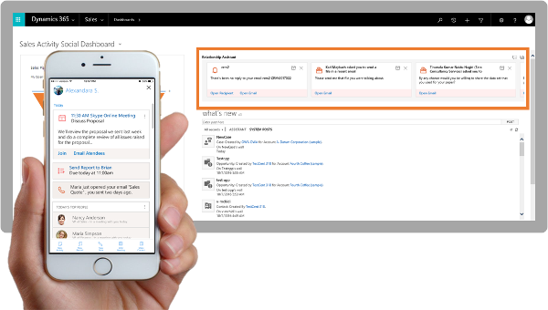
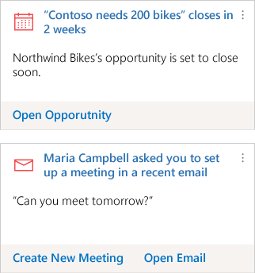
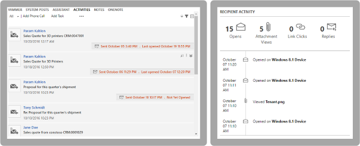
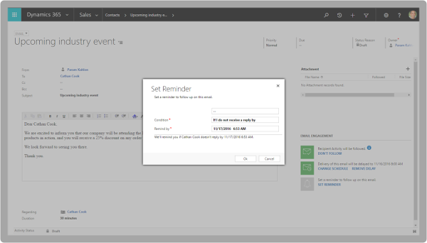
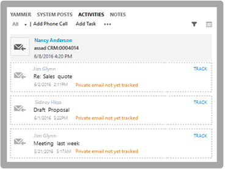

# Analyze customer-interaction data with Embedded intelligence 

Applies to Dynamics 365 (online), version 9.0.2 

Embedded intelligence is a suite of features which continuously analyze the vast collection of customer-interaction data already stored in your [!INCLUDE[pn_dynamics_crm](../includes/pn-dynamics-crm.md)] and [!INCLUDE[pn_Microsoft_Exchange](../includes/pn-microsoft-exchange.md)] databases, to help you better understand your business relationships, evaluate your activities in relation to previous successes, and choose the best path forward.  
  
Embedded intelligence includes the following features, which all work together to amplify their individual strengths:  
  
-   [Relationship assistant](../sales-enterprise/relationship-assistant.md)  
-   [Email engagement](../sales-enterprise/email-engagement.md)   
-   [Auto capture](../sales-enterprise/auto-capture.md)  
  
The feature [**Relationship Analytics**](../sales-enterprise/relationship-analytics.md) <!--and **Predictive Lead Scoring** are--> is available as preview feature in the Dynamics 365 (online), version 9.0.2. Additional restrictions apply depending on which versions of [!INCLUDE[pn_dynamics_crm](../includes/pn-dynamics-crm.md)] and [!INCLUDE[pn_Microsoft_Exchange](../includes/pn-microsoft-exchange.md)] you are running. For complete details about how to enable these preview features, plus version requirements, prerequisites, and any known issues, see [Configure and enable embedded intelligence](configure-enable-embedded-intelligence.md).
  
A preview feature is a feature that is not complete, but is made available before it’s officially in a release so customers can get early access and provide feedback. Preview features aren’t meant for production use and may have limited or restricted functionality.  
  
> [!IMPORTANT]
>  Microsoft doesn't provide support for this preview feature. [!INCLUDE[pn_microsoftcrm](../includes/pn-microsoftcrm.md)] technical support won’t be able to help you with issues or questions. Preview features aren't meant for production use and are subject to a separate [supplemental terms of use for preview features](http://go.microsoft.com/fwlink/p/?LinkId=511446).
  
For information about how to enable these features, see [Configure and enable embedded intelligence](../sales-enterprise/configure-enable-embedded-intelligence.md).  
    
   

## Get right information at the right time  
The relationship assistant is constantly at work, keeping an eye on your activities, records, and communications with customers to automatically show you the right information at the right time. It analyzes your daily actions and communications and uses them to drive insights that help you focus on what’s important today, and how to optimize your communications to help nurture healthy business relationships going forward.  
  
   
  
 The assistant combines and analyzes all of the information at its disposal, and then generates a collection of *action cards*, which are displayed as your entry point to [!INCLUDE[pn_dynamics_crm](../includes/pn-dynamics-crm.md)] on mobile devices, and as a carousel or column display on your web-based dashboards. When working with individual records you’ll see the action cards that apply directly to that record (all record types are supported, including custom entities). Many different types of cards are available, each of which provides tailored information, helpful links, and action controls for working with that information.  
  
   
  
 The system reminds you of upcoming activities; it evaluates your communications and suggests when it might be time to reach out to a contact that’s been inactive for a while; it identifies email messages that may be waiting for a reply from you; it alerts you when an important opportunity is nearing its close date; and much more.  
  
 [!INCLUDE[proc_more_information](../includes/proc-more-information.md)] [Relationship assistant](../sales-enterprise/relationship-assistant.md), [Action cards reference](../sales-enterprise/action-cards-reference.md)  
  
   

## Get more out of email with email engagement  
 *Email engagement* helps you create more effective email messages—and to learn how your contacts are interacting with them. Stay on top of your email and prioritize those prospects or customers that are most engaged.  
  
   
  
 When writing a new message, get started quickly by choosing the most effective content template, with recommendations based on previous open and reply rates.  
  
 Create *followed* email messages, which let you know when a recipient opens the email, clicks a link, opens an attachment, or sends a reply.  
  
 Write your messages when it's convenient for you, but schedule delivery for when they're most likely to be noticed and read by  recipients. The system even checks recipients' time zones to provide  advice about when the best delivery times might be.  
  
 Set yourself a reminder for when it’s time to follow up on a message. Your reminder is provided as an action card displayed by the relationship assistant, so it will be brought to your attention right away. Each card includes links to help you investigate, act upon, snooze, or dismiss the card.  
  
   
  
 You can view the status and history of your followed messages anywhere they are shown in [!INCLUDE[pn_dynamics_crm](../includes/pn-dynamics-crm.md)]. The current status and most-recent interaction are shown right in the **Activities** list for any record where the email is relevant, and you can expand the listing to see the full interaction history.  
  
 To protect the privacy preferences of your customers, you can choose to not allow followed messages for individual contacts by setting a flag on their contact or lead record.  
  
 [!INCLUDE[proc_more_information](../includes/proc-more-information.md)] [Email engagement](../sales-enterprise/email-engagement.md)  
  
   

## Find and track relevant messages from your Exchange server with auto capture  
 [!INCLUDE[pn_dynamics_crm](../includes/pn-dynamics-crm.md)] can now analyze your email messages directly in [!INCLUDE[pn_Microsoft_Exchange](../includes/pn-microsoft-exchange.md)] to find all messages that might be relevant to your work in [!INCLUDE[pn_dynamics_crm](../includes/pn-dynamics-crm.md)]. The system looks for messages to or from relevant email addresses, and presents you with the relevant messages right in [!INCLUDE[pn_dynamics_crm](../includes/pn-dynamics-crm.md)]. With just one click, you can track any of the suggested messages in [!INCLUDE[pn_dynamics_crm](../includes/pn-dynamics-crm.md)], which makes them available to your sales team and also for use by other Embedded intelligence features.  
  
   
  
 You can still track messages in [!INCLUDE[pn_dynamics_crm](../includes/pn-dynamics-crm.md)] in all the ways that you could before, including by using the [!INCLUDE[pn_crm_app_for_outlook_short](../includes/pn-crm-app-for-outlook-short.md)] or tracked folders. All tracked messages in [!INCLUDE[pn_dynamics_crm](../includes/pn-dynamics-crm.md)] are available to Embedded intelligence features.  
  
 [!INCLUDE[proc_more_information](../includes/proc-more-information.md)] [Auto capture](../sales-enterprise/auto-capture.md)  
 
   

## View key performance indicators of your business interactions

What opportunities should have priority? When was the customer last contacted? Who on the team has been interacting with the customer? Use relationship analytics to get relevant data to answer these and other questions about your customer related activities.

 [!INCLUDE[proc_more_information](../includes/proc-more-information.md)] [Relationship analytics](relationship-analytics.md)   

 
   

## Privacy notices  

[!INCLUDE[cc_privacy_relationship_insights_relationship_assistant](../includes/cc-privacy-relationship-insights-relationship-assistant.md)]
  
[!INCLUDE[cc_privacy_relationship_insights_email_engagement](../includes/cc-privacy-relationship-insights-email-engagement.md)]
  
[!INCLUDE[cc_privacy_relationship_insights_auto_capture](../includes/cc-privacy-relationship-insights-auto-capture.md)]

[!INCLUDE[cc_privacy_relationship_insights_relationship_analytics](../includes/cc-privacy-relationship-insights-relationship-analytics.md)]
  
### See also

[Configure and enable embedded intelligence](../sales-enterprise/configure-enable-embedded-intelligence.md) 

