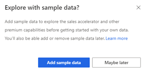
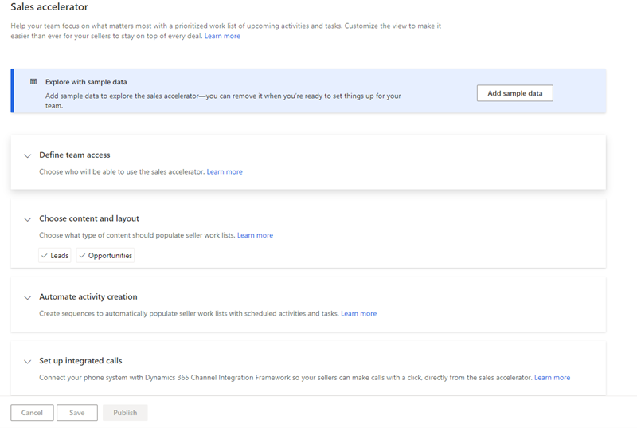
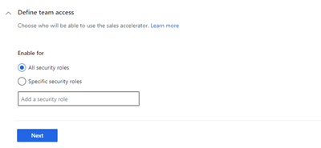
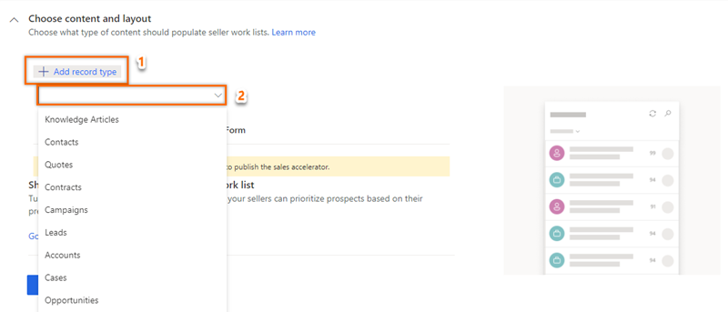
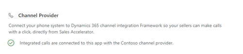
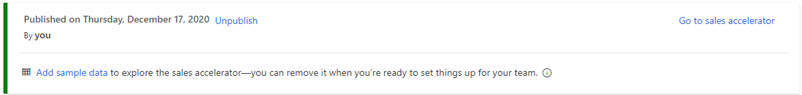

# Configure the sales accelerator

The Dynamics 365 Sales Insights sales accelerator helps sellers in your organization increase their sales productivity and prioritize activities for the day through the work list available in your sales app. An administrator or a sales manager uses the sequence designer to create a sequence of activities&mdash;separated by time intervals&mdash;including emails, phone calls, and tasks. Sequences are connected to relevant records, so sellers can follow the best practices that have been defined in the sequence for the leads and opportunities that are assigned to them. The sequence is then applied to leads or opportunities and assigned to a seller automatically, according to your organization's sales strategies.  

As an administrator, you must enable and configure the sales accelerator in your organization to make it available for sales managers and sellers to use. Follow these steps:

1. [Review the prerequisites and recommendations](#review-the-prerequisites-and-recommendations).
2. [Set up the sales accelerator](#set-up-the-sales-accelerator).

## Review the prerequisites and recommendations

### Prerequisites

Ensure that you meet the following requirements:

- Purchase a Sales Insights license, Dynamics 365 Sales Premium license, or start a trial to use advanced Sales Insights features.

- Enable advanced Sales Insights features. More information: [Install and configure premium Sales Insights features](intro-admin-guide-sales-insights.md#install-and-configure-premium-sales-insights-features)

### Recommendations

For the best experience of the sales accelerator, enable and configure [predictive lead scoring](configure-predictive-lead-scoring.md) and [predictive opportunity scoring](configure-predictive-opportunity-scoring.md) to display predictive scores for each record in the work list. Displaying the score helps your sellers to prioritize leads and opportunities based on their predicted likelihood to convert.

## Set up the sales accelerator

1. Sign in to your sales app, and in the lower-left corner of the page, go to **Change area** > **Sales Insights settings**.
2. On the site map, under **Sales accelerator**, select **Setup**.    
    The sales accelerator configuration page opens.      
    For the first-run experience, go to step 3. If the feature has already been configured and you want to update the configuration, go to step 4.    
3. If you're configuring the feature for the first time in your organization, select **Get started**.     
    >[!div class="mx-imgBorder"]
    >    

    A dialog box appears with the option to install sample data to explore the feature. Installing the sample data is relevant only for your sandbox or trial environments. Adding the sample data might take a few minutes. However, you can choose to ignore the sample data installation and add it later when required. More information: [Manage sample data](manage-sample-data.md)    
    >[!div class="mx-imgBorder"]
    >        

    The configuration page opens.    
    >[!div class="mx-imgBorder"]
    >     
 
4. In the **Define team access** section, select one of the following options to provide permissions to users to use the sales accelerator feature, and then select **Next**.     
    >[!div class="mx-imgBorder"]
    >   
    
    | Security roles | Description |
    |----------------|-------------|
    | All security roles | Select this option to give access to view the Sales Hub app to all the security roles in your organization. |
    | Specific security roles | Select this option to specify security roles to give access to view the Sales Hub app to just a few users. Use the lookup box to add the security roles. |    
    
5. In the **Choose content and layout** section, choose the record types (**Leads** and **Opportunities**) and their corresponding related forms that users use in your organization, as required. Select **Next**.     
    The selected record type will display the **Sequence (up next)** widget, and sales managers will use the record types to configure the sequence that will be assigned to records to be displayed in the app. By default, the **Leads** and **Opportunities** record types are selected.     
    >[!NOTE]
    >If you're using custom record types for leads and opportunities, the names of your custom record types are displayed.    
    
    >[!div class="mx-imgBorder"]
    >   
6. In the **Automate activity creation** section, choose an option based on your requirements:    
    - Select **Go to sequences** to create sequences and apply them to records. More information: [Create and manage sequences](create-manage-sequences.md)
    - Select **Skip this step** to come back later and create the sequences.
    >[!div class="mx-imgBorder"]
    >           
7. In the **Set up integrated calls** section, the status of the phone system that's integrated through Dynamics 365 Channel Integration Framework is displayed under **Channel Provider**. The phone system allows sellers to make calls directly through the sales accelerator feature. The priority of the phone system that's selected for the sales accelerator depends on the ranking that's defined in the Dynamics 365 Channel Integration Framework configuration. More information: [Integrate a sample softphone dialer with Dynamics 365 Sales](integrate-sample-softphone.md)     
    >[!div class="mx-imgBorder"]
    >        
    After the phone system is successfully verified, configure the following advanced call settings:    
    - Under **Phone number priority**, select the phone numbers for **Default**, **Fallback1**, and **Fallback2**. When sellers initiate calls through a sequence step or the work list, the softphone chooses the phone numbers in the order they're listed.     
        For example, you can select **Business Phone** in **Default**, **Mobile Phone** in **Fallback1**, and **Home Phone** in **Fallback2**. When sellers initiate a call, the number in the **Default** option is dialed, if it's available. If it isn't available, the call goes to the next option.            
        >[!NOTE]
        >For opportunities, the phone number priority will be applied to the primary contacts.  

    - Under **Call settings**, select the **Create records automatically on click** option to automatically create a phone call activity when sellers initiate a call from a sequence step or from the work list.   
    >[!div class="mx-imgBorder"]
    >       
8. Save and publish the configuration.
    A status message is displayed at the top of the page with details including the time and user who published the configurations.
    >[!div class="mx-imgBorder"]
    >

The sales accelerator is ready to use in your organization for the selected security roles.

## Customizations

By default, the **Up next** widget is displayed on the **Default Main** and **Sales Insight** forms. To add the **Up next** widget to other forms, follow the process specified in [How do I add the Up next widget to an entity form?](faqs-sales-insights.md#sales-accelerator)

### See also

[Create and manage sequences](create-manage-sequences.md)     
[What is the sales accelerator?](sales-accelerator-intro.md)
