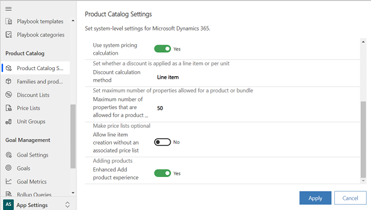
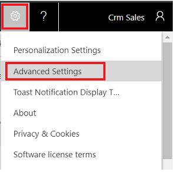
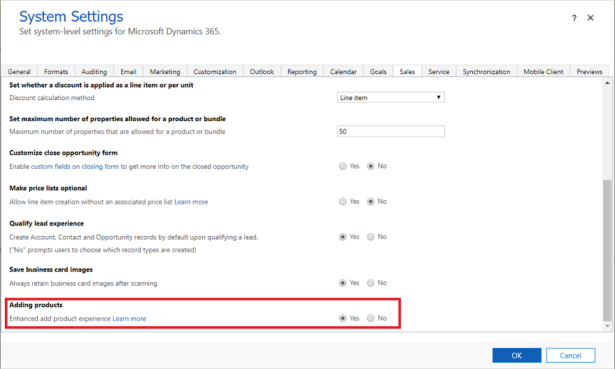

# Preview: Enable the enhanced experience of adding products (Sales Hub)

[!INCLUDE [cc-beta-prerelease-disclaimer](../includes/cc-beta-prerelease-disclaimer.md)]

Increase seller productivity by enabling the enhanced experience for searching and adding products to opportunities, quotes, orders, and invoices. With the enhanced experience, salespeople can:

-  Quickly search for products.
-  View product details inline.
-  Compare products before selecting them.
-  Add multiple products in one go.

> [!IMPORTANT]
> - The enhanced experience for adding products is a preview feature. [!INCLUDE[cc-preview-features-definition](../includes/cc-preview-features-definition.md)]
> - [!INCLUDE[cc-preview-features-expect-changes](../includes/cc-preview-features-expect-changes.md)]
> - [!INCLUDE[cc-preview-features-no-ms-support](../includes/cc-preview-features-no-ms-support.md)]
<!--markdownlint-disable MD036-->
**To enable the enhanced experience from the Sales Hub app**

1. At the bottom of the site map, select **Change area** , and then select **App Settings**.

2. Under **Product Catalog**, select **Product Catalog Settings**.

3. Set **Adding Products** > **Enhanced Add product experience** to **Yes**.

    > [!div class="mx-imgBorder"]
    > 

4. Select **Apply**.

**To enable the enhanced experience from System Settings**

If you're using a custom app, you can enable the enhanced experience from **System Settings** in the legacy web client.

1. In your app, select the **Settings** icon, and then select **Advanced Settings**.

    > [!div class="mx-imgBorder"]  
    > 

    The **Business Management settings** page opens in a new browser tab.

2. On the navigation bar, select **Settings**, and then select **Administration**.

3. Select **System Settings**.

4. In the **System Settings** dialog box on the **Sales** tab, set **Enhanced add product experience** to **Yes**.

    > [!div class="mx-imgBorder"]
    > 

4. Select **OK**.

> [!IMPORTANT]
> The enhanced experience for adding products lets you define the columns to show in the **Add products** dialog box. More information: [Customize the Add products dialog box](customize-add-products-dialog-box.md)

### See also

[Add products to an opportunity by using the enhanced experience](add-products-enhanced-experience.md)  
[Add products to a quote, order, or invoice by using the enhanced experience](add-products-qoi-enhanced.md)

[!INCLUDE[footer-include](../includes/footer-banner.md)]
