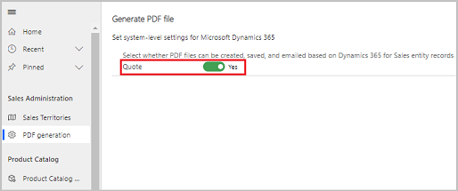

# Enable or Disable PDF generation from sales records

The PDF generation capability allow your users to generate PDF documents directly from a quote. 

> [!IMPORTANT]
> The create quote PDF capability and the option to enable PDF generation is introduced in version 9.0.1905.2010.

1.	At the bottom of the site map, select **Change area** , and select **App Settings**.

2.	Under **Sales Administration**, select **PDF generation**.

3.	To enable or disable PDF generation, on the **Generate PDF file** page, under **Select whether PDF files can be created, saved, and emailed based on Dynamics 365 Sales entity records**, set the **Quote** toggle to **Enabled** or **Disabled**. This option is set to **Enabled** by default.

    

4. Select **Apply**.

### See also

[Generate a PDF document from a quote record](create-quote-pdf.md)
