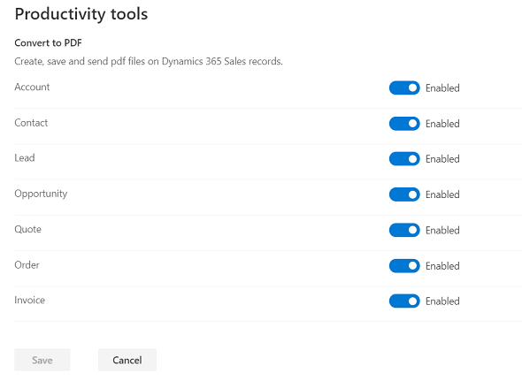

# Enable or disable PDF generation from sales records

The PDF generation capability allows your users to generate PDF files directly from sales records. The capability to create PDF files is supported on the following entities: Accounts, Contacts, Leads, Opportunities, Quotes, Orders, and Invoices. You can select the entities on which you want to enable PDF generation.

> [!IMPORTANT]
> The PDF generation capability for additional entities (entities other than quote) is released with Dynamics 365 Sales (Sales Hub) app version: 9.0.1911.1009, as part of the weekly release of the product to individual geographies.

1. At the bottom of the site map, select **Change area**  and then select **App Settings**.

2. In the site map, select **Overview**.

3. On the Overview page, under **Productivity tools**, select **Manage** for **Create, save and send pdf files on Dynamics 365 Sales records**.

4. To enable or disable PDF generation, on the Convert to PDF page, set the entity toggle to **Enabled** or **Disabled**. For example, if you want to enable PDF generation on Opportunity records, set the **Opportunity** toggle to **Enabled**.

    > [!div class="mx-imgBorder"]
    > 

5. Select **Save**.

### See also

[Create PDF files from sales records](create-quote-pdf.md)
