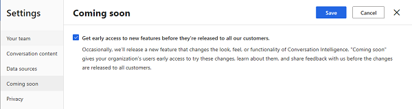

# Enable coming soon features

Sometimes "coming soon" features that change the look, feel, or functionality of the application are added to conversation intelligence before the formal release.

As an administrator, activating **Coming soon** mode gives users in your organization early access to these new features, allowing them to share feedback with us before the changes are formally released. 

> [!IMPORTANT]
> If you’ve already enabled **Coming soon** mode during your first-run setup, you’re not required to enable it again; however, you can disable **Coming soon** mode in your organization if you don’t wish to experience the new features that are yet to be released.

## Open coming soon settings page

> [!NOTE]
> Review the prerequisites. To learn more, see [Prerequisites to configure conversation intelligence](prereq-sales-insights-app.md).

### In conversation intelligence app

1.	Open the **Conversation intelligence** application.  
2.	Select the **Settings** icon on the top-right of the page and then select **Settings**.  
    > [!div class="mx-imgBorder"]
    >   
3.	On the **Settings** page, select **Coming soon**.  
    Coming soon page opens and you can [enable coming soon feature](#enable-coming-soon). 

### In Sales Hub app  

1.	Go to **Change area** in the lower-left corner of the page and select **Sales Insights settings**.  
    > [!div class="mx-imgBorder"]
    >   
2.	In the configuration page, under **Productivity**, select **Conversation intelligence**.  
    > [!div class="mx-imgBorder"]
    > 
3.	Select **Coming soon**.  
    Coming soon page opens and you can [enable coming soon feature](#enable-coming-soon). 

## Enable coming soon

1.	To enable, select **Get early access to new features before they’re released to all our customers** and then select **Save**.  
    > [!div class="mx-imgBorder"]
    >   
2. Save the settings.  
    The **Coming soon** mode is enabled. Users in your organization can try out the new features that will be released later.

### See also

[Administer conversation intelligence](intro-admin-guide-sales-insights.md#administer-conversation-intelligence)

[Prerequisites to configure conversation intelligence](prereq-sales-insights-app.md)
