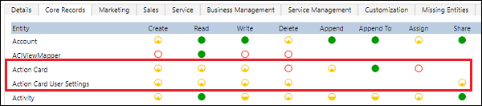

# Frequently asked questions

## General

**In which region is Sales Insights available?**<br>
Sales insights is available in the following regions:

-    Asia Pacific (APJ)
-    Canada (CAN)
-    Europe, the Middle East, and Africa (EMEA)
-    Great Britain (GBR)
-    India (IND)
-    Japan (JPN)
-    North America (NAM)
-    Oceania (OCE)

>[!NOTE]
>Currently, Sales Insights is not available in the following datacenters&mdash;Brazil, France, Germany, South Africa, UAE, Government Community Cloud (GCC), including USG, Department of Defense (DoD), and China.

**In which region are the features available?**<br>
Sales insights features are available in the following regions:

<table>

<tr>
<th>Feature</th><th>NAM</th><th>EMEA</th><th>GBR</th><th>APJ</th><th>CAN</th><th>IND</th><th>JPN</th><th>OCE</th>
</tr>
<tr>
<td>Assistant</td><td style="text-align:center"><b>&#x2714;</b></td><td style="text-align:center"><b>&#x2714;</b></td><td style="text-align:center"><b>&#x2714;</b></td><td style="text-align:center"><b>&#x2714;</b></td><td style="text-align:center"><b>&#x2714;</b></td><td style="text-align:center"><b>&#x2714;</b></td><td style="text-align:center"><b>&#x2714;</b></td><td style="text-align:center"><b>&#x2714;</b></td>
</tr>
<tr>
<td>Sales accelerator</td><td style="text-align:center"><b>&#x2714;</b></td><td style="text-align:center"><b>&#x2714;</b></td><td style="text-align:center"><b>&#x2714;</b></td><td style="text-align:center"><b>&#x2714;</b></td><td style="text-align:center"><b>&#x2714;</b></td><td style="text-align:center"><b>&#x2714;</b></td><td style="text-align:center"><b>&#x2714;</b></td><td style="text-align:center"><b>&#x2714;</b></td>
</tr>
<tr>
<td>Conversation intelligence</td><td style="text-align:center"><b>&#x2714;</b></td><td style="text-align:center"><b>&#x2714;</b></td><td style="text-align:center"><b>&#x2714;</b></td><td style="text-align:center"><b>&#x2714;</b></td><td style="text-align:center"><b>&#x2714;</b></td><td style="text-align:center"><b>&#x2714;</b></td><td style="text-align:center"><b>&#x2714;</b></td><td style="text-align:center"><b>&#x2714;</b></td>
</tr>
<tr>
<td>Auto capture</td><td style="text-align:center"><b>&#x2714;</b></td><td style="text-align:center"><b>&#x2714;</b></td><td style="text-align:center"><b>&#x2714;</b></td><td style="text-align:center"><b>&#x2714;</b></td><td style="text-align:center"><b>&#x2714;</b></td><td style="text-align:center"><b>&#x2714;</b></td><td style="text-align:center"><b>&#x2714;</b></td><td style="text-align:center"><b>&#x2714;</b></td>
</tr>
<tr>
<td>Notes analysis</td><td style="text-align:center"><b>&#x2714;</b></td><td style="text-align:center"><b>&#x2714;</b></td><td style="text-align:center"><b>&#x2714;</b></td><td style="text-align:center"><b>&#x2714;</b></td><td style="text-align:center"><b>&#x2714;</b></td><td style="text-align:center"><b>&#x2714;</b></td><td style="text-align:center"><b>&#x2714;</b></td><td style="text-align:center"><b>&#x2714;</b></td>
</tr>
<tr>
<td>Relationship analytics</td><td style="text-align:center"><b>&#x2714;</b></td><td style="text-align:center"><b>&#x2714;</b></td><td style="text-align:center"><b>&#x2714;</b></td><td style="text-align:center"><b>&#x2714;</b></td><td style="text-align:center"><b>&#x2714;</b></td><td style="text-align:center"><b>&#x2714;</b></td><td style="text-align:center"><b>&#x2714;</b></td><td style="text-align:center"><b>&#x2714;</b></td>
</tr>
<tr>
<td>Who knows whom</td><td style="text-align:center"><b>&#x2714;</b></td><td style="text-align:center"><b>&#x2714;</b></span</td><td style="text-align:center"><b>&#x2716;</b></span</td><td style="text-align:center"><b>&#x2716;</b></span</td><td style="text-align:center"><b>&#x2716;</b></span</td><td style="text-align:center"><b>&#x2716;</b></span</td><td style="text-align:center"><b>&#x2716;</b></span</td><td style="text-align:center"><b>&#x2716;</b></span</td>
</tr>
<tr>
<td>Talking points</td><td style="text-align:center"><b>&#x2714;</b></td><td style="text-align:center"><b>&#x2714;</b></td><td style="text-align:center"><b>&#x2714;</b></td><td style="text-align:center"><b>&#x2714;</b></td><td style="text-align:center"><b>&#x2714;</b></td><td style="text-align:center"><b>&#x2714;</b></td><td style="text-align:center"><b>&#x2714;</b></td><td style="text-align:center"><b>&#x2714;</b></td>
</tr>
<tr>
<td>Predictive lead scoring</td><td style="text-align:center"><b>&#x2714;</b></td><td style="text-align:center"><b>&#x2714;</b></td><td style="text-align:center"><b>&#x2714;</b></td><td style="text-align:center"><b>&#x2714;</b></td><td style="text-align:center"><b>&#x2714;</b></td><td style="text-align:center"><b>&#x2714;</b></td><td style="text-align:center"><b>&#x2714;</b></td><td style="text-align:center"><b>&#x2714;</b></td>
</tr>
<tr>
<td>Predictive opportunity scoring</td><td style="text-align:center"><b>&#x2714;</b></td><td style="text-align:center"><b>&#x2714;</b></td><td style="text-align:center"><b>&#x2714;</b></td><td style="text-align:center"><b>&#x2714;</b></td><td style="text-align:center"><b>&#x2714;</b></td><td style="text-align:center"><b>&#x2714;</b></td><td style="text-align:center"><b>&#x2714;</b></td><td style="text-align:center"><b>&#x2714;</b></td>
</tr>
<tr>
<td>Premium forecasting</td><td style="text-align:center"><b>&#x2714;</b></td><td style="text-align:center"><b>&#x2714;</b></td><td style="text-align:center"><b>&#x2714;</b></td><td style="text-align:center"><b>&#x2714;</b></td><td style="text-align:center"><b>&#x2714;</b></td><td style="text-align:center"><b>&#x2716;</b></td><td style="text-align:center"><b>&#x2714;</b></td><td style="text-align:center"><b>&#x2714;</b></td>
</tr>
</table>

**Which version of Exchange is supported for features in Sales Insight?** <br>
The Sales Insights features support the following versions of Exchange:

<table>
<tr>
<th>Feature</th><th>Exchange Online</th><th>Exchange Server 2013 and above</th><th>Is Exchange required?</th>
</tr>
<tr>
<td>Relationship analytics and health</td><td style="text-align:center">Yes</td><td style="text-align:center">No</td><td style="text-align:center">No</td>
</tr>
<tr>
<td>Assistant</td><td style="text-align:center">Yes</td><td style="text-align:center">No</td><td style="text-align:center">No</td>
</tr>
<tr>
<td>Email engagement</td><td style="text-align:center">Yes</td><td style="text-align:center">Yes</td><td style="text-align:center">Yes</td>
</tr>
<tr>
<td>Who knows whom</td><td style="text-align:center">Yes</td><td style="text-align:center">No</td><td style="text-align:center">Yes</td>
</tr>
<tr>
<td>Talking points</td><td style="text-align:center">Yes</td><td style="text-align:center">No</td><td style="text-align:center">Yes</td>
</tr>
</table>

>[!NOTE]
>- The assistant and relationship analytics can work without Exchange. However, the information displayed in relationship analytics will not contain Exchange data and the assistant will not display cards that are based on Exchange data. 
>- For relationship analytics, support for Exchange Online is available only in North America (NAM) and Europe, the Middle East, and Africa (EMEA).
>- For who knows whom, the organization's Office 365 data location must be in one of the following locations and not in your region specific data canter location:
>   - Global Geography 1 – EMEA (Austria, Finland, France, Ireland, Netherlands).
>   - Global Geography 2 – Asia Pacific	(Hong Kong, Japan, Malaysia, Singapore, South Korea).
>   - Global Geography 3 – Americas (Brazil, Chile, United States).<br>
>   To learn more on data center locations, see [Data Center Locations](https://docs.microsoft.com/microsoft-365/enterprise/o365-data-locations?view=o365-worldwide#data-center-locations).

**What languages are supported now?**<br>
Sales insights supports the following languages:

| Feature | Language supported |
|---------|--------------------|
| Assistant, Assistant studio, Auto capture, Email engagement, Predictive lead scoring, Predictive opportunity scoring, Premium forecasting, Relationship analytics, Sales accelerator, and Who knows whom | Arabic, Basque, Bulgarian, Catalan, Chinese Simplified (PRC), Chinese Traditional (Hong Kong SAR), Chinese Traditional (Taiwan), Croatian, Czech, Danish, Dutch, English, Estonian, Finnish, French, Galician, German, Greek, Hebrew, Hindi, Hungarian, Indonesian, Italian, Japanese, Kazakh, Korean, Latvian, Lithuanian, Malay, Norwegian, Polish, Portuguese (Brazil), Portuguese (Portugal), Romanian, Russian, Serbian (Cyrillic), Serbian (Latin), Slovakian, Slovenian, Spanish, Swedish, Thai, Turkish, Ukrainian, and Vietnamese. |
| Notes analysis | Supports English, French, German, Italian, and Dutch for machine learning models. |
| Talking points and Exchange insight cards in Assistant | Supports only English - United States (en-US) for machine learning models. |
| Activity-content based Auto capture |- For contact suggestions, the body of emails and meetings are analyzed in English and French.<br>- For activity suggestions, the body of emails and meetings are analyzed in English, French, German, Italian, Dutch, and Norwegian. |
| Conversation intelligence | Chinese Simplified (PRC), Dutch, English, French, German, Italian, Japanese, Portuguese, Portuguese (Brazil), Spanish, and Arabic. |

To learn more, see [Infrastructure availability PDF](https://aka.ms/dynamics_365_international_availability_deck)

**Where is my organization's data stored?**    
Depending on the region where your organization is hosted, data is stored in the following locations:   

| Region | Primary Azure data center location  | Secondary Azure data center location |
|--------|-------------------------------------|--------------------------------------|
| Asia Pacific (APJ) | South East Asia (Singapore) | East Asia (Hong Kong) |
| Canada (CAN) | Canada Central (Toronto) | Canada East (Quebec City) |
| Europe, the Middle East, and Africa (EMEA) | West Europe (Netherlands) | North Europe (Ireland) |
| France (FRA) | France Central (Paris) | -- |
| Great Britain (GBR) | UK South (London) | UK West (Cardiff) |
| India (IND) | Central India (Pune) | South India (Chennai) |
| Japan (JPN) | Japan East (Tokyo, Saitama) | Japan West (Osaka) |
| North America (NAM) | East US (Virginia) | West US 2 (Washington) |
| Oceania (OCE) | Australia East (New South Wales) | Australia Southeast (Victoria) |

**Will Sales Insights affect my storage quota?**    
Yes. After the install of sales insights, the last two years of key sales data required to deliver the advanced analytics and AI results including contacts, opportunities, leads, accounts, and activities are copied into your Sales Insights managed data lake and will be counted against your total file storage quota.

## Assistant

**How do I disable teasers?**    
To disable, follow these steps:    
1. Sign in to the Dynamics 365 Sales Hub app, and go to **Change area** > **Sales Insights settings**.    
2. On the site map, select **Overview**.    
3. Go to **Teasers** section and toggle the option to disable the teasers.     
    > [!div class="mx-imgBorder"]
    > 

**Why am I getting insufficient permissions alert while using an Insight card?**   
If you see an alert about having insufficient permissions to use an Insight card, take these steps:    
1. Go to **Settings** > **Security** > **Security Roles**.   
2. Choose the user role viewing the insight cards.    
3. Select the **Core Records** tab.    
4. Set the privileges to Read and Write access for **Action card** and **Action card User Settings**.     
   

**Why am I getting contact administrator error while authenticating credentials in assistant studio?**     
The error is occurring due to your organization’s policies to restrict third-party tools to access user information. To resolve the issue, you can provide consent for yourself through the [Azure portal](https://portal.azure.com) for third-party tools to access your data. To provide consent for the entire organization, contact your tenant administrator. Select the enterprise application as **Dynamics 365 Sales Insights** in Azure portal while providing the consent. To learn more, see [Grant admin consent in Enterprise apps](https://docs.microsoft.com/azure/active-directory/manage-apps/grant-admin-consent#grant-admin-consent-in-enterprise-apps).

## Sales accelerator     
**How do I add the Up next widget to an entity form?**    
>[!NOTE]
>You can add the **Up next** widget only to managed forms.     
To add the **Up next** widget to an entity form, follow these steps:   
1.	Go to **Settings** > **Solutions** and the create an empty solution. For example, **AddWidget**.    
2.	Add a **Form** to the solution.    
3.	Save the changes and publish the customizations.   
4.	Export the created **AddWidget** solution as **UnManaged**.    
5.	Delete the Solution **AddWidget** from the organization.    
6.	Extract the zip file of the downloaded solution.    
7.	Change the ```<Managed>``` value to 1 in the file ```Solution.xml``` and then save.     
    ```<Managed>1</Managed>```    
8.	Open the ```customizations.xml``` file and remove the parameter ```<systemform unmodified="1">```.     
9.	Choose the ```<column>``` under **Summary** tab, where you want to add the widget.    
10.	Add the ```<section>``` tag as following:    
    ```
    <section name="CadenceWidget" showlabel="false" showbar="false" id="{<NEW_GUID_G1>}" IsUserDefined="0" layout="varwidth" columns="1" labelwidth="115" celllabelalignment="Left" celllabelposition="Left" labelid="{<NEW_GUID_G2> }">
      <labels>
          <label description="Cadence Widget" languagecode="1033" />
      </labels>
      <rows>
          <row>
              <cell id="{<NEW_GUID_G3>}" showlabel="false" colspan="1" rowspan="6" labelid="{<NEW_GUID_G4> }">
                  <labels>
                      <label description="Cadence widget" languagecode="1033" />
                  </labels>
                  <control id="CadenceWidgetControl" classid="{F9A8A302-114E-466A-B582-6771B2AE0D92}"  uniqueid="{<NEW_GUID_G5>}" isunbound="true">
                      <parameters />
                  </control>
              </cell>
          </row>
          <row />
          <row />
          <row />
          <row />
          <row />
      </rows>
    </section>
    ```      
11.	Replace all the ```<NEW_GUID_G*>``` occurrences by generating a new GUID for each place.     
12.	For ```<controlDescriptions>``` node, add a child node as following:    
    ```
    <controlDescription forControl="{<GUID_G5>}">
    <customControl formFactor="2" name="MscrmControls.AcceleratedSales.CadenceWidgetControl">
        <parameters />
    </customControl>
    <customControl formFactor="0" name="MscrmControls.AcceleratedSales.CadenceWidgetControl">
        <parameters />
    </customControl>
    <customControl formFactor="1" name="MscrmControls.AcceleratedSales.CadenceWidgetControl">
        <parameters />
    </customControl>
    </controlDescription>
    ```     
13.	Replace the ```<GUID_G5>``` in ```customizations.xml``` with the **GUID_G5** generated from **step 11**.    
14.	Save the changes and zip the folder.     
15.	Open Dynamics 365 and go to **Settings** > **Solutions**.     
16.	Import the zipped solution.    
17.	Publish all customizations.    
18.	Verify that the **Up next** Widget successfully shows up on the form.

**How to add work list site map to your custom app**    
>[!NOTE]
>Enable sales insights in your organization before you add the site map to your custom app.     

To add the work list site map to your custom app, follow these steps:   

1. Open your custom app in the app designer. In the following example, the custom app **Sales SandBox** is opened.   
    > [!div class="mx-imgBorder"]
    >      
2. Open the site map designer. Select the pencil icon corresponding to the **Site Map** section.     
    > [!div class="mx-imgBorder"]
    >      
3. Select the area in which you want to add the work list entry and then select **+ Add** > **Subarea**.    
    > [!div class="mx-imgBorder"]
    >       
    In the following example, subarea entry is added to the **Sales** area under **Sales records**.     
    > [!div class="mx-imgBorder"]
    >       
4. Select **New Subarea** and go to the **Properties** tab.
    > [!div class="mx-imgBorder"]
    >        
5. In the subarea properties, enter the following values:     
    - Choose **Type** as **URL**.
    - Enter the **URL** value as `/main.aspx?pagetype=control&controlName=MscrmControls.AcceleratedSales.AnchorShellControl`.
    - Enter the **Title (1033)** for the entry. For example, **Sales accelerator**.
    - Select the **Icon** to use in the sitemap. For example, use default icon **salesacceleration.svg**. 
    - Enter the **ID** field enter a unique ID value. For example, **SalesAccelerationInstance**.    
        > [!div class="mx-imgBorder"]
        >        
6. (Optional) To show or hide the section only to enabled users, go to **Advanced** and then select **Privileges**. In the **Entity** dropdown list, select **Work Queue record**.     
7. Save and publish the sitemap.
    The work list site map entry is added to your custom app.

## Relationship analytics and health   
**What do I need in order to use Relationship analytics?​**<br>
Relationship analytics uses data from Dynamics 365 for Sales. Optionally, it includes data from Exchange Online and LinkedIn InMail with the LinkedIn solution with sync-back enabled. For Exchange data, the graph is built only on user accounts situated in the United States.​    

**How do I enable Relationship analytics?​**<br>
Install [!INCLUDE[pn_dynamics_sales_insights](../includes/pn-dynamics-sales-insights.md)] and enable the Relationship analytics feature from  **Settings** > **AI setup**.​    

**What is the frequency of KPI updates?​**<br>
KPIs are updated every 24 hours, potentially fewer.​    

**What are the signals in relationship health?​**<br>
Relationship health looks at activity, recency, engagement, and sentiment of activities between sellers and customers.​   

**Can I configure relationship health?​**<br>
An administrator can influence the relationship health score by changing the weight of activity types and the expected level of communications with customers.

## Predictive lead/opportunity scoring   
**What do I need in order to use lead/opportunity scoring?​**<br>
Install [!INCLUDE[pn_dynamics_sales_insights](../includes/pn-dynamics-sales-insights.md)] and use standard lead entity or standard opportunity entity.​   
To build a lead score model, a minimum of 40 qualified and 40 disqualified leads are required.    
To build an opportunity scoring model, a minimum of 40 won and 40 lost opportunities are required.    
Verify that the leads and opportunities are created on or after January 01, in the previous year.

**Can I customize the model?​**<br>
Yes, you are able to modify which attributes are selected to train the model. That said, the out-of-the-box model automatically selects the attributes it determines is most relevant for your business.

**Can I create multiple models for leads/opportunities?​**<br>
Yes, you can add and publish multiple models that are specific to each line of business in your organization.

**What is the difference between score and grade?​**<br>
The score is generated by the machine learning model. <br>
The grade is just grouping scores in four buckets that the admin can configure.

## Notes analysis

**What do I need in order to use Notes analysis?​**<br>
Notes analysis requires Microsoft 365.​

**How do I enable Notes analysis?​**<br>
Install [!INCLUDE[pn_dynamics_sales_insights](../includes/pn-dynamics-sales-insights.md)] and enable the Notes analysis feature from **Settings** > **AI setup**.​

**What does Notes analysis look at for the intent?​**<br>
Notes analysis looks at notes and posts on the timeline for the intent that may indicate a record should be created. Notes analysis looks for meeting requests, meetings, tasks, and contacts.

## Talking points

**What do I need in order to use Talking points?​**<br>
Talking points require Microsoft 365 Exchange and a configured server-side sync (SSS) profile (mailbox need not be enabled for SSS).​

**How do I enable Talking points?​**<br>
Install [!INCLUDE[pn_dynamics_sales_insights](../includes/pn-dynamics-sales-insights.md)] and enable the Talking points feature from **Settings** > **AI setup**.​

**What do Talking points look at for the conversation starters?​**<br>
Talking points look at the inbox of the signed-in user for emails from the contact list that includes conversational topics relating to sports, entertainment, and health.​

**How is my privacy protected?​**<br>
User privacy is safeguarded because only emails from the signed-in user's mailbox are shown. Your colleagues won't be able to see those same talking points unless they were also a recipient of that email.​

**How long will it take for results to appear?​**<br>
It takes a few seconds to display the results.​

## Who knows whom

**What do I need in order to use Who knows whom?​**<br>
Who knows whom requires Microsoft 365 Exchange. The graph is built only on user accounts situated in the United States. Geo availability will expand as Sales Insights becomes available in more regions. Server-side sync is required for email introduction requests. ​

**What do I need to build a connection graph in who knows whom?​**<br>
To build a connection graph in who knows whom, Microsoft 365 Exchange is required. The graph is built only on user accounts that are in the following Office 365 geography locations:
- Global Geography 1 – EMEA (Austria, Finland, France, Ireland, Netherlands).
- Global Geography 2 – Asia Pacific	(Hong Kong, Japan, Malaysia, Singapore, South Korea).
- Global Geography 3 – Americas (Brazil, Chile, United States).

More information: [Data center locations](https://docs.microsoft.com/microsoft-365/enterprise/o365-data-locations?view=o365-worldwide#data-center-locations)

Also, server-side sync is required for email introduction requests. ​

**How do I enable who knows whom?​**<br>
Install [!INCLUDE[pn_dynamics_sales_insights](../includes/pn-dynamics-sales-insights.md)], opt in to Connection insights from the Microsoft 365 admin, and enable the Who knows whom feature from **Settings** > **AI setup**.​


**How long will it take for results to appear?**<br>
It takes about one to three days for results to populate the graph the first time. Later, updates take three to six days, depending on the new activities included in the graph.​

**​Who will be included in the graph?​**<br>
Everyone in the tenant is included in the graph. Administrators or users have the option to opt out users or groups such as C-suite, M&A, finance, and so on. To opt out of the connection graph, see [Opt out of connection graph](configure-who-knows-whom.md#opt-out-of-the-connection-graph).​

**​How are the connections weighted?**<br>
Connections are weighted by a combination of how well the signed-in user knows the intermediary, and how well the intermediary knows the target contact or lead. This means that a salesperson might not see the same results as another salesperson does, because they know different people in the organization.

**What is the source of the data?**<br>
Who knows whom has the following data sources:
-	**Dynamics 365**: The lead or contact email ID that is used to query Exchange Online to find who in the tenant has communication with sellers.
-	**Exchange Online**: The feature evaluates the collaboration, communication, and business relationships of sellers within the Office 365 organization to determine connection strength. This includes recent email interactions, sellers' contacts, and the organization directory.

**Where is the data stored?**<br>
The insights are generated within the Exchange Online system, so we follow the same data security principles as Exchange Online. More information: [Security and compliance for Exchange Online](https://docs.microsoft.com/exchange/security-and-compliance/security-and-compliance)

**What is the data retention policy, and where is it set?**<br>
The service is fully GDPR-compliant. Dynamics 365 won't cache any data on its side, and the data is queried every time a page is loaded with who knows whom.

**How do I opt out?**<br>
You can choose to opt out of the connection graph. More information: [Opt out of the connection graph](configure-who-knows-whom.md#opt-out-of-the-connection-graph).

**How does an Exchange administrator exclude users?**<br>
The Exchange administrator can provide the Azure AD group that contains all the users that they want to exclude (for example, CEOs or vice presidents). 

**What level of access do administrators have?**<br>
The Dynamics 365 administrator must enable the feature in Dynamics 365 Sales, and the Exchange administrator must enable it in Exchange Online. Enabling the feature establishes a connection between Dynamics 365 Sales and Exchange Online, so data can be exchanged between the systems. If any of the administrators disable it, the data won't be visible on the who knows who widget.

## Conversation Intelligence

**How long does it take for data updates to reflect in the app?**<br>
The data is refreshed periodically and could take up to 12 hours to reflect. We continue to make improvements to reduce this delay.

**Can sellers (or non-managers) use this app?**<br>
Yes, the application is also available for sellers and can view their conversational insights.

**Is an admin needed to enable the app for my organization?**<br>
Yes. Administrator must configure the application for you to use. If administrator didn't configure the application, you can explore the application with the demo data that is provided.

**Which telephony system do you support?​**<br>
The application is independent of telephony systems. If you have stereo call recordings (two-channel stereo), we process them at scale to generate insights​.

**What does the onboarding experience include?​** <br>
As part of the onboarding experience, you must provide the access key to the Azure blob location where you upload your call recording files for processing. You must adhere to standard metadata format (in JSON) of conversation intelligence and upload that along with every call recording file. Apart from this, you must share trackers that you care about along with the competitive brands and products for conversation intelligence to track these words across calls.

**How is the sentiment model built?**<br>
Conversation intelligence transcribes the calls into text and generates sentiment from the text in the conversation.

**I have mono-channel recording files. Can I still use conversation intelligence?​**<br>
No, we DO NOT process mono-channel call recording files. We only support stereo-type call recording files.

**How long does it take to see the results?​**<br>
Conversation intelligence takes a few minutes to process and display the data on the dashboard, depending on the size of the call recording files and format. You must have at least 10 call recording files to process and display the data.

**Do you retain the call recordings?​**<br>
No. The call recordings are deleted as soon as the audio file is processed​.

### See also

[Overview](overview.md)  
[Introduction to administer Sales Insights](../sales/intro-admin-guide-sales-insights.md)


[!INCLUDE[footer-include](../includes/footer-banner.md)]