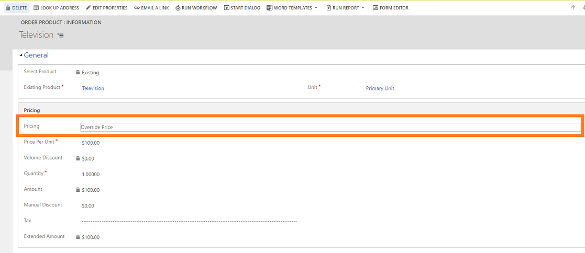
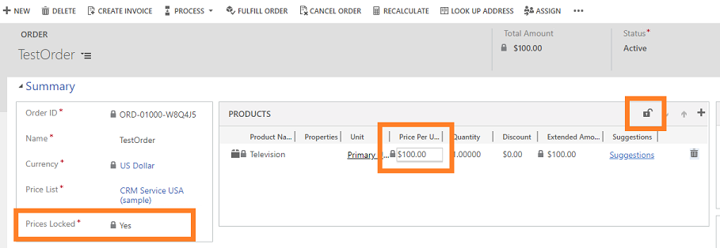

# Frequently asked questions

## Entity: Opportunity

**Question**: When can I edit the **Est.Revenue** value in the **Opportunity** form?

**Answer**: To edit the value of estimated **Revenue** in the **Opportunity** form, the **Revenue** must be configured as **User Provided** and the opportunity must be in an **Open** state. 

   > [!div class="mx-imgBorder"]
   > 

## Entities: Opportunity, Quote, Invoice, and Order

> [!NOTE]
> In this section, we use the entity **Opportunity** to frame the questions. However, these questions are also true for these other entities: **Quote**, **Invoice**, and **Order**.

**Question**: Why does a view other than **Opportunity Product Inline Edit View** lose the inline editing functionality and why can't I see grid actions such as move up, move down, and lock icons in the legacy web client if a view other than **Opportunity Product Inline Edit View** is selected for the **Opportunity Product** subgrid in the **Opportunity** form?

**Answer**: This is a by-design behavior in the legacy web client. However, this behavior is changed in Unified Interface. We recommend that you use Unified Interface to experience the inline edit view. To verify whether a grid is editable, go to **Grid control properties**.

   > [!div class="mx-imgBorder"]
   > 

   > [!NOTE]
   > - In Unified Interface, the behavior of the grid columns **Price Per Unit** and **Quantity** as editable or non-editable is independent of the view that is selected.  
   > - An editable grid doesn’t guarantee that all columns are editable; it depends on the **Pricing**.

**Question**:  Why is the amount not calculated automatically in the **Amount** fields of opportunity, quote, order, or invoice records?

**Answer**:   The value in the **Est. Revenue** and **Total Amount** fields of an opportunity is updated only the following conditions are met:

- Your organization is configured to use system pricing calculation. To verify whether system pricing calculation is enabled, make sure that the **Use system pricing calculation** setting in **System Settings** is set to **Yes**. More information: [System Settings dialog box - Sales tab](system-settings-sales-tab.md) 

- The opportunity is refreshed (either when you select the **Refresh** button on the command bar or open the record) or when you select the **Recalculate Opportunity** button on the command bar.

The value in the **Est. Revenue** or **Total Amount** field isn't updated without the opportunity being refreshed or recalculated.

**Question:** 
Why are some fields editable while some are locked in the Product subgrid in the Opportunity, Quote, Order, and Invoice records?

**Answer:** 
There are certain restrictions on inline editing based on the type of products in the subgrid:

-   If the product in the subgrid is an individual product and an existing product from the product catalog, all fields except the Quantity and Discount are locked for editing.

-   If the product in the subgrid is an individual product and a write-in product from the product catalog, all fields except the Product Name, Quantity, and Discount are locked for editing.

-   If the product in the subgrid is a product bundle or an optional product of a bundle, all fields except Quantity and Discount are locked for editing.

-   If the product in the subgrid is a required product from an existing product bundle, all fields in the subgrid view are locked for editing.

## Entities: Opportunity Product, Quote Product, Order Product, and Invoice Product 

> [!NOTE]
> In this section, we use the entity **Opportunity Product** to frame the questions. However, these questions are also true for these other entities: **Quote Product**, **Order Product**, and **Invoice Product**.

**Question**: How can I configure the value of the default **Pricing** to **Override Price** on the **Opportunity Product** form?

**Answer**: To configure the value of the default **Pricing** as **Override Price** in the **Opportunity Product** form: 
1. Go to **Settings** > **Customizations** > **Customize the System**.
2. Select **Entities** > **Opportunity Product** > **Fields**.
3. Select the **ispriceoverridden** field and configure the **Default Value** to **Override Price**.
4. Save and publish the customizations.

  > [!div class="mx-imgBorder"]
  > 
 
## Entities: Order and Invoice

> [!NOTE]
> In this section, we use the entity **Order** to frame the questions. However, these questions are also true for the entity **Invoice**.

**Question**: How can I change the default value for the **Prices Locked** field in the **Order** form?

**Answer**: You can change the default value for the **Prices Locked** field in the **Order** form through customizations or the inline editable grid:
  1. Go to **Settings** > **Customizations** > **Customize the System**.
  2. Select **Entities** > **Order** > **Fields**.
  3. Select the **ispricelocked** field, and then set **Default Value** to **No**.
  4. Save and publish the customizations.

**Question**: For a particular **Order** form, how can I change the state of **Prices Locked** field?

**Answer**:  You can change the state for the **Prices Locked** field through the inline editable grid. Select the **Lock** icon on the editable grid, and the state of the **Prices Locked** field changes accordingly. 

In the legacy web client: 
  > [!div class="mx-imgBorder"]
  > 

In Unified Interface:
  > [!div class="mx-imgBorder"]
  > 

**Question**: When can I change the values in the **Pricing Per Unit** column in the **Products** grid?

**Answer**: The **Prices Locked** (ispricelocked) field controls the prices specified on the **Order** form and locks them from any further updates.

These tables define the behavior of **PricePerUnit** in the **Products** subgrid and **Order** product form: 

**For existing products**:
 
|Configuration| In editable grid – **PricePerUnit** column value| In non-editable grid – **PricePerUnit** column value| **Order** product form|
|-------------|-------------|-------------|-------------|
|**Prices Locked** is Yes|Non-editable|Non-editable|Non-editable|
|**Prices Locked** is No and **Pricing** is Override Price|Editable|Non-editable|Editable|
|**Prices Locked** is No and **Pricing** is Use Default|Non-editable|Non-editable|Non-editable|

**For write-in products**:

|Configuration| In editable grid – **PricePerUnit** column value| In non-editable grid – **PricePerUnit** column value| **Order** product form|
|-------------|-------------|-------------|-------------|
|**Prices Locked** is Yes|Non-editable|Non-editable|Non-editable|
|**Prices Locked** is No|Editable|Non-editable|Editable|
   
**Question**: What is the result of changing the product price in **Pricelist** on the **PricePerUnit** of the **Order** product form?

**Answer**: The following table defines the effect of changing the product price in **Pricelist** on the **PricePerUnit** of the **Order** product form:

|Entity state|IsPriceLocked|Pricing|Is the value of **PricePerUnit** on the **Order** product form changed?|
|------------|-------------|-------|----------------------------------------------------------------------|
|Editable|Yes|Default or Override|No|
|Editable|No|Default|Yes|
|Editable|No|Override|No|
|ReadOnly|Yes or No|Default or Override|No|
