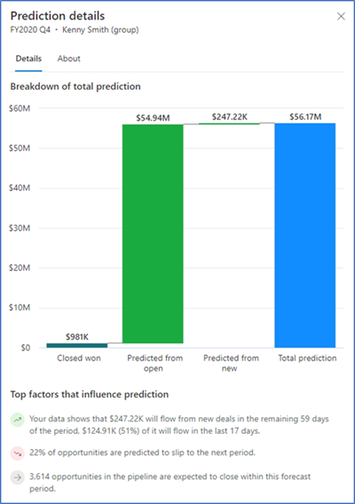
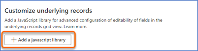

# Configure advanced settings

[!INCLUDE[cc-data-platform-banner](../includes/cc-data-platform-banner.md)]

In the **Advanced** step of forecast configuration, you can configure the following:

- [Automatically hide parent rows](#automatically-hide-parent-rows)
- [Enable multi-currency selection](#enable-multi-currency-selection)
- [Enable prediction factors](#enable-prediction-factors)
- [Customize underlying records](#customize-underlying-records)

## Automatically hide parent rows

When you open a forecast, each parent node has a dedicated contributor row under the tree where individual [simple columns](choose-layout-and-columns-forecast.md#simple-type)&mdash;such as quota and revenue contribution&mdash;are shown. For certain organizations, these dedicated contributor rows might have null-value simple columns that display no revenue contributions. In the **Advanced** settings step, you can hide these dedicated contributor rows under the parent node.  
For example, you've configured a forecast based on **User** hierarchy. When the manager **Kenny Smith** opens the forecast, he can see a row dedicated for himself with null values along with other users, though he doesn’t have any associated opportunities that include simple columns.  
> [!div class="mx-imgBorder"]
>   
In such cases, you can hide the dedicated contributor rows under the parent node. The parent row that includes the rolled-up values will still be displayed.  
As an administrator or forecast manager, you enable this feature by turning on the **Auto-hide parent row** toggle in the **Advanced** forecast configuration step.  
> [!NOTE]
> By default, this option is enabled.  
> [!div class="mx-imgBorder"]
>   
> [!IMPORTANT]
> Though you can select the option to hide the parent row, the row won't be hidden if the parent row has underlying records or values defined for simple columns in the forecast.  
<a name="enable-multi-currency-selection"></a>
## Enable multiple-currency selection

For sales teams that are distributed across different geographies, viewing the forecast revenue values in the organization's base currency might cause confusion for users who are accustomed to operating in the currency of their region. By enabling multiple-currency selection, sales teams can convert forecast revenue data to any currency that's available in the system, in real time, based on current conversion rates. This helps users across regions more readily understand the current state of the forecast in their own currency.  
>[!NOTE]
>The real-time conversion of forecast data is always based on the latest exchange rate defined by your organization.  
For example, you have sales teams in the United States and Europe. The US dollar is set as the base currency for your organization, and the euro is also available in the system. When you configure a forecast with multiple-currency selection enabled, sales teams that open the forecast will find the revenue values displayed in dollars. The sales team in Europe will have the option to select euro as the currency and display revenue in that currency. Any manual adjustments made to the forecast grid will use the selected currency.  
> [!div class="mx-imgBorder"]
>   
As an administrator or forecast manager, turn on the **Multi-currency selection** toggle in the **Advanced** forecast configuration step to allow users to view the forecast data in any currency that has been defined for your organization.  
> [!div class="mx-imgBorder"]
> 

## Enable prediction factors

Predictive forecasting factors provide additional details about the components of a forecast prediction. By analyzing these details, you can discover new insights about your data and understand how it's influencing the prediction. The following image is an example of a **Prediction details** pane, including the top factors that influence the prediction.

> [!div class="mx-imgBorder"]
> 

As an administrator or forecast manager, you turn on the **View prediction insights** toggle in the **Advanced** forecast configuration step to allow users to view top factors and insights for predictions in the **Prediction details** pane.

> [!div class="mx-imgBorder"]
>   

>[!NOTE]
>Premium forecasting must be enabled for the **Prediction details** pane to work. More information: [About premium forecasting](/dynamics365/ai/sales/configure-premium-forecasting)

## Customize underlying records

You can customize underlying records by adding a JavaScript library. These customizations include disabling fields based on a certain logic, preventing fields from being automatically saved, and setting error notifications for fields. Before you upload it, the JavaScript library must be created in accordance with the schemas defined in [Events and context object](../sales-enterprise/developer/reference/custom-actions/events-context.md).  
**To create and upload a JavaScript library**  
1. Write your custom JavaScript code. In the following example, we create JavaScript to disable all fields except a few for the **Opportunity** entity.   
    ```JavaScript
    function OnRowLoad(executionContext) {

    // Get the logical name of the loaded entity as part of forecasting editable grid.
    var entityName = executionContext.getFormContext().data.entity.getEntityName();

        if (entityName === "opportunity") {

            // Defining the attributes list from opportunity that must be enabled if loaded as part of view.
            var OPTY_ENABLE_ATTRS_LIST = ["name", "msdyn_forecastcategory", "actualvalue", "actualclosedate", "estimatedvalue", "estimatedclosedate"];

            executionContext.getFormContext().data.entity.attributes.forEach(
                attribute => {
                    // Disabling all attributes other than OPTY_ENABLE_ATTRS_LIST
                    if (!OPTY_ENABLE_ATTRS_LIST.includes(attribute.getName())) {
                        attribute.controls.get(0).setDisabled(true);
                    }
                }
            )        
        }
    }
    ```      
    > [!NOTE]
    > -	The function names in the JavaScript file must match the event names and must accept the context object parameter. 
    > -	The forecasting context object that's referred to in the example is different from the execution context of the Common Data Service. A forecasting context object is specific to forecasting and supports the advanced configurations of the underlying records grid. More information: [Events and context object](../sales-enterprise/developer/reference/custom-actions/events-context.md)  
2.	Add your JavaScript code in a Script web resource.  
    1. Go to your customer engagement app instance in a browser, and select **Settings** > **Customizations**.
    2. In the **Customization** area, select **Customize the System**.
    3. In the solution explorer, under **Components**, select **Web Resources**.
    4. Select **New**.
    5. In the new web resource dialog box, enter the **Name** (for example, **mySampleScript.js**) and **Display Name**(for example, **Sample: Walkthrough script**) for your web resource.
    6. From the **Type** drop-down list, select **Script (JScript)**, and then do one of the following:
        - Select **Choose File** to upload the file containing your JavaScript code.
        - Select **Text Editor**, and then paste your JavaScript code in the editor. 
    7. Select **Save**, and then select **Publish**.  
3.	Upload the JavaScript library to your forecast configuration.      
    >[!NOTE]
    >You can have only one JavaScript file at a time for a forecast. To upload a new file, you must first remove the existing file. You can upload a file to a forecast at any time.      
    1.	On the forecast configuration page, go to the **Advanced** step, and under **Customize underlying records**, select **Add a JavaScript library**.  
        > [!div class="mx-imgBorder"]
        >            
    2.	In the **Add a JavaScript library** dialog box, search for the JavaScript file that you want to upload, and then select **Add**.  
        > [!div class="mx-imgBorder"]
        >           
The file is added to the forecast.  
 
<table>
<tr><td>

> [!div class="nextstepaction"] 
> [Previous step: Configure and manage drill-down entities](configure-manage-drill-downs.md)
</td><td>

> [!div class="nextstepaction"] 
> [Next step: Activate and upload simple columns data](activate-upload-simple-columns-data-forecast.md)
</td></tr>
</table>

### See also

[Configure forecasts in your organization](configure-forecast.md)  
[Events and context objects for underlying records grid](../sales-enterprise/developer/reference/custom-actions/events-context.md)


[!INCLUDE[footer-include](../includes/footer-banner.md)]