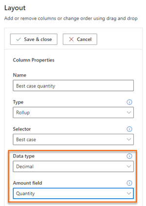
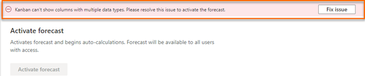
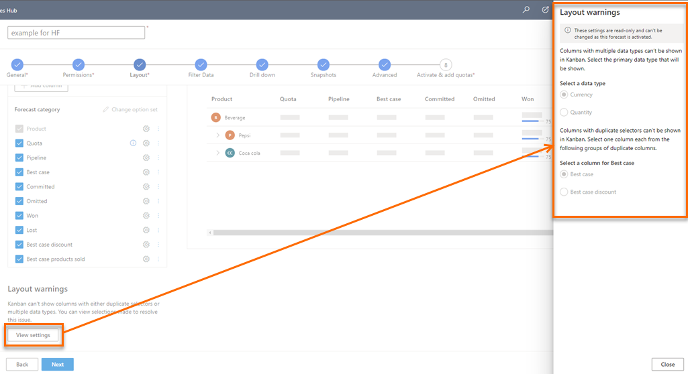

# Forecast with multiple data type columns

You can have multiple columns with different data types such as currency and quantity in a single forecast. An example use case is, for a product-based forecast, you can have a view with both product volume numbers (quantity) and product revenue (currency) for the same forecast category column (Best case quantity and Best case revenue). 

> [!div class="mx-imgBorder"]
> 

>[!NOTE]
>To configure columns, see [Choose layout and columns](choose-layout-and-columns-forecast.md).

In forecast grid, all data type columns are displayed in a single view. For Kanban, deal flow, and trend chart, it doesn't make sense to show  quantity and revenue nodes of the same category. Hence, for multiple data type forecast, you must select the data type whose columns to be displayed before activating the forecast.

Similarly, kanban view, deal flows, and trend charts can't show two columns with same selector. For example, Best case selector is used for multiple revenue columns. Showing two columns of the same category in kanban and deal flow is not appropriate. So, you must choose a revenue column to display in these views before activating the forecast. 

>[!NOTE]
>For deal flows and trend charts, you must enable premium forecasting.

let's look at few examples on how you can configure and activate these forecasts.

- [Example 1: With a forecast category, create two different currency columns and a quantity column](#same-fc-different-data-type-currency-qty)
- [Example 2: With a forecast category, create a currency column and a quantity column](#same-fc-different-data-type)
- [Example 3: With two different forecast categories, create a currency column and a quantity column](#different-fc-different-data-type)

**Example 1: With a forecast category, create two different currency columns and a quantity column**

You're configuring a forecast in which you want to see **Best case** forecast category's total amount, discount amount, and number of products sold to get this amount. You configure three **Best case** columns as following:

| Column name | Selector | Data type | Amount field |
|-------------|----------|-----------|--------------|
| *Best case* | Best case| Currency | Actual amount |
| *Best case discount* | Best case| Currency | Discount Amount |
| *Best case products sold* | Best case| Integer | Number of products sold |

After you've completed the other configuration steps as required and while activating, an error message is displayed on the top of the **Activate forecast** configuration page. More information: [Activate and upload simple columns data](activate-upload-simple-columns-data-forecast.md)

> [!div class="mx-imgBorder"]
> 

Select **Fix Issue** and the following **Layout warning** pane is displayed to select a primary data type to display values for the selected data type. 

> [!div class="mx-imgBorder"]
>  

- If you select the primary data type as **Quantity**, the forecast chooses the **Best case products sold** column to display in the kanban view, deal flows, and trend charts as the **Best case products sold** column is the only column that has a quantity (integer) data type. You can proceed with activating the forecast as there is no conflict between the columns display. 
    
    > [!div class="mx-imgBorder"]
    >  

    The following screen is an example of kanban view when you select quantity as primary data type:

    > [!div class="mx-imgBorder"]
    > 
    
- If you select the primary data type as **Currency**, the forecast has to choose between **Best case** and **Best case discount** columns to display in the kanban view, deal flows, and trend charts, as both these columns have **Currency** as data type and are of the same selector (Best case). Choose the column appropriately and save. 

    > [!div class="mx-imgBorder"]
    >  

    The following screen is an example of kanban view when you select currency as primary data type:

    > [!div class="mx-imgBorder"]
    > 

**Example 2: With a forecast category, create a currency column and a quantity column**

You're configuring a forecast in which you want to see **Best case** forecast category's total amount and number of products sold to get this amount. You configure two **Best case** columns as following:

| Column name | Selector | Data type | Amount field |
|-------------|----------|-----------|--------------|
| *Best case* | Best case| Currency | Actual amount |
| *Best case products sold* | Best case| Integer | Number of products sold |

After you've completed the other configuration steps as required and while activating, an error message is displayed on the top of the **Activate forecast** configuration page. More information: [Activate and upload simple columns data](activate-upload-simple-columns-data-forecast.md)

> [!div class="mx-imgBorder"]
> 

Select **Fix Issue** and the following **Layout warning** pane is displayed to select a primary data type to display values for the selected data type. 

> [!div class="mx-imgBorder"]
>  

Select the primary data type as required. The selector is same for **Best case** (currency) and **Best case products sold** (quantity) columns and the difference is with the data type. Choose  a data type to display the column in the kanban view, deal flows, and trend charts.

**Example 3: With two different forecast categories, create a currency column and a quantity column**

You're configuring a forecast in which you want to see the total revenue of **Won** forecast category and see the products sold under the **Best case** forecast category. You configure the **Won** and **Best case** columns as following:

| Column name | Selector | Data type | Amount field |
|-------------|----------|-----------|--------------|
| *Won* | Won | Currency | Actual amount |
| *Best case products sold* | Best case| Integer | Number of products sold |

After you've completed the other configuration steps as required and while activating, an error message is displayed on the top of the **Activate forecast** configuration page. More information: [Activate and upload simple columns data](activate-upload-simple-columns-data-forecast.md)

> [!div class="mx-imgBorder"]
> 

Select **Fix Issue** and the following **Layout warning** pane is displayed to select a primary data type to display values for the selected data type. 

> [!div class="mx-imgBorder"]
>  

Select the primary data type as required. Since the **Won** (currency) and **Best case** (quantity) columns has different selectors and data types, you must choose a primary data type to display in the kanban view, deal flows, and trend charts.

## View selected primary data type

You can view the details of the primary data type that is selected for a forecast. The displayed details is view only and can't be edited. To view the details:

1. Sign in to the **Sales Hub** app.

2. In the site map, select the Change area icon , and then select **App Settings**. 

3. Under **Performance management**, select **Forecast configuration**.

    The forecast configuration page opens. 

4. Select the **More options** icon corresponding to the forecast and selects **Edit**.

5. Go to the **Layout** configuration step. At the bottom of the **Layout** section, a **Layout warnings** section is displayed. 

6. Select **View settings**. A layout warnings pane is displayed on the right-side of the page.

    > [!div class="mx-imgBorder"]
    >  

    You can view the primary data type selected for forecast and you can't edit the values.

### See also

[Activate and upload simple columns data](activate-upload-simple-columns-data-forecast.md)

[Choose layout and columns](choose-layout-and-columns-forecast.md)
