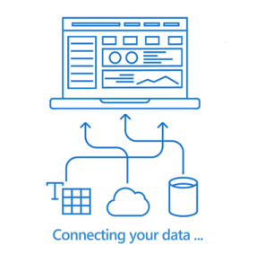
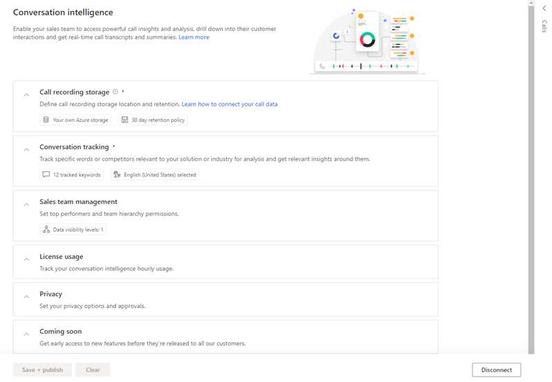
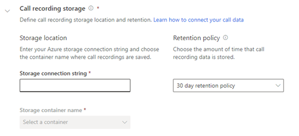
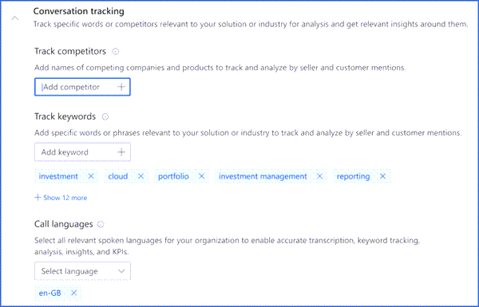
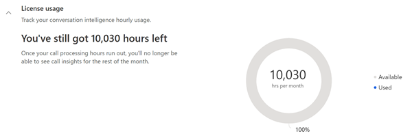
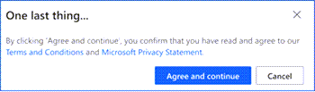
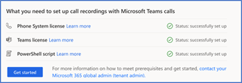
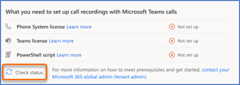
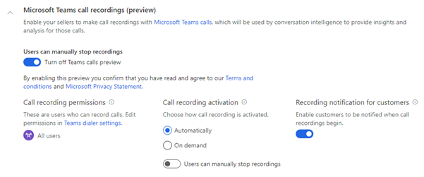

# First-run setup experience for conversation intelligence with Microsoft Teams in Dynamics 365

You can configure conversation intelligence with Microsoft Teams by completing the following section:      
- [The conversation intelligence application](#the-conversation-intelligence-application)    
- [The Sales Hub app](#the-sales-hub-app)    
- [Microsoft Teams call recording](#microsoft-teams-call-recording)    

After you sign in to conversation intelligence or your sales app, you can set up the conversation intelligence depending on the role that's assigned to you.      
- As an administrator, you can set up the complete application&mdash;including connecting to a Dynamics 365 Sales environment&mdash;grant app permissions, connect call data, enable the preview, and define tracked key words and competitors to use the features that the application offers.     
- As a sales manager or seller, you can access the application by using demo data. An administrator must configure the application so you can view the data that's relevant to you.

## The conversation intelligence application

1.	Review the prerequisites. More information: [Prerequisites to setup conversation intelligence](prereq-sales-insights-app.md)  
2.	Sign in to the conversation intelligence application as an administrator.  
    > [!div class="mx-imgBorder"]
    >    
3.	Select **Set up Conversation intelligence**.   
4.	In the **Connect your data** dialog box, select your Dynamics 365 Sales environment to connect with the application.  
    > [!div class="mx-imgBorder"]
    >     
    The application detects your environment.  
5.	In the **Terms and conditions** dialog box, carefully read the [Microsoft privacy statement](https://privacy.microsoft.com/privacystatement), and read and select the check box for the [terms and conditions](https://www.microsoft.com/licensing/product-licensing/products). Select **Agree and continue**.  
    > [!div class="mx-imgBorder"]
    >   
    >[!NOTE]
    >Selecting the first check box allows Microsoft to collect your organization's data to improve the quality of insights. This is optional. 
    The application takes a few minutes to connect to your data, during which a progress dialog box is displayed.
    > [!div class="mx-imgBorder"]
    >     
6.	In the **Connect your call data** dialog box, enter the **Storage connection string** and **Container name**, and then select **Connect**. More information: [Configure conversation intelligence to connect call data](configure-conversation-intelligence-call-data.md)  
    > [!div class="mx-imgBorder"]
    >    
7.	If you want to turn on access to preview features, in the **Coming soon** dialog box, select the check box and then select **Agree and continue**.  
    > [!div class="mx-imgBorder"]
    >    

    > [!NOTE]
    > If you don't want to enable the preview feature for your organization, skip this step. You can always enable preview features later. More information: [Enable coming soon features](enable-preview-features-sales-insights-app.md)  
8.	In the **Keyword and competitor tracking** dialog box, add the keywords and competitors that you want to track on the call. You can update these keywords and trackers later if your organization's requirements change. More information: [Configure conversation content](../sales/configure-keywords-competitors.md)      
    > [!NOTE]
    > You can also skip adding the keywords and competitors at this point. You can always add them later.  
    
    > [!div class="mx-imgBorder"]
    >    
9.	Select **Finish** to complete the setup of conversation intelligence for your organization.
    The status message will be displayed at the top of the page.  
    > [!div class="mx-imgBorder"]
    > 

Now your conversation intelligence application is ready, and managers and sellers can use it to view this data.

## The Sales Hub app

Perform the following steps to configure conversation intelligence through the Sales Hub app.

1.	You must have the Dynamics 365 system administrator or equivalent security role. More information: [Assign a security role to a user](https://docs.microsoft.com/power-platform/admin/create-users-assign-online-security-roles#assign-a-security-role-to-a-user)  
2.	Sign in to Dynamics 365, and go to your sales app.  
3.	Select the **change area**  in the lower-left corner of the page, and then select **Sales Insights settings**.  
    > [!div class="mx-imgBorder"]
    >   
4.	On the configuration page, under **Productivity**, select **Conversation intelligence**.  
    > [!div class="mx-imgBorder"]
    >   
5.	In the **Call recording storage** section, configure the storage-related options as follows:  
    - **Storage location**: Enter the **Storage connection string** and **Container name** to upload the call recordings for analysis. More information: [Configure conversation intelligence to connect call data](../sales/configure-conversation-intelligence-call-data.md).    

        >[!NOTE]
        >By default, the Microsoft provided storage is selected, and we recommend that you use this storage.   

    - **Retention policy**: Choose a time limit for data retention. The application retains call recording data for the specified time limit and deletes it when the time limit is reached. More information: [Retention Policy](data-retention-deletion-policy.md#retention-policy)  
    > [!div class="mx-imgBorder"]
    >   
6.	In the **Conversation tracking** section, add the keywords and competitors that you want to track on the call. You can update these keywords and trackers later when your organization's requirements change. Also, you can add languages that the sellers might use during their calls with customers. More information: [Configure conversation content](../sales/configure-keywords-competitors.md)    
    > [!div class="mx-imgBorder"]
    >   
    >[!NOTE]
    >- Storage and conversation tracking are the only required fields for first-time onboarding to conversation intelligence. Steps 7 to 10, including, are optional. You can choose to configure now or later when required. If you choose to configure these settings later, you can skip to step 11. 
    >- Sales managers can configure the conversation trackers specific to their team.  

7.	In the **Sales team management** section, configure the top sellers and hierarchy options as follows:  
    - **Call data visibility**: Select the levels of hierarchy for which sales managers can view conversation intelligence data. 
    - **Team members and top performers**: You can view the names of their team members whose calls are being analyzed in conversation intelligence, select their top performers. You can choose the top performers manually, or let the application choose them automatically. Select one of the following options:  
        - **Manually select top performers**: Choose top performers from the list of sellers. In the **Top performer** column, select the star icon corresponding to a seller. The seller is added to the top performers list, where the seller's data is compared against other sellers.
        - **Enable automatic identification of top performers**: The application automatically selects the top performers based on the number of leads they qualified or opportunities they won. When you select this option, you choose whether to rank performers **by won opportunities** or **by lead qualification**.   
    You can skip configuring this section and add your sales team later, when required. More information: [Configure and view your team page](../sales/configure-view-your-team-page.md).

    > [!div class="mx-imgBorder"]
    >   

8.	In the **License usage** section, you can view the information about the total call recording processing hours left and used. This information view-only and can't be changed.  
    > [!div class="mx-imgBorder"]
    >    
9.	In the **Privacy** section, you can select the check box to allow Microsoft to improve the quality of insights through read-only access to your organization's data in conversation intelligence. This is optional.  
    > [!div class="mx-imgBorder"]
    >    
10.	In the **Coming soon** section, select the **Access new features before they're released to all our customers** check box to
    enable preview features for your organization. If you prefer not to enable preview features at this time, skip this step. You can always enable them later. More information: [Enable coming soon features](../sales/enable-preview-features-sales-insights-app.md)  
    > [!div class="mx-imgBorder"]
    >   
11.	Select **Save + publish**.      
    A message is displayed to accept the terms and conditions. Read the terms and conditions, and the privacy statement, carefully. Select **Agree and continue**.      
    > [!div class="mx-imgBorder"]
    >   

Conversation intelligence is configured and ready for use in your organization.

## Microsoft Teams call recording

> [!IMPORTANT]
> - The enhanced experience for Microsoft Teams calling with conversation intelligence is a preview feature. [!INCLUDE[cc-preview-features-definition](../includes/cc-preview-features-definition.md)]
> - [!INCLUDE[cc-preview-features-expect-changes](../includes/cc-preview-features-expect-changes.md)]
> - [!INCLUDE[cc-preview-features-no-ms-support](../includes/cc-preview-features-no-ms-support.md)] 

When Microsoft Teams call recording is integrated with conversation intelligence, making calls and analyzing conversations are made easy. An organization's sales teams can drill down into their customer interactions, and get real-time call transcripts and post-call summaries.

As a Dynamics 365 system administrator, you must configure conversation intelligence to connect Microsoft Teams call recording for your sales teams to get real-time call transcripts, post-call summaries, and call insights.

### Review the prerequisites

Review the following requirements before you configure Microsoft Teams call recording for conversation intelligence:

- You must have a Dynamics 365 system administrator or equivalent security role. More information: [Assign a security role to a user](https://docs.microsoft.com/power-platform/admin/create-users-assign-online-security-roles#assign-a-security-role-to-a-user)
- Your organization has a phone system installed with a valid license to use it. More information: [Set up Phone System in your organization](https://docs.microsoft.com/MicrosoftTeams/setting-up-your-phone-system)
- You have a license to use Microsoft Teams call recording. More information: [Microsoft Teams add-on licenses](https://docs.microsoft.com/MicrosoftTeams/teams-add-on-licensing/microsoft-teams-add-on-licensing?tabs=small-business)
- You have [configured Microsoft Teams dialer](https://docs.microsoft.com/dynamics365/sales-enterprise/configure-microsoft-teams-dialer) in your organization.
- A tenant administrator must run the PowerShell script, described in the [Run the PowerShell script to record calls](#run-the-powershell-script-to-record-calls) section, to record, and store Microsoft Teams calls. information: 

### Run the PowerShell script to record calls

Before you configure the Teams dialer, run the PowerShell script to record calls through Teams and store them in default Microsoft storage for real-time processing. You must have tenant administrator privileges to run the script. Follow these steps:

1.	Download the PowerShell script to your local computer. Select **Download**.   
    > [!div class="mx-imgBorder"]
    >      

2.	Open a PowerShell command window and go to the script location.     
3.	To run the script, enter the following command, and then press **Enter**:     
    ```.\<script name>```     
    The package starts installing and a sign-in dialog box opens.     
4.	Enter your tenant administrator credentials to sign in to your organization to create the following:     
    -	Azure Active Directory (Azure AD) security group for whom the recording will be enabled.     
    -	Microsoft Teams call recording&ndash;related artifacts, such as service principal and recording policy.      
5.	The script installs successfully.     

You can proceed to configure the Microsoft Teams call recording for conversation intelligence.

### Configure Microsoft Teams call recording

1.	Sign in to Dynamics 365 Sales Hub app.

2.	Select the **change area**  in the lower-left corner of the page, and then select **Sales Insights settings**.  
    > [!div class="mx-imgBorder"]
    >   

3.	On the site map, under **Connection insights**, select **Conversation intelligence**.     
    The conversation intelligence requirements verification page opens.

    > [!div class="mx-imgBorder"]
    > 

4.	In the **What you need to set up Microsoft Teams calls** section, the application validates the licenses to use the phone system and Microsoft Teams for your organization. Also, it verifies that the PowerShell script to record and store the calls for Microsoft Teams has been run in your organization.

    - Upon successful validation, the status corresponding to **Phone system license**, **Teams license**, and **PowerShell script** is displayed as **Status: Successfully set up**. Proceed to step 5.

      > [!div class="mx-imgBorder"]
      > 

    - <a name="teams-tenant-admin-contact"></a> If any of the validations fails, you can't proceed with the configuration. You must contact your tenant administrator to set up the phone system and Microsoft Teams call recording for your organization.
    When the tenant administrator reviews and completes the configuration of your [phone system](https://docs.microsoft.com/MicrosoftTeams/setting-up-your-phone-system) and [Microsoft Teams licenses](https://docs.microsoft.com/MicrosoftTeams/teams-add-on-licensing/microsoft-teams-add-on-licensing?tabs=small-business), 
    configure the [PowerShell script to record calls](#run-the-powershell-script-to-record-calls), as described earlier in this topic. Upon successful validation of the licenses, continue with the configuration. 
    Select **Check status**.
      > [!div class="mx-imgBorder"]
      > 

    >[!NOTE]
    >If you don't want to use default Microsoft provided storage, use your custom defined storage location to upload call recording, under **Record and upload your own calls**, select **Connect my own storage**. You're directed to the storage settings page. To learn more, go to [The Sales Hub app](#the-sales-hub-app), earlier in this topic.   
    >

5.	Select **Get started**. The conversation intelligence configuration page opens.

6.	Under **Microsoft Teams call recordings (preview)**, configure the call-related options as described in the following table.

    | Option | Description |
    |--------|-------------|
    | Turn on Teams call preview | Turn on this toggle to enable the preview to use Microsoft Teams call recording as your phone system to record calls. More information: [Configure Microsoft Teams dialer](https://docs.microsoft.com/dynamics365/sales-enterprise/configure-microsoft-teams-dialer) |
    | Call recording permissions | Specifies the security roles from your organization who have permission to use the Microsoft Teams dialer. By default, permission is granted to all security roles in your organization. If you want to add or remove security roles, go to [Configure the dialer](https://docs.microsoft.com/dynamics365/sales-enterprise/configure-microsoft-teams-dialer#configure-the-dialer). |
    | Call recording activation | Select an option to initiate call recordings:<ul><li>**Automatically**: Select this option if you want the calls to be automatically recorded when a call is initiated.</li><li>**On demand**: Select this option if you want to allow sellers to start the call recording when a call is initiated.</li></ul>Turn on the **Users can manually stop recording** toggle to allow users to stop recording at any point during the call. |
    | Recording notification for customers | Turn on this toggle to notify customers when the call recording is initiated. This lets customers know that the sellers are recording their conversation. |
    
    > [!div class="mx-imgBorder"]
    >    

7.	Under **Call recording storage**, configure the storage-related options as described in the following table.

    | Option | Description |
    |--------|-------------|
    | Storage for call recordings | Select an option to store your call recordings for analysis:<ul><li>**Microsoft provided storage**: Select this option if you want to use the storage provided by Microsoft. By default, this option is selected, and we recommend that you use this storage.</li><li>**Your own Azure storage**: Select this option if you want to use your custom Azure storage. After you select this option, enter the **Storage connection string** and **Container name**.</li></ul> To learn more, go to [Configure conversation intelligence to connect call data](configure-conversation-intelligence-call-data.md). |
    | Retention policy | Choose a retention time limit. The application will retain call recording data for the specified time limit and deletes it when the time limit is reached. To learn more, go to [Retention Policy](data-retention-deletion-policy.md#retention-policy). |   

    > [!div class="mx-imgBorder"]
    > 

    >[!NOTE]
    > Steps 8 to 12, including, are optional. You can choose to configure now or later when required. If you choose to configure these settings later, you can skip to step 13.    

8.	Under **Conversation tracking**, add the keywords and competitors that you want to track on the call. You can update these keywords and competitors later if your organization requires it. Also, you can add languages that the sellers might use during their calls with customers. To learn more, go to [Configure keywords and competitors in Conversation content](configure-keywords-competitors.md).     
    > [!div class="mx-imgBorder"]
    >     
9. In the **Sales team management** section, configure the top sellers and hierarchy options as follows:  
    - **Call data visibility**: Select the levels of hierarchy for which sales managers can view conversation intelligence data.  
    - **Team members and top performers**: You can view the names of your team members whose calls are being analyzed in conversation intelligence, select your top performers, and delete data if necessary. 
        You can choose the top performers manually, or let the application choose them automatically. Select one of the following options:  
        - **Manually select top performers**: Choose top performers from the list of sellers. In the **Top performer** column, select the star icon corresponding to a seller. The seller is added to the top performers list, where the seller's data is compared against other sellers.
        - **Enable automatic identification of top performers**: The application automatically selects the top performers based on the number of leads they qualified or opportunities they won. When you select this option, you choose whether to rank performers **by won opportunities** or **by lead qualification**.  
    > [!div class="mx-imgBorder"]
    >   
    You can skip configuring this section and add your sales team later, when required. More information: [Configure and view your team page](../sales/configure-view-your-team-page.md) 
10.	In the **License usage** section, you can view information about the total call recording processing hours that are left versus how many have been used. This information view-only and can't be changed.  
    > [!div class="mx-imgBorder"]
    >    
11.	In the **Privacy** section, you can select the check box to allow Microsoft to improve the quality of insights through read-only access to your organization's data in conversation intelligence. This is optional.  
    > [!div class="mx-imgBorder"]
    >    
12.	In the **Coming soon** section, select the **Access new features before they're released to all our customers** check box to turn on the "coming soon" feature.      
    If you don't want to enable preview features for your organization, skip this step. You can always enable them later. More information: [Enable coming soon features](../sales/enable-preview-features-sales-insights-app.md)  
    > [!div class="mx-imgBorder"]
    >   
13.	Select **Save + publish**.      
    A message is displayed to accept the terms and conditions. Read the terms and conditions, and the privacy statement, carefully. Select **Agree and continue**.      
    > [!div class="mx-imgBorder"]
    >     

Microsoft Teams call recording for conversation intelligence is configured and ready for use in your organization.

### See also

[Introduction to administer conversation intelligence](intro-admin-guide-sales-insights.md#administer-conversation-intelligence)  
[Prerequisites to use conversation intelligence](prereq-sales-insights-app.md)
