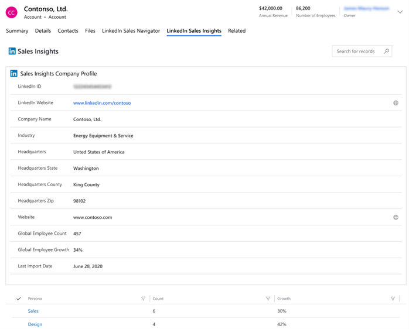
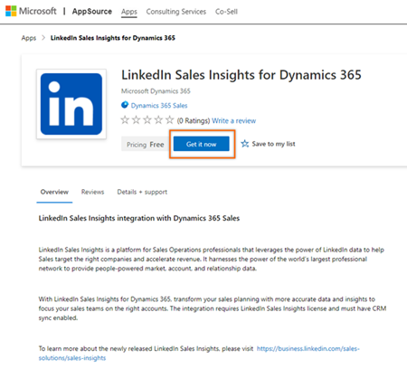
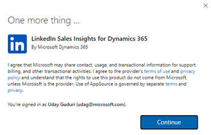
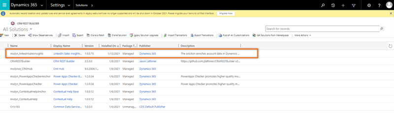

# Install or delete the LinkedIn Sales Insights solution

LinkedIn Sales Insights integration imports the latest company profile data&mdash;such as personas, number of employees, and company URL&mdash;from LinkedIn Sales Insights into a matched account in Dynamics 365 automatically, to help keep your data up to date. Importing this data reduces the manual effort required to match company profiles between the two products, enter the details in Dynamics 365 Sales and frequently update data as LSI updates them.

As an administrator, you can install LinkedIn Sales Insights and make it available for your sales teams to use. When installed, all the accounts that are available in your organization will display the **LinkedIn Sales Insights** tab in **Account** forms. Those accounts that have a matching LinkedIn Sales Insights company profile will show data from LinkedIn Sales Insights.

> [!div class="mx-imgBorder"]
> 

## Review the prerequisites

Before you install LinkedIn Sales Insights, be sure you meet the following requirements:

- You have a **System Administrator** security role in Dynamics 365.
- You have a [Microsoft Relationship Sales](https://dynamics.microsoft.com/sales/relationship-sales/) subscription for Dynamics 365 and signed up for [LinkedIn Sales Insights](https://business.linkedin.com/sales-solutions).    
    or     
    You've **LinkedIn Sales Navigator Team** or **LinkedIn Sales Navigator Enterprise** license, and signed up your team for **LinkedIn Sales Insights**. More information: [LinkedIn Sales Solutions](https://business.linkedin.com/sales-solutions)

    >[!NOTE]
    >We recommend having a Microsoft Relationship Sales solution Plus license. To learn more, see the Dynamics 365 Sales section in the [Microsoft Dynamics 365 Licensing Guide](https://go.microsoft.com/fwlink/?LinkId=866544).

- You've enabled JavaScript in your browser.
- You've disabled your pop-up blocker for the Dynamics 365 domain.
- CRM sync is enabled for your organization. More information: [Enable Sales Navigator CRM Sync & Activity Writeback for Dynamics 365](https://business.linkedin.com/sales-solutions/sales-navigator-customer-hub/resources/ms-dynamics-sync-activity-writeback)

## Install the solution

1. Go to the [LinkedIn Sales Insights for Dynamics 365](https://go.microsoft.com/fwlink/?linkid=2154471) page, and then select **Get it now**.

    > [!div class="mx-imgBorder"]
    > 

2. Read the terms and conditions, and then select **Continue**.     

    > [!div class="mx-imgBorder"]
    > 

    A Power Platform admin center page opens where you can select the organization to install LinkedIn Sales Insights for Dynamics 365.

    > [!div class="mx-imgBorder"]
    > 

3. In the **Select an environment** list, select your organization, select the check boxes for Microsoft and Dynamics 365 legal terms and privacy statements, and then select **Install**. On the **Manage your solutions** page, you can see the status of the installation.

To verify that the installation is complete, perform the steps in the following procedure.

## Validate the installation

1. In your app, select **Settings**, and then select **Advanced Settings**.

2. Go to **Settings** > **Customizations** > **Solutions**.

3. Verify that the **msdyn_linkedinsalesinsights** solution is installed in your organization.

    > [!div class="mx-imgBorder"]
    > 

## Uninstall the solution

1. In your app, select **Settings**, and then select **Advanced Settings**.

2. Go to **Settings** > **Customizations** > **Solutions**.

3. Select the **msdyn_linkedinsalesinsights** solution, and then select **Delete**.

4. In the confirmation message that appears, select **OK**.

The solution is removed from your organization.

### See also

[Understand the LinkedIn Sales Insights tab](understand-lsi-accounts-form.md)  
[LinkedIn Sales Insights for Dynamics 365 Sales - Installation Guide](https://www.linkedin.com/help/sales-navigator/answer/a419445)
