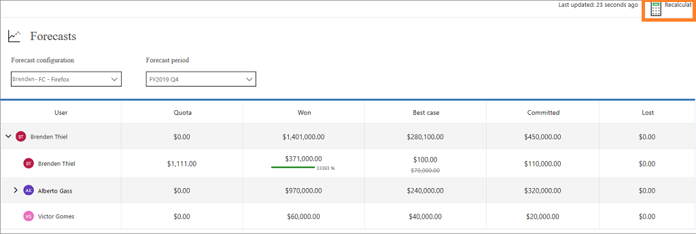
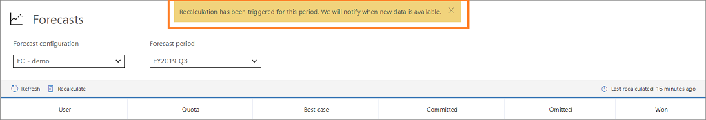
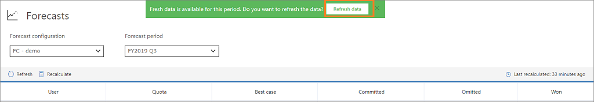

# Maintain up-to-date forecast data

Forecast data is kept up to date by being automatically recalculated at regular intervals. If you're actively interacting with the forecast, a recalculation is triggered when the data is found to be more than 10 minutes old. After the recalculation, you'll be prompted to refresh the forecast grid to show the latest data.

If you're not actively interacting with the forecast, the data is recalculated every hour. The **Last recalculated** label on the command bar shows the time when the forecast was last recalculated successfully.

If you know that the underlying data has changed, you can select **Recalculate** to manually recalculate, and then refresh to view the updated values. When you recalculate: 

-	The aggregation and roll-ups for the underlying data are recalculated.

-	Any target or quota changes are checked and updated.

-	Any other changes affecting the forecast values (excluding hierarchy changes) are refreshed.

-	Only the current forecast period is recalculated.

> [!NOTE]
> The **Recalculate** command doesn't change any value that was manually adjusted.

**To recalculate and refresh forecast data manually**

1. Select **Recalculate** on the command bar.

    > [!div class="mx-imgBorder"]
    > 
    
    A notification appears at the bottom of the screen, confirming the recalculation. Recalculation happens in the background, and you can continue to work while recalculation is in progress.

    > [!div class="mx-imgBorder"]
    > 

2. After the application recalculates the forecast data, a notification appears to refresh the data. On the notification, select **Refresh page**.

    > [!div class="mx-imgBorder"]
    > 

    > [!NOTE]
    > You can cancel the notification and refresh the data later. Select **Refresh** on the command bar.

After recalculation, the data in the forecast reflects the latest opportunity and hierarchical changes.

### See also

[Project accurate revenue with sales forecasting](project-accurate-revenue-sales-forecasting.md) 

[View a forecast](view-forecasts.md) 

[Analyze revenue outcome by using predictive forecasting](/dynamics365/ai/sales/analyze-revenue-outcome-using-predictive-forecasting)

[Troubleshooting forecasts](ts-forecasts.md)

[!INCLUDE[footer-include](../includes/footer-banner.md)]