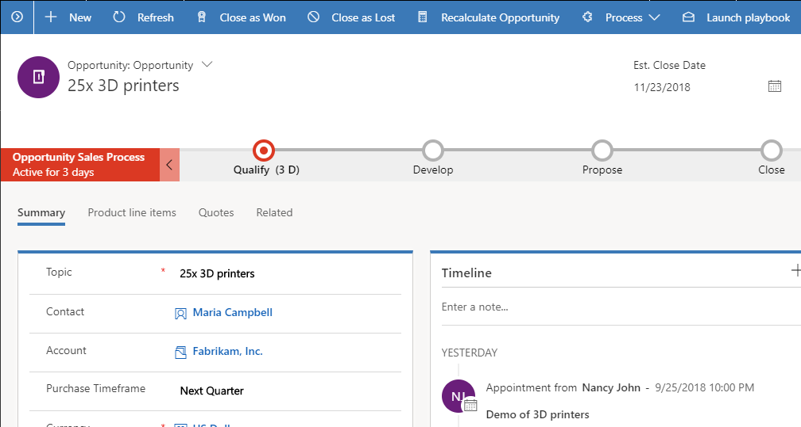

# Launch a playbook to carry out activities consistently

To ensure consistency in your business process or to know what steps to follow in certain scenarios or events, rely on the playbooks prepared by your managers that guide you with the actions you can take. Playbooks can also contain best practices based on practices that have worked in similar situations before.

1. Make sure you have the **Playbook user** role or equivalent permissions.

2.  Go to the record you want to launch playbook from. For example, if you know your organization has playbooks created for opportunities, open an opportunity record.

3.  On the command bar, select **Launch playbook**.

     > [!div class="mx-imgBorder"]
     >   

    > [!NOTE]
    > The **Launch playbook** button appears on an entity form only when there’s at least one published playbook template for that entity. If you do not see this button, talk to your playbook manager.

4.  In the **Playbook templates** dialog box, select a playbook that you want to use, and then select **Launch**.

    You’ll see a notification “Playbook launched successfully.”

    > [!NOTE]
    > You can launch only one playbook at a time.

### See also
[Track playbook activities](track-playbook-activities.md)  
[Enforce best practices with playbooks](enforce-best-practices-playbooks.md)  
[Mark playbook as completed](mark-playbook-completed.md)

[!INCLUDE[footer-include](../includes/footer-banner.md)]