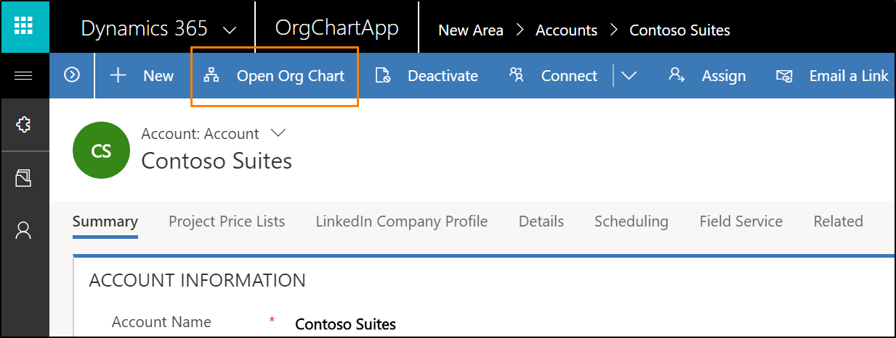
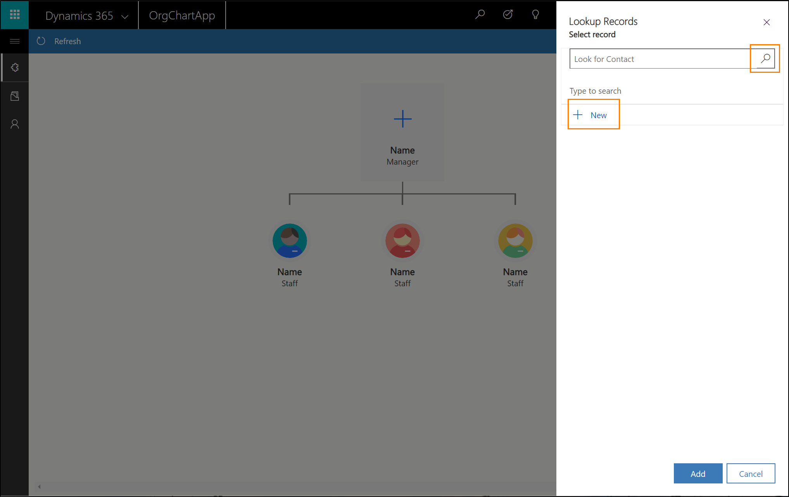
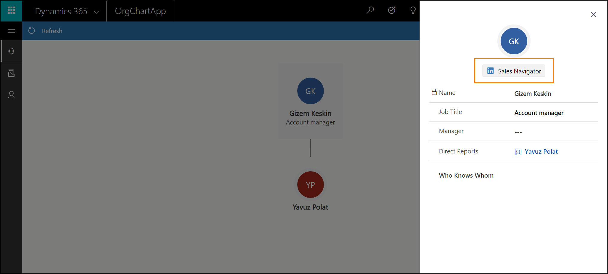
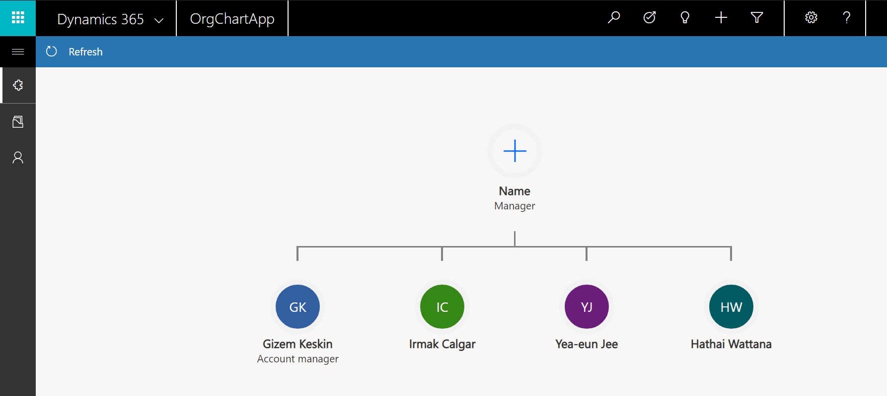

# Organize contacts in live org charts for accounts

The live org chart lets salespeople maintain external organization charts for their accounts. [!INCLUDE [pn-dyn-365-sales](../includes/pn-dyn-365-sales.md)] users can build a hierarchy for existing accounts or use it as a starting point for adding contacts to a new account. The org chart also provides easy access to an embedded [!INCLUDE [pn-linkedin](../includes/pn-linkedin.md)] Sales Navigator widget, helping to ensure that contacts are kept up to date.

> [!IMPORTANT]
> When using the org chart, the hierarchy settings will be auto-enabled if they weren't enabled before. A relationship with schema name `contact_parent_contact` will be created with the parent attribute schema name `parent_contactid`. If you wish to use a different relationship for the org chart, please contact your admin to create a new [hierarchical relationship](https://blogs.technet.microsoft.com/lystavlen/2014/10/02/how-to-enable-hierarchy-to-contacts-in-dynamics-crm-2015/).

## Accessing the Org Chart

The org chart is accessible from the account form. Select **Open Org Chart** from the command bar to open the org chart for the account.
 

When entering the org chart for a new account with no contacts, a placeholder org chart will be presented. The contacts are placeholders, representing a manager and direct reports which can be added to the chart.

## Add a contact to the org chart

1. Select the manager node which is represented with a ‘plus’ icon.   
This will open a **Lookup Records** side panel where you can search for contacts, or quickly create a new one. The search for contacts will return results for contacts which are currently not associated with another account to avoid disrupting another hierarchy. All contact searches behave in this manner.

   
 
2. To create a new contact, select **New Contact** and enter the contact details in the quick create form.

3. Select **Save and Close**.

4. In the **Lookup Records** side panel, select **Add**. After the contact is saved, the org chart will show the contact which is now associated with the account with their full name and their job title.

5. Double-click the contact to add more contacts to the chart or edit the contact details. A contact can only have a single manager but may have many direct reports. 
 
## Embedded [!INCLUDE [pn-linkedin](../includes/pn-linkedin.md)] Sales Navigator control

If you have a Sales Navigator seat, [!INCLUDE [pn-linkedin](../includes/pn-linkedin.md)] profiles are always just a few clicks away and can be used to ensure contact details remain up to date. Sign in to the service by selecting the **Sales Navigator** button. You’ll then be presented with the embedded [!INCLUDE [pn-linkedin](../includes/pn-linkedin.md)] Sales Navigator widget, where you can match the contact and see their [!INCLUDE [pn-linkedin](../includes/pn-linkedin.md)] profile.

> [!NOTE]
> Removing fields from the Sales Navigator widget (Contact Details pane) or adding new fields isn't supported.

## Org chart for accounts without hierarchy

If an organization has no hierarchy associated with the contacts, then the contacts will all be on the same level and report to a placeholder contact. You can edit the contact details to manage the hierarchy.

 
## Manage the org chart

### Drag and drop contacts to edit the hierarchy

Select and drag any contact on the org chart. When a contact is dragged over to another contact, it becomes a direct report of the contact that it was dragged to. When contacts are dragged and dropped, their direct reports move with them. When you finish arranging the contacts, select the **Save** button in the the command bar.
 
### Expand and collapse a hierarchy

When you hover over a contact, you'll find arrows to expand and collapse the hierarchy of a contact. Select the arrows to show or hide peers or reports of a contact.
 
### Zoom and pan on the org chart

Use the mouse wheel to zoom the org chart in and out. By clicking and dragging on the canvas you can pan across the org chart. For larger organizations, this makes navigating the org chart much easier.

## Remove contacts from the org chart

To remove a contact from the org chart, select it and select the **Remove** button from the command bar. This will remove the contact from the org chart, but it will not delete the contact, just the association the contact has with the account.
When a contact is removed, the direct reports (if available) of that contact will move to the level of the deleted contact.
 

### See also
[Work with accounts and contacts in model-driven apps](../basics/accounts-contacts.md)    
[User Guide (Sales and Sales Hub)](user-guide.md)    
[Administrator and Sales Manager Guide](admin-guide.md)    
[How to enable hierarchy for contacts](https://blogs.technet.microsoft.com/lystavlen/2014/10/02/how-to-enable-hierarchy-to-contacts-in-dynamics-crm-2015/)

[!INCLUDE[footer-include](../includes/footer-banner.md)]