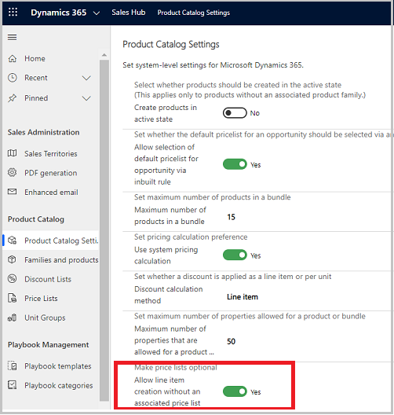
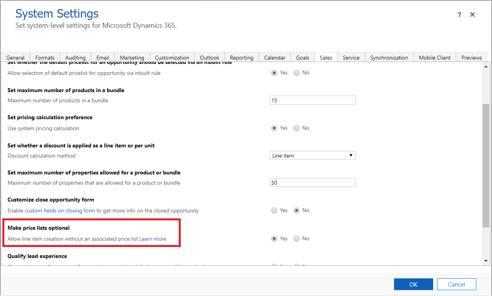

# Allow adding products without associated price list

When adding products to opportunities, quotes, orders, or invoices, at times, salespeople need to specify the product prices ad hoc. You can allow salespeople to add products without associating a price list first.

## Make price list optional (Sales Hub)

1.	In your app, at the bottom of the site map, select **Change area** , and select **App Settings**.

2.	Under **Product Catalog**, select **Product Catalog Settings**.

3.  Under **Make price lists optional**, set the **Allow line item creation without an associated price list** option to **Yes**.

    

4.  Select **Apply**.

## Make price list optional (legacy web client)

1.  In your app, on the nav bar, select the **Settings** icon, and then select **Advanced Settings**.

    The Business Management settings page opens in a new browser tab.

2.  On the nav bar, select **Settings**, and then select **Administration**.

3.  Select **System Settings**.

4.  In the **System Settings dialog** box, on the **Sales** tab, set the **Make
    price lists optional** field to **Yes**.

    

### See also
[Add products to an opportunity](add-products-opportunity.md)  
[Add products to a quote, order, or invoice](add-product-quote-order-invoice.md)

[!INCLUDE[footer-include](../includes/footer-banner.md)]