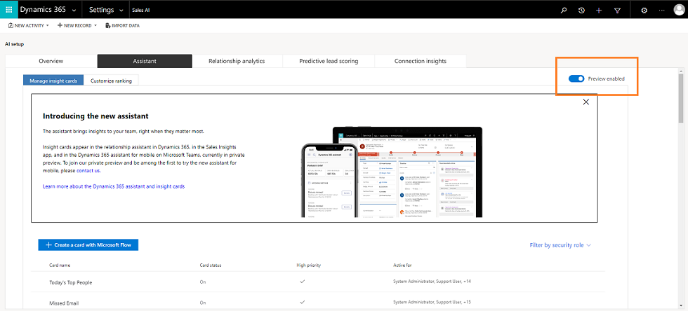
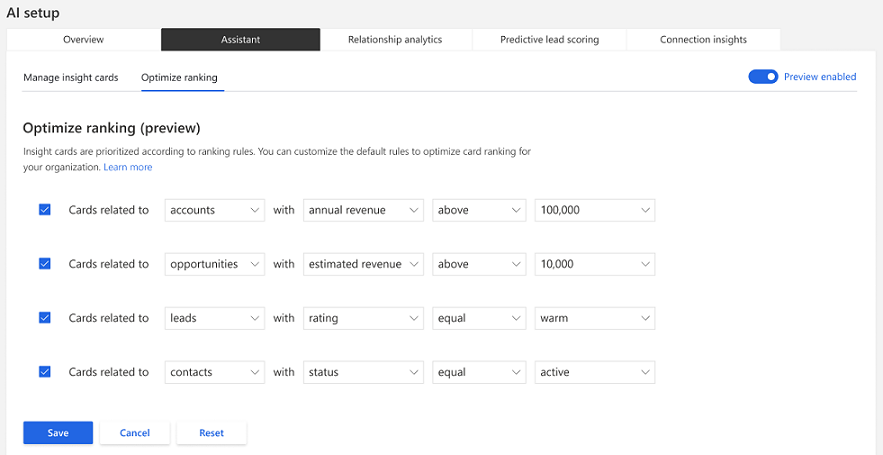

# Manage insight cards

The Assistant displays actionable insight cards (formerly called action cards) for users in [!INCLUDE[pn-dyn-365-sales](../includes/pn-dyn-365-sales.md)]. The Assistant is evolving and we're introducing new preview capabilities such as customized insight cards to your team. To learn more about predefined insight cards, see [Action cards](action-cards-reference.md).

With the new redesigned assistant administration, you can perform tasks that were previously available, such as turn on and off the insight cards and set thresholds for certain cards. Additionally, you can use preview capabilities to create customized insight cards and optimize card ranking for your Dynamics 365 Sales organization. The preview features include:

- [Creating custom insight cards](create-insight-cards-flow.md)
- [Prioritizing individual cards](edit-insight-cards.md#set-priority-for-a-card)
- [Optimizing card ranking](optimize-ranking-insight-cards.md)
- [Assigning cards to users by roles](edit-insight-cards.md#assign-roles-to-or-remove-roles-from-a-card)
- [Turn on or off insights cards](edit-insight-cards.md#turn-cards-on-or-off)
- [Edit flow of an insight card](edit-insight-cards.md#edit-flow-of-a-card)

> [!NOTE]
> To learn more about the characteristics of insight cards (formerly called action cards), see [Create custom cards in assistant](sample-extend-relationship-assistant-card-type.md)

## Prerequisites

Verify the following prerequisites before you start working on insight card creation.

- You must have administrative privileges.
- You must purchase a **Dynamics 365 Sales Insights** license.
- Advanced Sales insights features are enabled. To learn more, see [Install and configure premium Sales Insights features](intro-admin-guide-sales-insights.md#install-and-configure-premium-sales-insights-features).
- Preview features for Assistant are enabled.
    1. Sign in to **Dynamics 365 Sales** and go to **Settings** > **Sales AI**.
    2. Select **Configure** on the **Assistant** section.
        
        
        
        The **Assistant** tab opens.

    3. On the **Assistant** tab, select **Enable preview features**.
        
        
        
        The feature is enabled, and you can start using it.

## Understand Assistant tab

After enabling Sa;es Insights features, select **Configuration** on the **Assistant** section to go to the **Assistant** tab (configuration page). The assistant displays two tabs:

- **Manage insight cards**
- **Optimize ranking**

### Manage insight cards 

The **Manage insight cards** tab allows you to: 

- Create custom insight cards.
- View the information on the cards that are available for your organization in a tabular format.
- Filter and/or sort cards.
- Enable preview features for the assistant feature.

The following is an example of the **Manage insight cards** tab:

1. **Create cards with Microsoft Flow**: This allows you to create cards that are custom made for your organization.
To learn more, see Create custom cards.
2. **Table with card details**: This displays the cards that are available in your organization. On the cards, you can perform actions such as edit the settings, disable, assign to security roles, and prioritize.

    To learn more, see [Edit insight cards](edit-insight-cards.md).

3. **Filters**: This allows you to filter the cards displayed in the table based on the security roles. For example, if you want to view only the cards that are available to a salesperson, select Salesperson from the filter drop-down list and the table is refreshed to display the cards that are assigned only to the salesperson role.
4. **Preview enable button**: This allows you to turn on or off the preview features for customizing the assistant in your organization, giving you the opportunity to try the feature. If the preview is not enabled, you cannot create custom cards or perform other action on cards such as edit, set priorities, assign to roles, and so on.

### Optimize ranking

The **Optimize ranking** tab provides information on the rules that are created to prioritize cards to appear in the application. The following is an example of the **Optimize ranking** tab:

To learn more, see [Optimize ranking of insight cards](optimize-ranking-insight-cards.md)

### See also

[Create insight cards](create-insight-cards-flow.md)

[Edit insight cards](edit-insight-cards.md)

[Optimize ranking of insight cards](optimize-ranking-insight-cards.md)