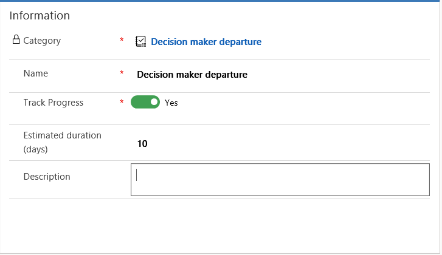
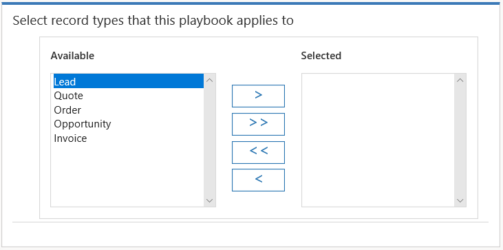
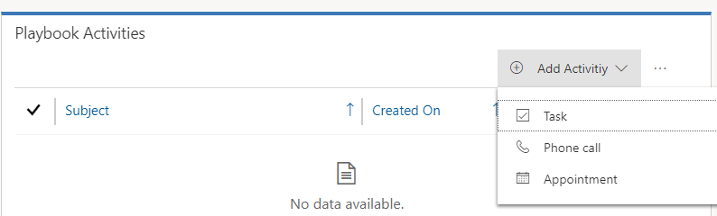
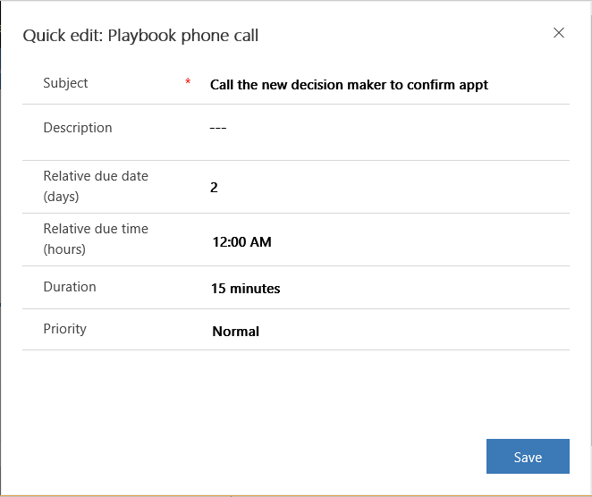

# Manage playbook templates

Playbooks provide users with guidance on recurring tasks in which consistent actions are expected. Playbooks can also contain best practices based on scenarios that have worked in similar situations before.

## Create a playbook template

1.  Make sure you have **Playbook administrator** role or equivalent permissions.

2.  In the site map, select the Change area icon , and then select **App Settings**.  

3.  Select **Playbook Templates**.

4.  In the **Playbook Template** form, provide the following details, and then select **Save**:

    - **Category**. Select the category for which you want to create the playbook template. Think of the category as an event or an issue that you want to address.

    - **Name**. Enter a descriptive name for the template.

    - **Track progress**. Select whether to track the progress of the playbook by creating the activities under a playbook; those activities are in turn linked to the record type that the playbook applies to.

        For example, consider a situation where you have a template created for an opportunity. If you set **Track Progress** to **Yes**, all playbook activities are created under the playbook that is launched from the opportunity record (following the hierarchy Opportunity record &gt; Playbook record &gt; Activities).

        If you set **Track Progress** to **No**, the playbook activities are created directly under the opportunity record (following the hierarchy Opportunity record &gt; Activities).

    - **Estimated duration (days)**. Enter the estimated duration in days to indicate the time it might take to complete the playbook template once launched.

        > [!div class="mx-imgBorder"]
        >   

5.  In the **Select record types that this playbook applies to** section, the **Available** box lists all the entities that are enabled for using playbooks. Select and move the record types to which the current playbook template applies into the **Selected** box.

    The playbook capability is currently enabled only on **Lead**, **Quote**, **Opportunity**, **Order**, **Invoice**, **Account**, and **Contact** record types. As a playbook manager, when you create a playbook template, you can select which entity that playbook applies to.

    > [!div class="mx-imgBorder"]
    >   

6.  In the **Playbook Activities** section, select **Add Activity**, and then select the activity you want to create.

    > [!div class="mx-imgBorder"]
    >   

    For example, if the playbook is defined for an event in which a decision maker leaves the organization while working with a sales person, you can create a phone call record to make a call to the new decision maker, and schedule an appointment.

7.  In the **Quick create** form of the activity, provide the following information, and then select **Save**:

    *  **Subject**. Enter a short description of the activity's objective. 

    *  **Description**. Enter additional information to describe the playbook activity.

    *  **Relative due date (days)**. Enter the number of days in which the activity is due. The starting point for the number of days is the launch date of the playbook. This field is available only for task and phone-call activities.

    *  **Relative due time (hours)**. Enter the time the activity is due.

    *  **Relative start date (days)**. Enter the number of days in which the activity must start. This date is relative to when the playbook is launched.

    *  **Relative start time**. Enter the time of day the activity must start.

    *  **Relative end date (days)**. Enter the number of days by which the activity must end. This date is relative to when the playbook is launched.

    *  **Relative end time**. Enter the time of day the activity must end.

    *  **Duration**. If you’re creating a task or a phone call, select the duration for the task or phone call activity.

    * **Priority**. Select the priority of the activity.

        > [!div class="mx-imgBorder"]
        >   

8.  In the lower-right corner, select **Save**.

    > [!NOTE]
    > After the playbook activity is created, you can associate documents related to the activity so that your sales reps can refer to these documents while working on the playbook activity. [!INCLUDE[proc-more-information](../includes/proc-more-information.md)] [Associate documents with playbook activity](associate-documents-playbook-activities.md)

## Publish a playbook template

You must publish a playbook to make it available for your users.

To publish a playbook:

1. In the list of playbook template records, select the playbook template you want to publish.
2. On the command bar, select **Publish**.

    Or

* Open the playbook template, and on the command bar, select **Publish**.

> [!NOTE]
> The playbook template you’re trying to publish must have the following:
>   -   At least one playbook activity added.
>   -   At least one record type to which the playbook template applies.

> [!IMPORTANT]
> If you want to make changes to a published playbook template, on the command bar, select **Revise**.

### See also
[Associate documents with playbook activities](associate-documents-playbook-activities.md)  
[Enforce best practices with playbooks](enforce-best-practices-playbooks.md)  
[Define playbook categories](define-playbook-categories.md)

[!INCLUDE[footer-include](../includes/footer-banner.md)]
