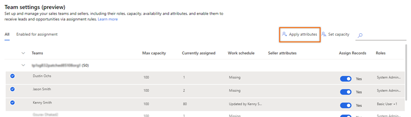
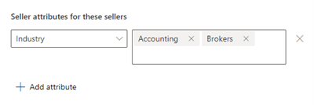
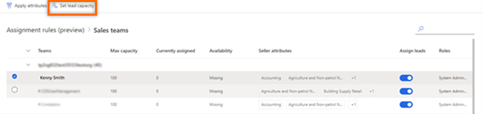
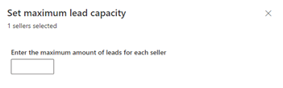
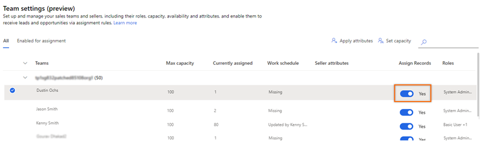
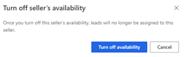

# Manage sales teams in assignment rules

Using sales team management in assignment rules, you can assign attributes to sellers and configure the maximum number of leads that a seller can handle at once. When the rule is applied to a lead, the attributes and lead capacity you've defined here will determine how the lead is assigned.

You can use the **Sales teams** page to:

-	[Add attributes to sellers](#add-attributes-to-sellers).
-	[Set lead capacity for sellers](#set-lead-capacity-for-sellers).
-	[Turn off lead assignment to sellers](#turn-off-lead-assignment-to-sellers).

Before you start using the sales teams designer, verify that the security roles that are assigned to your sellers were selected when the sales accelerator was configured. More information: step 4 in [Set up the sales accelerator](enable-configure-sales-accelerator.md)

## Add attributes to sellers

Attributes define the characteristics of a seller, such as skills, location, and language. Before you apply attributes to sellers, verify that the attributes have been defined. More information: [Create an attribute](manage-seller-attributes.md#create-an-attribute)

You can apply attributes in bulk by selecting multiple sellers at a time.
<!--markdownlint-disable MD036-->
**To add attributes**

1.	Sign in to your Dynamics 365 Sales Hub app.

2.	Go to the **Change area**  in the lower-left corner of the page, and select **Sales Insights settings**.

3.	Under **Sales accelerator**, select **Assignment rules (preview)**.

4.	On the **Assignment rules** page in the **Sales teams** section, select **Manage**.

    >[!div class="mx-imgBorder"]
    >   

    The **Sales teams** page lists the teams that include sellers whose security roles were configured when the sales accelerator was originally set up.

    >[!div class="mx-imgBorder"]
    >   

5.	On the **Sales teams** page, select the seller, and then select **Apply attribute**.  

    >[!TIP]
    >To bulk-apply the attributes, select multiple sellers.

    >[!div class="mx-imgBorder"]
    >  

    The **Apply attribute** pane opens.

6.	On the **Apply attribute** pane, select one of the following options:

    -	**Replace**: This option replaces the existing attributes that were already applied to the seller. If any leads were assigned to the seller based on the previous attributes, those leads won't be affected.
    -	**Apply More**: This option adds more attributes to the seller, in addition to the attributes that were already applied.

7.	Select **+ Add attribute**, and then choose the attribute and its corresponding values. Repeat this step for each attribute you want to add.

    >[!div class="mx-imgBorder"]
    >

8.	Select **Apply**.

The attributes are applied to the sellers.

## Set lead capacity for sellers

When you set lead capacity, you set an upper limit for the number of leads a seller can be assigned at any given time. When a seller reaches this limit, even though a lead is created and ready to be automatically assigned to the seller, the lead won't be assigned. You can view unassigned leads in the **Open Leads** view.

For example, Kenny is a seller, and his lead capacity limit is set to 5. A new lead is generated, and the assignment rule qualifies the lead to be assigned to Kenny. However, Kenny is currently handling his maximum of five leads, so the newly generated lead won't be assigned to him.

**To set lead capacity**

1.	Sign in to your Dynamics 365 Sales Hub app.   

2.	Go to the **Change area**  in the lower-left corner of the page, and select **Sales Insights settings**.   

3.	Under **Sales accelerator**, select **Assignment rules (preview)**.   

4.	On the **Assignment rules** page in the **Sales teams** section, select **Manage**.      
   The **Sales teams** page lists the sales teams with sellers whose security roles are configured during the setup of sales accelerator.

5.	On the **Sales teams** page, select the seller, and then select **Set lead capacity**.  

    >[!NOTE]
    >To bulk-apply attributes, select multiple sellers.

    >[!div class="mx-imgBorder"]
    >   

    The **Set maximum lead capacity** pane opens.

    >[!div class="mx-imgBorder"]
    >

6.	In **Enter the maximum number of leads for each seller**, enter the value you want.

7.	Select **Apply**.

    >[!NOTE]
    >If you're changing the existing maximum lead capacity, a confirmation message appears. Select **Override settings**.    
    > 
 
The maximum lead capacity limit is set for the seller.

## Turn off lead assignment to sellers

When a seller is on vacation or otherwise unavailable, you can disable lead assignment until the seller is available again. 

**To turn off lead assignment**
<!--markdownlint-enable MD036-->  
1.	Sign in to your Dynamics 365 Sales Hub app.   

2.	Go to the **Change area**  in the lower-left corner of the page, and select **Sales Insights settings**.

3.	Under **Sales accelerator**, select **Assignment rules (preview)**.

4.	On the **Assignment rules** page in the **Sales teams** section, select **Manage**. 

5. In the **Assign leads** column, turn off the toggle.

    >[!div class="mx-imgBorder"]
    >   

6. In the confirmation message, select **Turn off availability**.  

    >[!div class="mx-imgBorder"]
    >

### See also

[Manage assignment rules for lead routing](create-manage-assignment-rules-lead-routing.md)    
[Create and activate an assignment rule](create-and-activate-assignment-rule.md)

[!INCLUDE[footer-include](../includes/footer-banner.md)]
