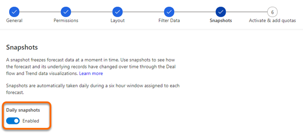

# Take snapshots automatically 

A snapshot freezes the forecast data at a moment in time. The frozen data includes aggregate column values, manual adjustments, and underlying record fields that directly affect the forecast. You can use these snapshots to see how the forecast and its underlying data have changed over time. 

Snapshots are taken automatically each day and while configuring the forecasts you can enable the option. When enabled, the snapshots are taken daily for that forecast and you can view deal flows and trend data based on the snapshots.

>[!NOTE]
>- Premium forecasting must be enabled for the snapshot feature.
>- You can enable or disable snapshots any time while a forecast active. When disabled, the previously taken snapshots are still available.  

To enable the snapshots, follow these steps:

1.	While configuring a forecast, the **Snapshots** step is displayed. 

    More information: [Configure forecasts by using a custom rollup entity](https://docs.microsoft.com/dynamics365/sales-enterprise/configure-forecast-using-custom-rollup-entity)
 
    > [!div class="mx-imgBorder"]
    >  

2.	Set the **Daily snapshots** toggle to **Enabled**. After the forecast is active, snapshots are automatically taken daily. The initial snapshot might take a few hours to generate.

    > [!div class="mx-imgBorder"]
    >  
 
>[!IMPORTANT]
>While configuring columns for a forecast, ensure that each column is unique and the **Selector** option doesn't have duplicates. If duplicates exist, when you activate the forecast an error will be displayed that states that snapshots can't be enabled for the forecast.

### See also

[About premium forecasting](configure-premium-forecasting.md) 
[Analyze deals flow between snapshots](analyze-deals-flow-between-snapshots.md)
