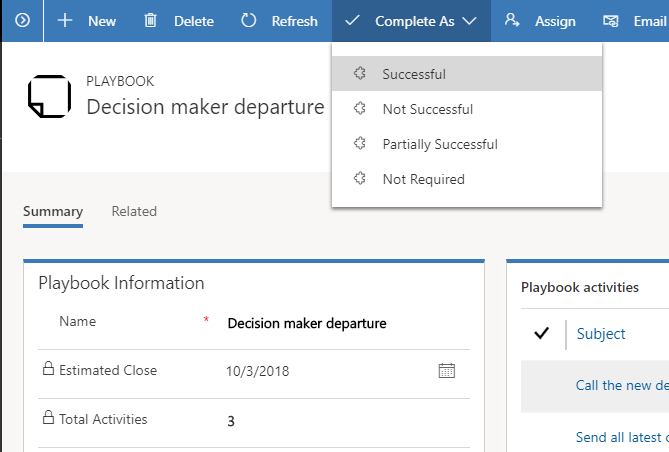

# Mark a playbook as completed

When you complete all the activities created for a playbook, you must mark the playbook as completed. This helps you to know if the playbook was successful or not.

1.  To mark a playbook as completed, go to the record you launched the playbook from (calling record).

2.  Select the **Related** tab, and then select **Playbooks**.

3. Open the playbook record.

4.  In the playbook record, on the command bar, select **Complete as**, and then select one of the following results:

    - Successful

    - Not Successful

    - Partially Successful

    - Not Required

    > [!NOTE]
    > A system administrator or customizer can add custom values to this field.

    > [!div class="mx-imgBorder"]
    > 

### See also
[Launch a playbook to carry out activities consistently](launch-playbook.md)  
[Track playbook activities](track-playbook-activities.md)

[!INCLUDE[footer-include](../includes/footer-banner.md)]