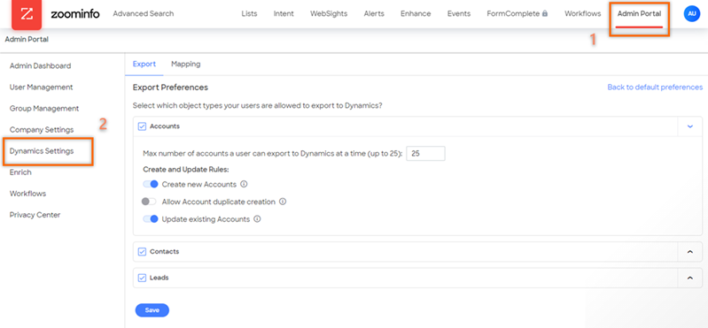

# Match fields between Dynamics 365 and ZoomInfo

When you try to export the data from the ZoomInfo app to your Dynamics 365 Sales organization, certain corresponding fields may not match and will not display updated values. To avoid such mismatches, you can map the corresponding fields between Dynamics 365 and ZoomInfo for accounts, contacts, and leads.

## Prerequisites
Before you start, be sure you have met the following prerequisites:
-	You must have the system administrator role. More information: [Assign a security role to a user](/power-platform/admin/create-users-assign-online-security-roles#assign-a-security-role-to-a-user).   
-	The ZoomInfo app is installed on your Dynamics 365 Sales organization. More information: [Install ZoomInfo app](install-zoominfo-app.md).   
-	A license to use the ZoomInfo app.

## Map the fields     
1.	Sign in to Dynamics 365 environment and open the ZoomInfo app.    
2.	On the left navigation pane, select **ZoomInfo** > **ZoomInfo**.   
    >[!NOTE]
    >The app might prompt you to enter credentials. Select either Google, Office, or enter your ZoomInfo credentials if you have an account with ZoomInfo.  

    > [!div class="mx-imgBorder"]
    > 
     
3.	On the top right corner of the page, select **More** > **Admin Portal**.
4.	On the **Admin Portal** page, select **Dynamics Settings**.

    > [!div class="mx-imgBorder"]
    >  

5.	Select the **Mapping** tab and then choose the **Accounts**, **Contacts**, or **Leads** tab to map the fields.   

    >[!NOTE]
    >In this example, we are using **Accounts**.    

    You can view the default or configured corresponding field between the ZoomInfo app and Dynamics 365.

    > [!div class="mx-imgBorder"]
    >  
    
6.	Map the fields as required. Each column is described with its functionality in the following table:   

    | Column name | Description |
    |-------------|-------------|
    | ZoomInfo Field | Displays a list of ZoomInfo fields that are available for you to map with Dynamics 365 fields. |
    | Dynamics Field | Displays a list of Dynamics 365 fields that are available for you to map. The list also includes your custom fields. |
    | Example | Displays an example of value for the selected ZoomInfo field. |
    | Update Option | Select one of the following options for the field:<ul><li>**Complete if missing**: Choose this option to only complete with ZoomInfo data if nothing exists in Dynamics. By default, this option is selected.</li><li>**Overwrite field**: Choose this option to overwrite existing data in Dynamics with ZoomInfo data.</li></ul> |
    
    >[!NOTE]
    >-	Select **Add Rows** to add more fields to the mapping table.
    >-	To set the mapped values to default, select **Back to default preferences**.  

7.	Select **Verify and save**.    

    The ZoomInfo app validates the corresponding mapped values and saves the mappings. If there are any mismatches in the mapping, an error is displayed to resolve the mismatched mappings.

### See also

[Install ZoomInfo app](install-zoominfo-app.md)   

[!INCLUDE[footer-include](../includes/footer-banner.md)]
