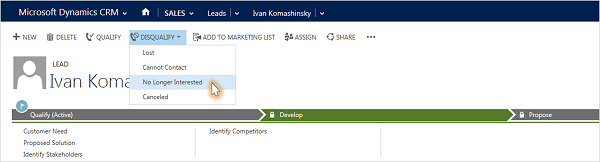

# What if you're no longer working a lead? (Sales Hub)

Let's say you've been talking to a lead and you determine that continuing to work the lead won't be worth your time, at least not right now. Not great news, but it happens.  
  
You'll need to disqualify the lead and give the reason.  

> [!NOTE]
>  Although you can delete the lead, we don't recommend it. Deletions can't be undone, and deleting a lead also deletes any notes and documents associated with the lead. Instead, disqualify the lead to preserve the history of the work you've done. In addition, when you disqualify a lead you can reopen it later.  
  
1. Open the lead.  
  
2. On the command bar, select **Disqualify**, and then select the reason.  
  
   > [!div class="mx-imgBorder"]  
   >   
  
### See also  
 [Create or edit a lead](../sales-enterprise/create-edit-lead-sales.md)   
 [Reopen a lead](../sales-enterprise/re-open-lead-sales.md)

[!INCLUDE[footer-include](../includes/footer-banner.md)]