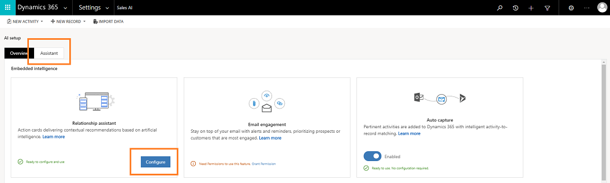

# Preview: Optimize ranking of insight cards

Applies to [!INCLUDE[pn-crm-online](../includes/pn-crm-online.md)] version 9.1.0.

[!INCLUDE [cc-beta-prerelease-disclaimer](../includes/cc-beta-prerelease-disclaimer.md)]

> [!IMPORTANT]
> [!INCLUDE[cc_preview_features_definition](../includes/cc-preview-features-definition.md)]  

The **Optimize ranking** tab provides information on the rules that are created to prioritize cards to appear in the application. The following is an example of **Optimize ranking** tab:

## How to optimize ranking

There are several cards defined for your organization and all will be displayed to the users through an externally prioritized list. In this externally prioritized list display of cards, users might miss cards that important and needs follow-ups. The **Optimize ranking** option in **Assistant** allows you to optimize the ranking of card that are important and promotes the card to display on the top.

You can define up to four rules in the ranking section and are based on the entities such as Account, Leads, and Opportunity. Also, the cards are given the priority in the order you define. For example, you created two rules the first is to prioritize cards that the annual revenue is above $100,000 and the second is prioritize cards that estimated revenue is above $10,000. The assistant analyzes the cards and displays the cards with annual revenue more than $100,000 and followed by estimated revenue with more than $10,000, later followed by the cards that are not prioritized. 

Follow these steps to rank the cards:

1. Sign in to **Dynamics 365 for Sales** and go to **Settings** > **Sales AI**.
2. On the **Assistant** section, select **Configure** or select the **Assistant** tab.

    

3. On the **Assistant** tab, select the **Optimize ranking** tab

   
 
    The list of rankings that are defined in your organization are displayed.

    When ranking rules are checked, specifying that the rules are active. If any rule not required in your organization, deselect the rule and save.

4. There are four properties you can edit for a rule. The rules are set using these four properties. The basic structure of rules displays as: **Cards related to** *'Name of the entity'* **with** *'Attribute type' 'Condition' 'Value'*. The four properties are:
    - **Name of the entity**: The entities such as account, leads, and opportunities are used to model and manage business data in Dynamics 365 for Customer Engagement apps.
        After you select the entity, the values in the Attribute type, Condition, and Value dropdowns change accordingly.
    - **Attribute type**: An entity has set of attributes. For example, the account entity contains attributes such as Name, Address, and OwnerId. 
        The list of attribute type displays in the drop down varies depending on the entity selection and is related to the fields defined within CRM.
    - **Condition**: The conditional specifies to display a card when the set condition is met. For example, some common conditions are above, equal, and below.
    - **Value**: The value specifies the unit of measure for a condition to validate for the attribute type.

        For example, you want prioritize cards of accounts where annual revenue of the account is more than $100,000 and display it to your user in your organization. You define the rule as, **Cards related to** *account* **with** *annual revenue* *above* *100,000*.

5. Save the rule.

    The ranking rule is created, processed, and applied to the cards in your organization.

### See also

- [Manage custom insight cards using Microsoft Flow](manage-custom-cards-flow.md)
- [Create insight cards](create-insight-cards.md)
- [Edit insight cards](edit-insight-cards.md)