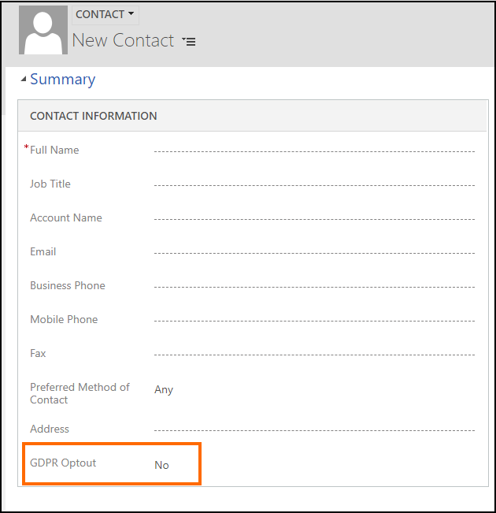

# Opt out of relationship analytics (GDPR)

A new field or attribute called **msdyn_gdproptout** (display name: **GDPR Optout**) is added to the Contact, Lead, and SystemUser entities when you [enable](intro-admin-guide-sales-insights.md) the Dynamics 365 Sales Insights features in your Dynamics 365 Sales instance. The field lets you specify whether relationship analytics will be performed on the entity record's data.

- Setting the **GDPR Optout** field to "yes/true" will prohibit any relationship analytics to be performed on the entity record's data.
- Setting the **GDPR Optout** field to "no/false" will allow relationship analytics to be performed on the entity record's data.

> [!NOTE]
> - For the [Auto Capture](/dynamics365/customer-engagement/sales-enterprise/auto-capture) feature, if you set the **GDPR Optout** field to "yes/true" for a Contact or Lead record, email data for such records won't be displayed in the respective Contact or Lead forms, or any entity form which has these Contact/Lead records as their linked or related entity.
> - This topic is applicable only for the [Relationship Analytics](relationship-analytics.md) and [Auto Capture](/dynamics365/customer-engagement/sales-enterprise/auto-capture) features.

## Setting the GDPR Optout field using UI

By default, the **GDPR Optout** field is not available on the Contact, Lead and SystemUser forms. You can customize the form to display the **GDPR Optout** field for these entities so that one can easily set an appropriate value in this field for a record. By default, the value is set to **No** (false) for this field when you create a new record.



For information about adding field to a form, see [Add a field to a form](/dynamics365/customer-engagement/customize/add-field-form)

## Setting the msdyn_gdproptout attribute value using code

You can also programmatically set or update the value of the **msdyn_gdproptout** attribute by using Web API or Organization service.
- **Web API**: When you want to update only a single attribute value for an entity record, use a PUT request with the property name appended to the Uri of the entity. The following example demonstrates how to update the `msdyn_gdproptout` attribute value to **true** of a contact record with the `contactid` value as 00000000-0000-0000-0000-000000000001.

    ```http
    PUT [Organization URI]/api/data/v9.0/contacts(00000000-0000-0000-0000-000000000001)/msdyn_gdproptout HTTP/1.1  
    Content-Type: application/json  
    OData-MaxVersion: 4.0  
    OData-Version: 4.0  

    {"value": true}
    ```

    For more information about updating records using Web API, see [Update and delete entities using the Web API](/dynamics365/customer-engagement/developer/webapi/update-delete-entities-using-web-api)

- **Organization service**: You can use the early or late bound programming style to update an attribute. The following example demonstrates how to update the `msdyn_gdproptout` attribute value to **true** for a contact record using late bound programming style.

    ```csharp  
    Entity contact = new Entity("contact");  
    
    // Create a column set to define which attribute should be retrieved.  
    ColumnSet attributes = new ColumnSet("msdyn_gdproptout");   
  
    // Retrieve the contact and its msdyn_gdproptout attribute.  
    contact = _orgService.Retrieve("contact", _contactId, attributes);  
  
    // Update the msdyn_gdproptout attribute value.  
    contact["msdyn_gdproptout"] = true;  
  
   // Update the contact record.  
   _orgService.Update(contact);  
    ```

For more examples of using the early or late bound programming style, see [Use the early-bound entity classes for create, update, and delete](/dynamics365/customer-engagement/developer/org-service/use-early-bound-entity-classes-create-update-delete) and [Use the Entity class for create, update and delete](/dynamics365/customer-engagement/developer/org-service/use-entity-class-create-update-delete).


### See also

[Dynamics 365 Sales Insights and GDPR](embedded-intelligence-gdpr.md)
