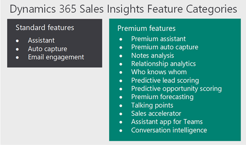

# Overview of Sales Insights Add-in for Dynamics 365 Sales

Welcome to Sales Insights add-in for Dynamics 365 Sales.

Sales Insights continuously analyzes the vast collection of customer-interaction data already stored in your Dynamics 365 Sales and Microsoft 365 databases. This helps you to better understand your business relationships, evaluate your activities in relation to previous successes, and choose the best path forward. Also, it enables you to build strong relationships with customers, take actions based on insights, and close opportunities faster.

Sales Insights helps organizations in the following four areas:

-	**Guided selling**: Guide sellers on their next course of action with timely and actionable insights.
-	**Productivity intelligence**: Free up sellers' time by minimizing manual data entry with contextual, real-time suggestions for updating existing records and creating new records, making sure your data is always up to date.
-	**Connection insights**: Build stronger relationships with customers and move relationships forward with AI-guided selling. Take preemptive steps to mitigate risks with a relationship health score.
-	**Predictive models**: Increase conversion and win rates by using AI to prioritize leads and opportunities with the highest likelihood to convert and buy.

These Sales Insights features are categorized as [standard](#standard-sales-insights-features) and [premium](#premium-sales-insights-features). The following diagram illustrates the various features available in Sales Insights: 

> [!div class="mx-imgBorder"]
> 

## Standard Sales Insights features

The standard Sales Insights features are available as part of the Dynamics 365 Sales Enterprise plan.

### Guided selling

-	**Assistant (standard)**: The assistant (formerly known as relationship assistant) analyzes information from Dynamics 365, Exchange, and other sources and suggests personalized and actionable insights to guide sellers on their best course of action, to build stronger relationships with their customers and to close more deals. More information: [Use assistant to guide customer communications](assistant.md)

### Productivity intelligence

-	**Auto capture (standard + premium)**: Auto capture helps keep track of customer engagements by surfacing suggestions to track emails and meetings from Exchange right in Sales. This way, nothing falls through the cracks and you have full control over what's being shared. In addition to activity capture, auto capture also surfaces suggestions for new contacts based on these activities. More information: [Capture customer-related activities with Auto capture](auto-capture.md)

-	**Email engagement (standard)**: Email engagement helps you create more effective email messages&mdash;and learn how your contacts are interacting with them. Stay on top of your email and prioritize those prospects or customers that are most engaged. More information: [Use email engagement to view message interactions](email-engagement.md) 

## Premium Sales Insights features

The premium Sales Insights features require a Sales Insights or a Sales Premium license that consists of the [standard features](#standard-sales-insights-features) along with the following features.

### Guided selling

-	**Assistant (premium)**: Consists of base assistant capabilities along with enhanced features that allow you to create and display custom insight cards using the assistant studio. The assistant studio helps you to create custom insight cards through Power Automate, configure prioritization, and identify who can see the cards. More information: [Manage insight cards](manage-custom-cards-flow.md)

### Productivity intelligence

-	**Sales accelerator and sequence (preview)**: Helps sales teams in organizations to focus on high-velocity selling by offering a tailored experience for sellers that minimizes the time spent identifying who is the next best customer to reach, gathering information across multiple sources, and focusing on how to approach customers. More information: [What is sales accelerator](sales-accelerator-intro.md)

-	**Notes analysis**: Monitors notes that you enter about a recent meeting or discussion with your customer to provide intelligent suggestions for new activities. More information: [How notes analysis assists you with suggestion](notes-analysis.md)

### Connection insights

-	**Conversation intelligence**: Conversation intelligence provides you with information and insights on top of your customer calls that help you easily follow up on business-critical items, allow sellers to quickly transform their engagements into revenue, and enable managers to intelligently manage the sales team and proactively coach sellers. To achieve this, conversation intelligence provides you with information through key performance indicators (KPIs) for pipeline and deals, and intelligent call data KPIs through conversation intelligence, such as sentiment analysis, keyword detection, action-item extraction and tracking, in addition to the option to play back the call and sift through the transcript&mdash;all of which provide an easy way to go through thousands and millions of calls to get to those that matter most, in seconds. More information: [Improve seller coaching and sales potential with Conversation Intelligence](dynamics365-sales-insights-app.md)

-	**Relationship analytics and health**: Gathers information from Dynamics 365 Sales for KPIs and activity histories, and displays it graphically. More information: [Use Relationship analytics to gather KPIs](relationship-analytics.md)

-	**Talking points**: Suggests topics to start a conversation with your customers based on historical email conversations such as sports, vacation, family, and entertainment. More information: [Know conversation starters for your customers](talking-points.md)

-	**Who knows whom**: Provides details such as names and email addresses of your colleagues who know a lead who you're going to interact with. More information: [How to get introduced to a lead](who-knows-whom.md)

### Predictive scoring

-	**Predictive lead scoring**: Helps you to focus on revenue generation efforts by providing a score to prioritize efforts on quality leads. More information: [Prioritize leads through scores](work-predictive-lead-scoring.md)

-	**Predictive opportunity scoring**: Helps you to focus on revenue generation efforts by providing a score to prioritize efforts on win opportunities. More information: [Prioritize opportunities through scores](work-predictive-opportunity-scoring.md)

-	**Premium forecasting**: Helps you to focus on revenue generation efforts by providing forecast projections based on sales pipeline and historical data. More information: [Analyze revenue outcome using predictive forecasting](analyze-revenue-outcome-using-predictive-forecasting.md)

> [!NOTE]
> The premium Sales Insights features that are in preview don't require a Sales Insights or a Sales Premium license during the preview period.

### See also

[Introduction to administer Sales Insights](../sales/intro-admin-guide-sales-insights.md)  
[Sales Insights privacy notice](privacy-notice.md)

[!INCLUDE[footer-include](../includes/footer-banner.md)]
