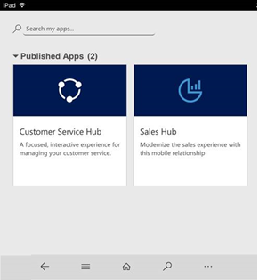

# Overview of Sales and Sales Hub

[!INCLUDE[cc-applies-to-update-9-0-0](../includes/cc_applies_to_update_9_0_0.md)]

Welcome to [!INCLUDE[pn-dyn-365-sales](../includes/pn-dyn-365-sales.md)]! 

[!INCLUDE[pn-dyn-365-sales](../includes/pn-dyn-365-sales.md)] enables sales people to build strong relationships with their customers, take actions based on insights, and close sales faster. Use [!INCLUDE[pn-dyn-365-sales](../includes/pn-dyn-365-sales.md)] to keep track of your accounts and contacts, nurture your sales from lead to order, create sales collateral, create marketing lists and campaigns, and even follow service cases associated with specific accounts or opportunities. The following image shows the menu for the Sales app.

## Available anywhere, on any device

Here are the flavors [!INCLUDE[pn-dyn-365-sales](../includes/pn-dyn-365-sales.md)] is available in: 

- The Sales app is the current full-featured, desktop-optimized app for sales scenarios. 

- The Sales Pro app is similar to the Sales app, but the entities included in the Sales Pro app are a subset of the entities included in the Sales app. 

- The Sales Hub is built on the Unified Interface framework. 

  The Unified Interface framework uses responsive web design principles to provide an optimal viewing and interaction experience for any screen size, device, or orientation. With [!INCLUDE[pn-crm-9-0-2-online](../includes/pn-crm-9-0-2-online.md)], the Sales Hub app is optimized to work on mobile devices as well as desktops.

  > [!NOTE]
  
  > For mobile devices, you'll also need to [install Dynamics 365 for phones and tablets](../mobile-app/install-dynamics-365-for-phones-and-tablets.md).

If you're using a desktop browser, you'll see the Sales app in the app switcher as shown in the following image.

If you're using a mobile device with [!include] for phones and tablets installed, you'll see the Sales Hub in the app switcher as shown in the following image.

The following image shows the Sales Hub screen on a tablet.

## What Dynamics 365 for Sales offers

[!INCLUDE[pn-dyn-365-sales](../includes/pn-dyn-365-sales.md)] offers great benefits, whether you're using a desktop, phone, or tablet.

### Benefits for sales people

- Follow guided business processes, so you know which steps to take next to close deals faster. You can tailor these business processes for your organization's needs.

- Manage customers and deals wherever you are, on any device (phone, tablet, PC, or Mac).

- Get productive faster by using familiar tools. [!INCLUDE[pn-dyn-365-sales](../includes/pn-dyn-365-sales.md)] is tightly integrated with [!include] apps, which makes it easier to get going more quickly:

  - Use [!INCLUDE[pn-sharepoint-short](../includes/pn-sharepoint-short.md)] to store and view documents like presentations or notes in the context of a record, such as an opportunity, so anyone working on the opportunity can view them. 
  
  - Open sales data in [!INCLUDE[pn-excel-short](../includes/pn-excel-short.md)], make changes, and save the changes back to [!INCLUDE[pn-dyn-365-sales](../includes/pn-dyn-365-sales.md)]&mdash;all without switching between applications. 
   
- Get actionable insights and suggestions based on how you work. For example, if you have an opportunity closing next week, the Relationship Assistant will send you a reminder to connect with your customer.

- Find all activities (appointments, phone calls, and so on) related to a customer or opportunity in one central place, so you have the context you need to do your job.

### Benefits for sales managers

- Accelerate your team's performance by using real-time analytics based on historical data and predictive information. 

- Monitor results, and provide feedback and coaching, in real time.

- Use immersive [!INCLUDE[pn-excel-short](../includes/pn-excel-short.md)] and prebuilt templates to do quick analysis without leaving [!INCLUDE[pn-dyn-365-sales](../includes/pn-dyn-365-sales.md)].

### See also
[User Guide (Sales and Sales Hub)](../sales-enterprise/user-guide.md)  
[Business process flows overview](../customize/business-process-flows-overview.md)  
[Set up a product catalog](../sales-enterprise/set-up-product-catalog-walkthrough.md)    
[Set up sales territories](../admin/add-remove-territory-members.md) (applies to the Sales app only)
