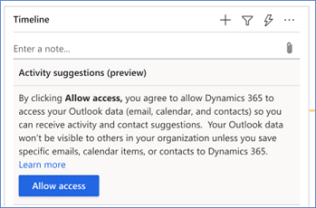
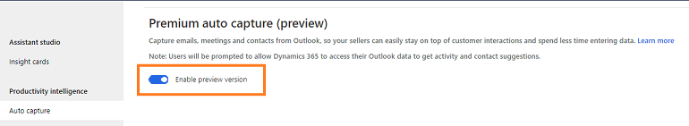
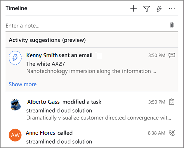
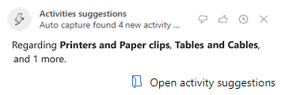
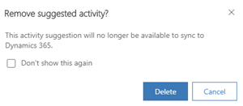
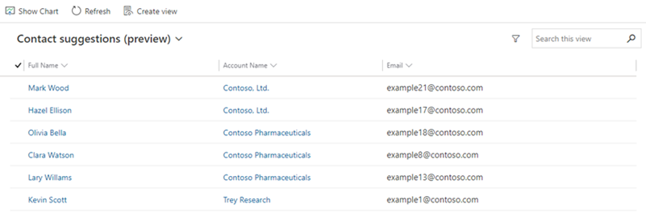

# Premium auto capture

[!INCLUDE [cc-beta-prerelease-disclaimer](../includes/cc-beta-prerelease-disclaimer.md)]

> [!IMPORTANT]
> - [!INCLUDE[cc_preview_features_definition](../includes/cc-preview-features-definition.md)]  
> - [!INCLUDE[cc_preview_features_expect_changes](../includes/cc-preview-features-expect-changes.md)]
> - Microsoft doesn't provide support for this preview feature. Microsoft Technical Support won’t be able to help you with issues or questions. Preview features aren't meant for production use and are subject to a separate [supplemental terms of use](https://go.microsoft.com/fwlink/p/?linkid=870960).

Premium auto capture helps salespeople focus on generating revenue instead of spending their time updating Dynamics 365 Sales data and logging every customer-related activity. In addition to activity suggestions based on capturing emails and meetings, premium auto capture also provides suggestions for creating new contacts.

> [!NOTE]
> To view the **Activity suggestions** and **Contact suggestions** options on the **Sales** site map, the security role assigned to you must have read privileges on **Suggested Activity** and **Suggested Contact** entities. To learn more, see [Security roles and privileges](/power-platform/admin/security-roles-privileges).  
> By default, administrators can view these options on the **Sales** site map. However, you must enable premium auto capture feature in your organization to use it. To learn more, see [How to enable and configure premium auto capture](configure-auto-capture.md#how-to-enable-and-configure-premium-auto-capture)

## Give consent

When an administrator enables premium auto capture, you need to give your consent to allow Dynamics 365 Sales to access your Exchange data so that auto capture can provide suggestions for activities and contacts. You can give consent in one of the following ways:

-	[Timeline](#through-the-timeline)

-	[Personal settings](#through-personal-settings)

### Through the timeline

1.	Sign in to the Dynamics 365 Sales Hub app.

2.	On the site map, select an entity&mdash;for example, **Opportunities**.

3.	Select a record from the list.

4.	On the timeline, select **Allow access**.

    > [!div class="mx-imgBorder"]
    >  

### Through personal settings

1.	Sign in to the Dynamics 365 Sales Hub app.

2.	In the change area, select **Sales Insights settings**.

3.	On the site map, select **Sales Insights** > **Personal settings** > **Productivity intelligence** > **Auto capture**.

4.	Turn on the **Enable preview version** toggle. 

    > [!div class="mx-imgBorder"]
    >  

    > [!NOTE]
    > You can turn off the **Enable preview version** toggle if you don't want Dynamics 365 to access your Outlook data to get activity and contact suggestions. 

## Manage activity suggestions on the timeline

When you open the record for an entity, the timeline displays the activity suggestions, such as emails and meetings, that are available for the record. Based on the communication captured from your Exchange data, these suggestions will be visible only to you. The suggestions are available for you to review and save for other users to view. You can also dismiss or edit the suggestions, to make sure you capture the right information in the right place. 

> [!div class="mx-imgBorder"]
> 

By default, a single suggestion is displayed. You can select **Show more** to display up to three suggestions at a time. If you've got more than three suggestions, the **Show all** option is displayed. Select **Show all** to view the list of all available suggestions.

> [!div class="mx-imgBorder"]
> 

-	**Sync and connect**: Select the check mark icon to add a suggestion as an activity on the timeline wall of a record. After the suggestion is added, other users in your organization can view this suggestion for the record. For example, you open an opportunity **Interest shown in AX27** and observe that there are a few suggestions available under it on the timeline. With the **Kenny Smith sent an email** suggestion selected, select the **Sync and connect** icon. The suggestion is saved as an **Kenny Smith sent an email** activity on the timeline, and will be visible for other users who access this opportunity.

    > [!div class="mx-imgBorder"]
    >  

-	**Edit**: Select the pencil icon to add a suggestion as an activity for another record. When you edit and sync the suggestion, it's available as an activity on the timeline of the other record and will be visible for users who have access to the record. For example, you open an email from **Kenny Smith**. On the timeline, you observe that the **Kenny Smith sent an email** suggestion is more appropriate for **Jim Glynn** than the suggestion. Select the edit option, and then use the **Regarding** lookup to choose **Jim Glynn**. 
 
    > [!div class="mx-imgBorder"]
    >  

    After you save the change, a confirmation message appears and specifies that the activity has been added to the **Jim Glynn** email.

-	**Remove**: Select this option if you don't want to add a suggestion as an activity on the timeline. For example, you opened an opportunity **Interest shown in AX27**. On the timeline, you observe that the **Kenny Smith sent an email** suggestion isn't appropriate for the **Regarding** fields that it's associated with, and you want to ignore it. Select the remove option, and then select **OK** in the confirmation message that appears. The suggestion will no longer appear in the list.

## Manage activity suggestions through the grid

The activity suggestions grid provides a single view for all the captured activities based on your communications. This ensures the information isn't lost on the timeline and helps you track activity suggestions in one place. The activity list consists of emails and meetings that are fetched and captured from your Outlook data by premium auto capture.

> [!div class="mx-imgBorder"]
> 

The Activity suggestions grid consists of the following columns:

-	**Activity**: This column specifies the type of activity, such as email or meeting. 

-	**Sender**: This column specifies the name from whom the activity was received.

-	**Subject**: This column specifies the subject line of the activity.

-	**Regarding Entity**: This column specifies the entity to which the activity could be added.

-	**Regarding**: This column specifies the record to which the activity can be added.

-	**Created Date**: This column specifies the date and time on which the activity is created.

Also, the Assistant displays a card to alert you when new activity suggestions are available. Select **Open activity suggestions** to open the activity suggestions grid and take appropriate action on the suggestions.

> [!div class="mx-imgBorder"]
> 

You can perform the following actions on the suggested activities:

-	Sync and connect, edit, or remove an activity

-	Sync and connect, or remove multiple activities

### Sync and connect an activity

To save an activity so it will be visible on the timeline for a record for other sales personnel, follow these steps:

1.	Sign in to the Dynamics 365 Sales Hub app.

2.	On the site map, select **My work** > **Activity suggestions**.

    > [!div class="mx-imgBorder"]
    > 

3.	Select an activity. In this example, we're selecting an email that's related to **Chairs & Tables**.

    > [!div class="mx-imgBorder"]
    > 

4.	On the toolbar, select **Sync and connect**.

    > [!div class="mx-imgBorder"]
    > 
 
5.	In the confirmation message that appears, select **Sync and connect**.

The activity suggestion is removed from the suggestions list and added to the timeline of the **Regarding** record, making it visible for everyone who has access to the record.

### Edit an activity

After reviewing the activity suggestion, perhaps you decide that the suggestion doesn't belong to the assigned **Regarding** record. You can change the **Regarding** record by selecting the appropriate entity to which the activity belongs. Follow these steps:

1.	Sign in to the Dynamics 365 Sales Hub app.

2.	On the site map, select **My work** > **Activity suggestions**.

    > [!div class="mx-imgBorder"]
    > 
 
3.	Select an activity suggestion. In this example, we're selecting an email that's related to **Chairs & Tables**.

    > [!div class="mx-imgBorder"]
    > 

4.	Select **Edit**.

5.	In the **Regarding** lookup, select an appropriate **Regarding** record for the activity suggestion. In this example, we're selecting **Jim Glynn**.

    > [!div class="mx-imgBorder"]
    >  

6.	Select **Sync and connect**.

The activity suggestion is removed from the suggestions list and added to the timeline of the **Regarding** record, making it visible for everyone who has access to the record.

### Remove an activity

Remove any activity suggestions that you don't want to add as activities on the timeline. Follow these steps:

1.	Sign in to the Dynamics 365 Sales Hub app.

2.	On the site map, select **My work** > **Activity suggestions**.

    > [!div class="mx-imgBorder"]
    > 
 
3.	Select an activity suggestion. In this example, we're selecting an email that's related to **Chairs & Tables**.

    > [!NOTE]
    > You can select multiple activity suggestions to delete.

    > [!div class="mx-imgBorder"]
    > 
 
4.	Select **Remove**.

    > [!div class="mx-imgBorder"]
    > 
 
5.	In the confirmation message that appears, select **Delete**.

A success message is displayed at the bottom of the screen, and the activity suggestion is deleted from the suggestions list.
 
## Manage contact suggestions through the grid

The contact suggestions grid provides a single view of suggestions to create contacts that are captured based on your communications. The list consists of contacts that were captured from your Outlook data, such as To, From, email message, and signature.  

> [!div class="mx-imgBorder"]
> 

The contact suggestions grid consists of the following columns:

-	**Full Name**: This column specifies the full name of the suggested contact.

-	**Account Name**: This column specifies the name of the company with which the suggested contact is associated.

-	**Email**: This column specifies the email address of the suggested contact.

Also, the Assistant displays a card to alert you when a contact suggestion is available. Select **Open contact suggestions** to open the contact suggestions grid and take appropriate action on the suggestions.

> [!div class="mx-imgBorder"]
> 
 
You can perform the following actions on the suggested contacts:

-	Save, edit and save, or delete a contact

-	Save or delete multiple contacts

### Save a contact

To save a contact, follow these steps:

1.	Sign in to the Dynamics 365 Sales Hub app.

2.	On the site map, select **Customer** > **Contact suggestions**.

    > [!div class="mx-imgBorder"]
    > 

3.	Select a contact. In this example, we're selecting **Kenny Smith**.

    > [!div class="mx-imgBorder"]
    > 

4.	Select **Save as contact**.

    > [!div class="mx-imgBorder"]
    > 
 
5.	In the confirmation message that appears, select **Save**. 

A success message is displayed at the bottom of the screen, and the contact is created in your Dynamics 365 organization.
 
### Edit and save contact

After reviewing the contact suggestion, you identify that some information of the contact suggestion needs update. You can update the information and save. Follow these steps:

1.	Sign in to Dynamics 365 Sales Hub app.

2.	From the site map, select **Customer** > **Contact suggestions**.

    > [!div class="mx-imgBorder"]
    > 

3.	Select a contact. In this example, we're selecting **Kenny Smith**.

    > [!div class="mx-imgBorder"]
    > 

4.	Select **Edit and save**. A **Quick Create: Contact** form opens to edit the contact information.

    > [!div class="mx-imgBorder"]
    > 

5.	Edit the contact information as required, and then select **Save and Close**. 

The contact is created and saved in your Dynamics 365 organization, and a confirmation message is displayed at the bottom of the screen.

### Delete contact

Delete contact suggestions if you don't want to add them to your contact list. Follow these steps:

1.	Sign in to the Dynamics 365 Sales Hub app.

2.	On the site map, select **Customer** > **Contact suggestions**.

    > [!div class="mx-imgBorder"]
    > 

3.	Select a contact. In this example, we're selecting **Kenny Smith**.

    > [!NOTE]
    > You can select multiple contact suggestions to delete.

    > [!div class="mx-imgBorder"]
    > 

4.	Select **Delete**. 

    > [!div class="mx-imgBorder"]
    > 
 
5.	In the confirmation message that appears, select **Delete**.

A success message is displayed at the bottom of the screen, and the contact is deleted from the suggestions list.

### See also

[Enable and configure auto capture](configure-auto-capture.md) 
[Basic auto capture](free-auto-capture.md)
