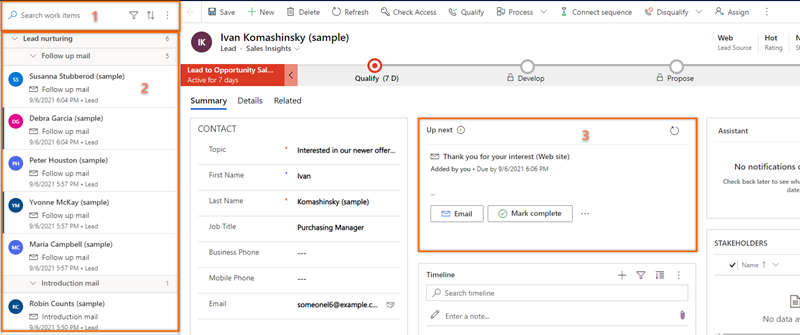
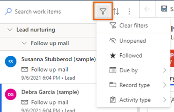
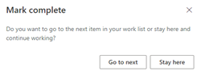
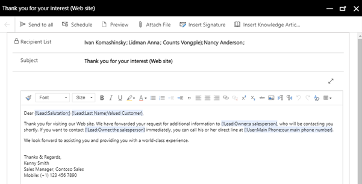

# Prioritize your sales pipeline by using the work list  

## Requirements
|  | |
|-----------------------|---------|
| **License** | Dynamics 365 Sales Enterprise or Dynamics 365 Sales Premium  More information: [Dynamics 365 Sales pricing](https://dynamics.microsoft.com/sales/pricing/) |
| **Security Role** | Salesperson and above    More information: [Predefined security roles for Sales](security-roles-for-sales.md)|
|||

During their workday, sellers need to juggle multiple tasks as they work on multiple records. As a result, it can be hard for them to plan and prioritize their customer-facing activities. The work list in the Sales accelerator for Dynamics 365 Sales Insights helps sellers prioritize their time and effort to ensure that important records aren't left behind.    
The Sales accelerator work list gives sellers the following capabilities:  
- Manage and view records that include the activities that are due in the last 30 days to be performed, sorted by priority, and remove records after an activity has been completed. More information: [View my records through the work list](#view-my-records-through-work-list)   
- Manage the work list by sorting, filtering, and grouping all records. More information: [Filter records in the work list](#filter-records-in-work-list)   
- View relevant information about customers, such as personal details, past and future activities, and the related entities for each record. More information: [Understand the Up next widget](#understand-the-up-next-widget)   
- Communicate with customers through phone and email. More information: [Connect with customers by using a record or the Up next widget](connect-with-customers.md)  
- Add manual activities to records in addition to those that have been defined in a sequence, if an ad-hoc activity is required. More information: [Add manual activities to records](#add-manual-activities-to-records)  
> [!NOTE]
> The work list is configured by a sales manager who defines the sequence of activities for records by using the sequence designer. More information: [Create and manage sequences](create-manage-sequences.md)   

## Prerequisites    
Review the following prerequisites before you start using work lists:   
- The Sales accelerator feature is installed in your organization and your role is assigned to access work lists. More information: [Configure the Sales accelerator](enable-configure-sales-accelerator.md)    
- A softphone and an email server are configured for your security role.    
- Dynamics 365 Channel Integration Framework version 1 is installed and a channel provider is configured for your Dynamics 365 organization. More information: [Integrate a sample softphone dialer with Dynamics 365 Sales](integrate-sample-softphone.md)   
- (Optional) [Predictive lead scoring](configure-predictive-lead-scoring.md) and [predictive opportunity scoring](configure-predictive-opportunity-scoring.md) are enabled, and models have been generated for your organization. Contact your administrator to enable these features.

## View my records by using the work list  
The work list displays a list of records that are assigned to you or to the security role you're associated with. The records display activities that are due for the current date&mdash;or pending from previous dates&mdash;that were created manually or through a sequence. This helps you to access all records that include activities in one place, instead of navigating across multiple forms in the application. A sales manager can configure and determine the entities to display to you in the work list. The top of the record in the work list will always be the next best customer with the highest prediction score.

**To view the work list**   
1. Sign in to the Dynamics 365 Sales Hub app, and go to **Change area** > **Sales**.   
2. From the site map, under **My Work**, select **Sales accelerator**.    
    The work list page opens, as shown in the following image.   
    > [!div class="mx-imgBorder"]
    >    

    | Number | Feature | Description |
    |--------|---------|-------------|
    | 1 | **Search, filter, sort, and group records** | You can search, filter, sort, and group the records that you want to view in the list to quickly identify the customers to contact. More information: [Filter, sort, and more options](#filter-records-in-work-list)  By using the lookup icon, you can search for a specific record by using the record name. Select the **More options** icon to [send bulk emails](#send-bulk-emails), [configure work list settings](#configure-personal-settings), and refresh the list. |
    | 2 | **Records list** | Displays a list of records that are assigned to you or to a security role that you're part of. The unread records appear in bold with a blue vertical bar on the left. You must perform and complete the activities on these records from the current date and from previous dates.  Each record displays the name of the record, primary contact name, next best action, priority scoring, and entity name. Hover over the record to view more options and the activity to perform.   Select **More options** to perform the following actions on the record:<ul><li>Mark as complete</li><li>Skip the current activity</li><li>Snooze the activity</li><li>Change the state of the record to unread or read</li><li>Follow or unfollow the record</li><li>Skip wait time (this option is available for items that are in the wait state)</li></ul> Also, you can select the activity icon to perform the specified activity for the record.  More information: [Connect with customers by using a record or the Up next widget](connect-with-customers.md)   When you complete an activity on the record, select the refresh icon. The list will be refreshed, and the record will be removed from the list.  **Note** The list displays records for a month from the current date. The records that are older than 30 days are automatically removed and won't be displayed.|

    | 3 | **Up next widget** | Displays the next best action that you can perform on a record for the given date. More information: [Understand the Up next widget](#understand-the-up-next-widget)|
    
## Filter, sort, and more options     
#### Filter       
Use filters to prioritize the records in the work list so you can reach customers at the right time. The following screen provides the list of options that are available to filter work list:    

> [!div class="mx-imgBorder"]    
>     
 
let's understand the filter options in detail:   
- **Clear filters**: Select this option to clear filter selections that were previously selected and set to default.   
- **Unopened**: Select the option to filter the list to view records that aren't opened or unread.   
- **Followed**: Select the option to  filter the list to view records that are followed by you.   
- **Due date**: Select this option to filter the records according to the time that a task must complete for a record. The following options are available:   
    - **Today**: Select this option to filter the list to view records with pending tasks that aren't completed today.   
    - **From tomorrow**: Select this option to filter the list to view records with pending tasks that are to be completed tomorrow.   
    - **Overdue**: Select the option to  filter the list to view records with pending tasks that aren't completed on time.   
- **Record type**: The **Record type** filter options contain the records types that sales accelerator is configured for. You can select all options to view all records, or you can select an individual type to view only the records that belong to that type.   
    Select at least one option to display relevant records in the work list. If no records match your selected type, an empty list is displayed. By default, all filter options are selected.   
- **Activity type**: The **Activity type** filter options are **Phone calls**, **Email messages**, **Tasks**, and **Meetings**. You can select all or any specific option to filter the records to display in the work list.    
    Select at least one option to display relevant records in the work list. If no records match your selected activity type, an empty list is displayed. By default, all filter options are selected.  
    For example, when you select the entity type as **Lead** and the activity type as **Call**, the work list displays only the lead records that include call activities.   
#### Sort    
Use the sort option to organize records into groups selecting the sort icon and display the records in the order of sort (ascending or descending).     
#### More options     
Use more options to do the following actions:   
- Refresh the list.
- Send an email to multiple recipients at once. More information: [Send bulk emails](#send-bulk-emails)
- Configure work list settings: Using the work list settings, you can choose what must happen to a record when a step is completed or skipped. Select **Settings** and on the **Work list settings** dialog box choose the following options:     

| Option | Description |
|--------|-------------|
| Ask before moving to the next work item | Select this option to display a confirmation message to whether to go to the next in-line record or stay on the same record after you complete or skip.  |
| Automatically go to the next work item | Select this option to go to the next in-line record after you complete or skip the step on the current record. |
| Stay on the same record | Select this option to remain on the same record even after you complete or skip the step. By default, this option is selected for both **When I mark a step as complete** and **When I skip a step**.|         
> [!div class="mx-imgBorder"]
>   

## Send bulk email

The bulk email feature helps you to optimize your work by sending the same email to a list of leads simultaneously. The leads need to have the same email step from the same sequence attached to all their records.

For example, let's say 10 leads have a sequence step to send an introduction email, and this step is pending for today. By using the bulk email feature, you can select all (or some) of the 10 leads and send them the introduction email all at once.

**To send bulk email**

1.	On the work list page, select **More options** > **Bulk email**.

    > [!div class="mx-imgBorder"]
    >     

    The work list records in the queue are automatically grouped according to the sequence and then the action.
    For example, the **Lead nurturing** sequence has 10 leads, with nine on the **Follow up mail** step and one on the **Introduction mail** step. When you select the **Bulk email** option, the records are first grouped by the lead nurturing sequence and then subgrouped by the **Follow up mail** and **Introduction mail** steps.     

    As shown in the following image, the **Bulk email** option in the upper-right corner is unavailable until you select the leads, as described in the following step.

    > [!div class="mx-imgBorder"]
    > 
 
2.	Choose the leads to whom you want to send the bulk email.
    You can select all the leads at once by selecting the step name, or you can expand the step and then select the leads individually.
    In this example, we're sending a bulk email to the leads Ivan Komashinsky, Lidman Anna, Counts Vongple, and Nancy Anderson.

    > [!div class="mx-imgBorder"]
    > 
 
3.	On the command bar, select **Bulk email**.

    The email composer opens. If you've selected an email template for the step, the template opens in the composer.  

    > [!div class="mx-imgBorder"]
    > 

    >[!NOTE]
    >Each user in the recipient list must satisfy the following conditions on the entity form:  
    >- On the **Details** tab under **CONTACT METHOD**, **Email** is set to **Allow**. 
    >- On the **Summary** tab under **CONTACT**, the user has a valid email address.

4.	(Optional) To preview the email, select **Preview**.

    The preview opens and shows tags that contain information about the first recipient (in this example, Ivan Komashinsky). However, when the actual email is sent, each email will include relevant information from each lead in your recipient list.

    > [!div class="mx-imgBorder"]
    > 

5. (Optional) To schedule the email, select **Schedule** and then choose a date and time at which you want to send the email.  

    > [!div class="mx-imgBorder"]
    >       
 
6.	Select **Send to all**.

The email will be sent to all the recipients you specify. You can verify that the timelines for those entities are updated with the email. After you refresh the work list, all the records you just sent email to will move to the next step.

## Understand the Up next widget

Using the **Up next** widget, you can view and perform actions on activities on a record. The widget displays the current activity, upcoming activity, and completed activities. You can add these activities to a record manually or by using a sequence:   
- In a sequence, a sales manager creates activities and applies them to the record according to business requirements. The activities in the sequence are displayed in the **Up next** widget.    
- For manual activities, you or a sales manager can create an activity on the timeline. The activity is displayed in the **Up next** widget as an activity, depending on its due time. This activity is available to you and other sellers who have access to the record.   
The following image shows an example of the **Up next** widget.    
> [!div class="mx-imgBorder"]
>     
1. **Current activity**: The current activity is a task that you must complete or skip to go to the next activity, which moves the record closer to completion. To perform an action such as making a phone call or sending an email, select the action icon displayed in the activity. More information: [Connect with customers by using a record or the Up next widget ](connect-with-customers.md).   
    After you complete the action, select **Mark complete**, and the activity is closed and moved automatically to completed items and is displayed on the timeline.   
    You can choose to skip the activity if you think it's not relevant to the record or you don't want to perform the action. Select **More options**, and then select **Skip**. The activity is skipped and moved to completed items.   
2. **Upcoming activity**: The upcoming activity is view-only, and you can't perform an action. The upcoming activity is displayed so you know what activity will appear next when you complete the current activity.    
3. **Completed activities**: The completed activities are the activities that are marked as complete or skipped for a record.        
    To view the completed activities list, select **Show completed**. The section expands to display the list of completed activities with details such as whether the activity was completed or was it skipped, with date and time. You can't perform any actions on these tasks; they're view-only. The following screen is an example of an expanded section of completed items.    
    > [!div class="mx-imgBorder"]
    >    

## Add manual activities to records

Using the sequence, your sales manager can define activities for you such as email, phone calls, tasks, and meetings. To meet business requirements, you might have to add extra activities to a lead or an opportunity. You can manually add activities for records to appear in the **Up next** widget in addition to activities defined in the sequence for a given day. The manual activities include email, phone calls, and tasks.   
The characteristics of manual activities are similar to an activity defined in a sequence. Sellers must perform the activity and mark it as complete. Then the activity will be moved to the list of completed activities in the **Up next** widget. A sales manager or you, as a seller, can add the manual activity to the records that you or your security role owns.    

**To add a manual activity**   
1. Sign in to the Dynamics 365 Sales Hub app, and go to **Change area** > **Sales**.   
2. From the site map, under **My Work**, select **Sales accelerator (preview)**.    
3. Select the record for which you want to add the manual activity from the work list.   
4. In the **Timeline** section, select the plus (+) icon.   
    >[!NOTE]
    >Only **Email**, **Phone call**, **Task**, and **Meetings** activities will be displayed in the **Up next** widget.    
5. Select and configure the activity that you want to add to the record.    
6. Save and close the activity.   
The activity is added to the record and displayed in the **Up next** widget, based on its due date.   

### See also

[What is the Sales accelerator?](sales-accelerator-intro.md)  
[Create and manage sequences](create-manage-sequences.md)

[!INCLUDE[footer-include](../includes/footer-banner.md)]
