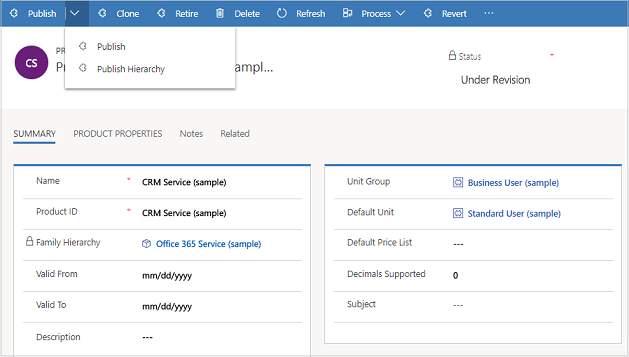

# Publish a product, family, or bundle to make it available for selling (Sales Hub)

When you're ready to sell a product or bundle, publish it to make it available to the sales agents so they can build orders or create opportunities for customers. By default, product records are created in a draft state, and are available to your sales agents only after you publish it. For products that don't have a parent product family, you can create them directly in an active state using a system setting, so that you don't have to publish them after creation. [!INCLUDE[proc_more_information](../includes/proc-more-information.md)] [System Settings dialog box - Sales tab](../admin/system-settings-dialog-box-sales-tab.md)  

> [!NOTE]
>  You can only publish a product or bundle with a parent family if the parent product family is active.  
     
## Publish a product, family, or bundle (Sales Hub)

1. [!INCLUDE[proc_permissions_admin_cust_mgr_vp_sales_ceo](../includes/proc-permissions-admin-cust-mgr-vp-sales-ceo.md)]  
  
2. Select the site map , then select **App Settings**, and then select **Families and Products**.  

3. Open the product, bundle, or family you want to publish, and on the command bar, select **Publish**. 

    > [!div class="mx-imgBorder"]
    > 

   This will change the product status to **Active** and make it available for selling.

> [!TIP]
> 
> You can't publish multiple product records at the same time. To publish all child products and families of a parent family at once, open the family, and choose **Publish** > **Publish Hierarchy**. For product records that don't belong to a product family, publish them individually after creating or editing them to make them available to your sales agents.
  
 
## Typical next steps  
  [Revise a product](revise-product.md)  
  
  [Retire a product](retire-product.md)  
  
  [Set up a product catalog: Walkthrough](../sales-enterprise/set-up-product-catalog-walkthrough.md) 
  
### See also  
 [Set up a product catalog: Walkthrough](../sales-enterprise/set-up-product-catalog-walkthrough.md)
