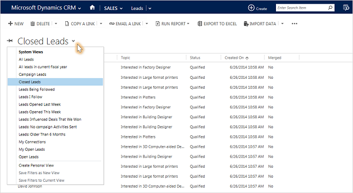
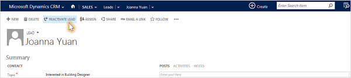

# Reopen leads (Sales and Sales Hub)

Great news! A lead that you thought wasn't interested has contacted you, and it looks like the person will buy after all. Assuming that you disqualified the lead (instead of deleting it), you'll be able to reopen it without reentering all the information you already gathered.  
  
1.  On the list of leads, select the down arrow, and then select the **Closed Leads** view.  
  
      
  
2.  Select the lead you want to reopen, and then select **Reactivate Lead**.  
  
      
  
### See also  
 [Create or edit a lead](../sales-enterprise/create-edit-lead-sales.md)   
 [What if you're no longer working a lead?](../sales-enterprise/no-longer-working-lead-sales.md)
