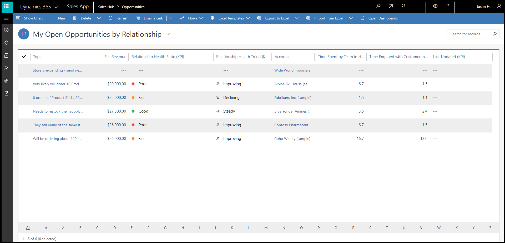
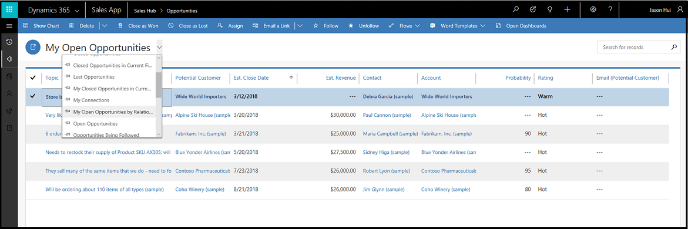
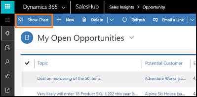
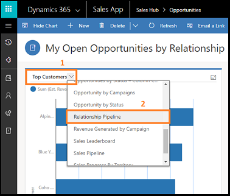
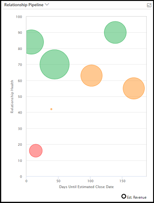
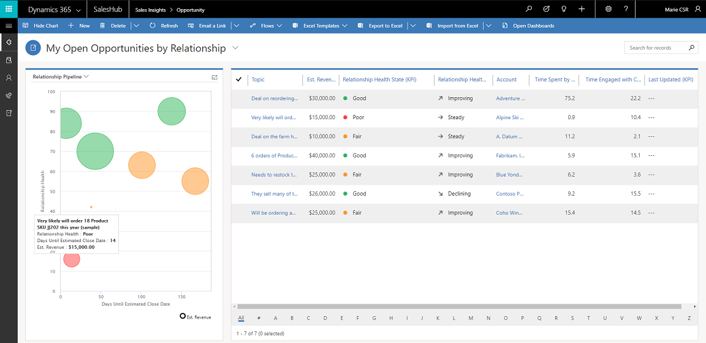
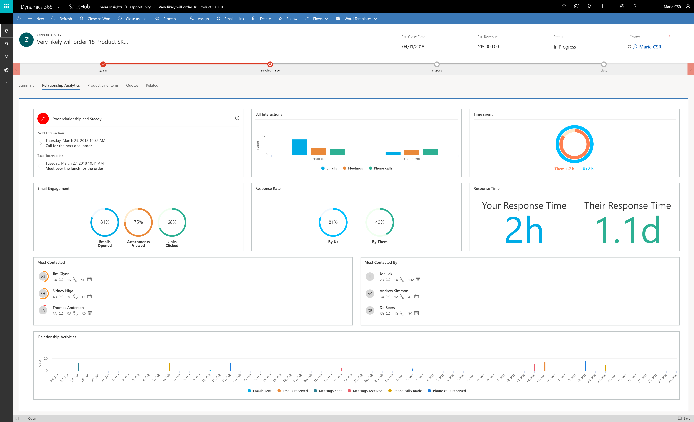
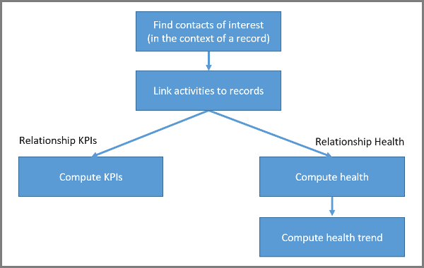
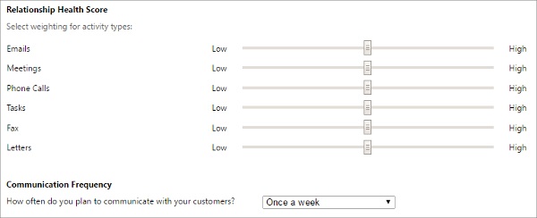

# Use relationship analytics to gather KPIs    
Relationship analytics enables [!INCLUDE[pn-dyn-365-sales](../includes/pn-dyn-365-sales.md)] to assemble relevant information from throughout its database to create a graphical display of key performance indicators (KPIs) and activity histories. The graphical display shows KPIs and activity histories for any contact, opportunity, lead, or account. The feature also calculates the overall health and trend of each of your business relationships.    

>[!NOTE]
>Health score and trend are not calculated for Account records.

Relationship analytics help sales professionals and managers answer questions such as:  
-   Which opportunities should I spend my time on?  
-   Do we have a good relationship with the customer?  
-   How much time have we spent with our customer?   
-   When was the last time we contacted them?   
-   When is the next time we will contact them?  
-   How many emails and meetings have we exchanged?   
-   What is the customer's response rate?    
-   How many activities were initiated by the customer?   
-   How long does it take our team to respond?    

   
## Get the big picture with relationship analytics in list views    
Relationship analytics provides the following for records:   
- Activity history and KPIs for contact, opportunity, lead, and account records.   
- Health score and health trend for contact, opportunity, and lead records.   
The most important KPIs (including your team's previous and next activity) are shown in the list view for each of these record types, so you can get an overview and sort the list by them.  

  

     
## Identify critical opportunities with the relationship pipeline view    
The relationship pipeline view provides a bubble chart that gives you a quick overview of the health, close date, and estimated revenue for your upcoming opportunities. To view it:  
1.  Go to **Sales** > **Opportunities**.   
2.  From the drop-down menu, select **My Open Opportunities by Relationship**.   

       
    
3.  From the command bar, select **Show Chart**.   

        
     
4.  At the top of the charts pane, open the drop-down list, and then select **Relationship Pipeline**.  

      
    
    The relationship pipeline chart appears.   
    
       
    
    Each upcoming opportunity is plotted as a bubble on the relationship pipeline chart. The size of each bubble indicates the estimated revenue of the opportunity. Health is plotted on the y-axis, so the higher up the bubble appears on the chart, the higher its health.  Estimated close date is plotted on the x-axis, so opportunities on the left side of the chart may expire soon. So, the most critical opportunities are those with the largest bubbles located near the lower-left corner, while the most promising opportunities are near the top of the chart.    

    Hover over a bubble to see the name of the opportunity and other details. Select a bubble to open its opportunity record. The color of each bubble indicates relationship health: green for good, yellow for fair, red for poor, and gray for zero (which indicates that the results have not been calculated, or that there is not enough data). 

         

    The relationship pipeline chart relies on several values being available for each opportunity record, but in some cases, these values may be missing for some or all opportunities. This could be due to an oversight, or it could be because you don't use these fields at your organization. The chart represents missing values as follows:     
    -   Opportunities that don't have a relationship health value are gray, with a value of zero. They are plotted at the bottom of the chart.    
    -   Opportunities with an estimated close date in the past are not shown.   
    -   Opportunities without an estimated close date are not shown.   
    -   Opportunities without an estimated revenue value show a value of zero. They are plotted as very small bubbles.  

     
## Analyze the health and activity history of a customer or opportunity   
You can view complete relationship analytics for an individual record, including graphs, KPIs, email interaction history, full activity history, and relationship health. These details are available in two expandable sections when you view an individual record, such as a specific opportunity.   

     

- **Relationship health and trend**: Shows your overall relationship health with the customer and includes the recent trend.   
- **Next interaction**: Shows the date and time for the next activity that is scheduled for the record. If you have access to that activity, then you'll also see its name or subject. The next and last interactions are only shown for opportunity and lead entities.   
- **Last interaction**: Shows the date and time for the last activity that you completed for the record. If you have access to that activity, then you'll also see its name or subject. The next and last interactions are only shown for opportunity and lead entities.   
- **All interactions**:  Shows the total number of activities initiated by members of your team and by the customer. The activities are broken down by general type such as email, meetings, and phone calls.    
- **Time spent**: Shows the relative amount of time spent on activities related to the record, including your team and the customer. For each activity where more than one team member was involved, the time spent on that activity is multiplied by the number of your team members who were present. But time spent by your customer is counted just once, even if more than one member of the customer's team was present.    
- **Email engagement**: Summarizes how your customer has interacted with the followed emails your team has sent to them. Unfollowed emails are not included, so you must enable and use the email-engagement feature to see any information here. [!INCLUDE[proc_more_information](../includes/proc-more-information.md)] [Use email engagement to view message interactions](email-engagement.md)   
- **Most contacted**: Provides statistics about the customers that your team contacts the most. These contacts might include [!INCLUDE[pn_dynamics_crm](../includes/pn-dynamics-crm.md)] users who are heavily involved with the customers even if they are not part of the record’s users.   
- **Most contacted by**: Provides statistics about your team that contacted customers the most. These contacts might include customers who are heavily involved with your team even if they are not part of the record’s users.    
- **Relationship activities**: Provides a detailed look at activities over 90 days, broken down by date and activity type, such as emails sent, emails received, meetings sent, meetings received, phone calls made, and phone calls received. 

## Relationship analytics with similar opportunities   
The current relationship analytics provides information such as graphs, KPIs, email interaction history, full activity history, and relationship health. This information doesn't offer a comparison with similar deals that were won, what's working, or what isn't working in the deal's engagement practices.    

As a seller, it's important for you to understand what's working better for a deal and learn about the best engagement practices from similar deals that were won in the past. The enhanced relationship analytics displays comparable information on the KPIs, graphs, activity history, and relationship health with similar deals that were won. Also, a list of similar deals that were won is displayed at the bottom. By opening the deals, you can learn what has worked and what didn't work, and implement these learnings in the deal you're currently trying to close.  

An administrator must enable the feature before you can start using it. More information: [Step 5 in Configure relationship analytics](configure-relationship-analytics.md#configure-similar-opportunities-preview).

>[!NOTE]
>If relationship analytics can't detect the similar opportunities for the current opportunity, relationship analytics takes top 100 won opportunities and displays KIPs to compare with the current opportunity.

The following screenshot shows an example of enhanced relationship analytics:   

> [!div class="mx-imgBorder"]
>    

1. **Summary**: Shows the summary of metrics and KPIs obtained for the records from your interactions with customers through emails, meetings, and phone calls. For example, *You take 12 hours less to respond to emails compared to the similar opportunities*.  
2. **Relationship health**: Shows your overall relationship health with the customer, and includes the recent trend for the deal.     
    - **Next interaction.** Shows the date and time for the next activity that's scheduled for the record. If you have access to that activity, you'll also see its name or subject. The next and last interactions are only shown for opportunity and lead entities.
    - **Last interaction.** Shows the date and time for the last activity that you completed for the record. If you have access to that activity, you'll also see its name or subject. The next and last interactions are only shown for opportunity and lead entities.
    
    This section also shows the top three most active contacts for the deal from you and your customer's organizations, with details about the last time these contacts interacted.   
3. **Customer interactions**: Shows the average number of interactions with customers in this deal compared to similar deals that were closed as won.  

    The graph displays the total number of activities initiated by members of your team and by the customer compared with the similar deals. The activities are broken down by general type, such as email, meetings, and phone calls.     
4. **Your hourly investment**: Shows the average amount of time your sellers spent on activities related to the record compared with similar deals. For each activity where more than one team member was involved, the time spent on that activity is multiplied by the number of your team members who were present.   
5. **Customer's hourly investment**: Shows the average amount of time your customers spent on activities related to the record compared with similar deals. For each activity, time spent by your customer is counted just once, even if more than one member of the customer's team was present.
6. **Email engagement**: Summarizes how your customer has interacted with the followed emails your team has sent to them. Unfollowed emails are not included, so you must enable and use the email-engagement feature to see any information here. [!INCLUDE[proc_more_information](../includes/proc-more-information.md)] [Use email engagement to view message interactions](email-engagement.md).
7. **Your response time**: Shows the average amount of time taken by your sellers to respond to customer emails on the opportunity, to the average amount of time taken for a response from the customer for all similar won deals.
8. **Customer's response time**: Shows the average amount of time taken by your customers to respond to emails on this opportunity, to the average amount of time taken for a response by customers on all similar won deals.   
9. **Your email send/receive ratio**: Shows the ratio of the number of emails sent by you and received by the customer in this opportunity, to the average sent and received ratio in all similar won deals.
10. **Customer's email send/receive ratio**: Shows the ratio of the number of emails sent by the customer and received by you in this opportunity, to the average sent and received ratio by customers on all similar won deals.
11. **Similar won deals**: Shows the list of similar opportunities that have been closed as won. The columns display activities count, time spent, response time, and the response ratio for each opportunity. You can select and open an opportunity to view what has worked better in a deal that was closed as won, and implement these observations in the current deal to help close it as well. The list is refreshed every seven days.
12. **Relationship activities**: Provides a detailed look at activities over 90 days, broken down by date and activity type, such as emails sent, emails received, meetings sent, meetings received, phone calls made, and phone calls received.       

   
## How relationship analytics values are calculated    
Relationship analytics values are derived from a careful analysis of the many related people, activities, companies, appointments, and email stored on your [!INCLUDE[pn-dyn-365-sales](../includes/pn-dyn-365-sales.md)] and [!INCLUDE[pn_Microsoft_Exchange](../includes/pn-microsoft-exchange.md)] servers. The process for finding and calculating the scores is summarized in the following flow chart.    

    

The following sections describe the function of each block in the flow chart.    

   
### Step 1: Find contacts of interest for the record    
Relationship analytics is concerned with activities performed by the *people* associated with a given record. The first step in finding the relevant activities is to find out which contacts to include in the analysis. Relationship analytics also provides time-spent values for you, your team, and your customer's team, so the identity of who did what is important throughout the process.  

This table shows how the system finds contacts that have an interest in each type of record. Later, the system will look for activities associated with each contact and decide which of those activities should be included in KPI calculations for that record.   

|  Records | Internal contacts  |  External contacts |
|----------|--------------------|--------------------|
|   Account   | -   Any [!INCLUDE[pn-dyn-365-sales](../includes/pn-dyn-365-sales.md)] user.|-   The **Primary Contact** for the account. -   All contacts in the account's **Contacts** list. |
| Opportunity | -   The **Owner** of the opportunity record. -   All users in the opportunity's **Sales Team** list. | -   The customer **Contact** listed for the opportunity. -   All contacts in the opportunity's **Stakeholders** list. -   The primary contact for the related **Account** record. |
|    Lead     | -   The **Owner** of the lead record. | -   Contact information in the lead's **Contact** section. -   All contacts in the lead's **Stakeholders** list. |
|   Contact   | -   Any [!INCLUDE[pn-dyn-365-sales](../includes/pn-dyn-365-sales.md)] user. | -   Contact information in the contact's **Contact** section.|

   
### Step 2: Link activities to the record   
Once the system has identified contacts of interest, it looks for activities associated with each contact and then identifies which activities to include in the relationship analytics for the record you are looking at. It identifies relevant activities as follows:    
- **Regarding records.** Any activity that has its **Regarding** value set to the current record is explicitly assigned to it and will always be included in its relationship analytics, even if that activity isn't also associated with a contact of interest.   
- **Email messages.** Includes all metadata from messages where the email address (or a reference to the contact record) for a contact of interest is shown in the **To**, **Cc**, or **From** field.    
- **Appointments.** Includes all metadata from appointments where a contact of interest is shown in the **Required** or **Optional** fields.    
- **Phone calls.** Includes all calls where  a contact of interest is shown in the **From** or **To** fields.  

   
### Examples of how relevant activities are identified    
Here are a few examples of how the rules outlined in the previous sections might be applied:   
-   If you are assigned to a lead and register a phone call activity with one of the stakeholders for that lead, then that phone call will be counted in the KPIs for that lead. Other users who call that same stakeholder, but who are not assigned to the lead, will not have their calls counted in the KPIs for that lead.   
-   If you are on the sales team for an opportunity and send an email regarding that opportunity to one of its stakeholders, then the metadata about that email will be counted in the KPIs for that account. An email from another user, who isn't on the team for that account, to that same stakeholder will not be counted for that opportunity.   
-   If you attend a meeting with the primary contact for an account, then the metadata about that appointment will be counted in the KPIs for that account and for that contact. If that account is also associated with an opportunity, the appointment will only count for that opportunity if you are also **Assigned** to that opportunity (or are on its **Sales Team**) and if the appointment is set as **Regarding** that opportunity.    

   
### Step 3: Compute relationship analytics KPIs    
After the system has found all the relevant activities, it's ready to calculate the KPIs and other analytics for each record. The following table summarizes the KPIs that are available.  

|Activity type|Initiated or completed by your team|Initiated or completed by the customer's team|  
|-------------|-----------------------------------------|---------------------------------------------------|  
|Emails|Total number   Total time spent   Time line (number per week)   Number of replies|Total number   Total time spent   Time line (number per week)   Number of replies   Interaction results for followed emails (opens, attachment views, and link views)|  
|Appointments|Total number   Total time spent by your team (if several team members were present at an appointment, then the duration is multiplied by the number of  team members  present)   Time line (number per week)|Total number   Total time spent (not multiplied by the number of customer contacts that were present)   Time line (number per week)|  
|Phone calls|Total number   Total time spent   Time line (number per week)|Total number   Total time spent   Time line (number per week)|  
|Overall (all activities)|Total time spent|Total time spent|  

> [!NOTE]
> Email interaction statistics are only provided for *followed emails*, which requires you to use the *email engagement* feature. For more information about how to create and send followed emails, see [Use email engagement to view message interactions](email-engagement.md).  

For KPIs that report your team and your customer, the system finds durations by applying the rules outlined in the following table:  

|Activity type|Source of duration value|  
|-------------------|------------------------------|  
|Appointments|**Duration** field for the appointment record|  
|Calls|**Duration** field for the phone call record|  
|Emails|Estimated (2.5 minutes to read, 5 minutes to write)|  
|Other|**Duration** field for each record|  

> [!TIP]
> The time calculations for appointments are a bit special. The details are given in the previous tables, but here's an example to illustrate it.   
> If you hold an appointment where three members of your team (including you) meet with two members of your customer's team, and the appointment lasts for 30 minutes, then that appointment contributes to your time KPIs as follows:  
> - **Time spent by my team**: *90 minutes* (30 minutes × 3 team members present)  
> - **Time spent by the customer**: *30 minutes* (time isn't multiplied by customer participants)  

   
### Step 4: Compute the relationship health and health trend    
The overall relationship health score is calculated by collecting the relevant activities, and weighting the activity by type (which enables your admin to set some types of activities to count more than others). The result is normalized to produce a health score between 0 and 100, and the health characterized as *good* (for a score of 60-100), *fair* (40-59) or *poor* (0-39).  

**Note**: 
- Health scores are computed for leads if they are in an active state. This stops once they reach a qualified or disqualified state.
- Health scores are computed for opportunities if the opportunity is open and ignored if it’s won or lost.
- Health scores are computed for contacts irrespective of their state.  

Your administrator can choose which types of activities are most relevant for your business. By default, all types of activities count the same, but your admin can increase or decrease the contribution of each type by up to 50 percent. In addition, your admin can choose how often salespeople should contact a customer (such as once a week); this setting also affects the health score.  

   

In addition to the absolute health score, the system also reports the general trend (up, down, or neutral) based on the number and value of recent activities. The trend direction updates relatively slowly, so it might take a little while to indicate a recent increase or decrease  in activity.  

### See also   

[Configure relationship analytics](configure-relationship-analytics.md)   
[GDPR for Dynamics 365 Sales Insights](embedded-intelligence-gdpr.md)   
[Opt out of relationship analytics (GDPR)](optout-relationship-analytics-gdpr.md)   
[View and export KPI data (GDPR)](view-export-KPI-data-gdpr.md)   
[Retrieve insights data using msdyn_RetrieveKPIValuesForGDPR action](../sales/retrieve-insights-data-msdyn-RetrieveTypeValuesFromDCI.md)
