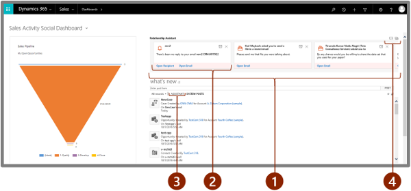
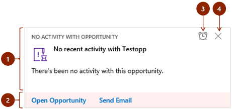
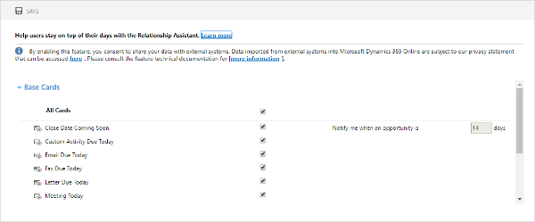

# Use relationship assistant to guide customer communications

Applies to Dynamics 365 (online), version 9.1.0 

The relationship assistant is part of the new *Embedded intelligence* suite of features. The assistant keeps an eye on your daily actions and communications, and generates a collection of *action cards* that are displayed prominently throughout the application to provide tailored, actionable insights. The assistant reminds you of upcoming activities; it evaluates your communications and suggests when it might be time to reach out to a contact that’s been inactive for a while; it identifies email messages that may be waiting for a reply from you; it alerts you when an opportunity is nearing its close date; and much more.  

The administrator must enable auto capture before you can try it out. For complete details about prerequisites, how to enable the feature, and how to set it up, see [Configure and enable embedded intelligence](configure-enable-embedded-intelligence.md).

## How and where the relationship assistant can help you  

 The relationship assistant is designed to deliver the most important and relevant information in relation to what you are doing *right now*. The assistant works by analyzing all of the data at its disposal and generating a collection of action cards, each of which includes a message summarizing what the card is about, plus a set of links for taking action. The assistant sorts the cards by priority and filters them for your current context.  

 When you start your day by signing in to [!INCLUDE[pn_crm_shortest](../includes/pn-crm-shortest.md)], the assistant draws your attention to your most important items and tasks, drawn from all areas of the application.  
  
   
  
 The figure shows a typical dashboard that includes the relationship assistant carousel. It highlights the following elements:  
  
1. **Action card carousel**: The relationship assistant shows pending action cards here. The most important card is shown on the left, and additional cards may be visible depending on your screen resolution and which view you are using. As you work, dismissing and snoozing cards, additional cards slide in from the right. The figure shows a top-level dashboard, so these cards are drawn from all areas of the site; carousels are also available on individual record views, where the cards are filtered for your specific context.  
  
2. **Action card**: This is a single action card.  
  
3. **Assistant column button**:  select the button to view all available action cards in a vertical, scrollable column. The carousel is hidden when you choose this view.    
4. **Feedback and customization buttons**: These are shown in the upper-right corner of both the carousel and the column views. Use the button on the left to provide feedback about the assistant to Microsoft. Use the button on the right to open your relationship assistant preferences, where you can choose which types of cards you want to see and set options for some of them.  
  
As you drill down into specific records, such as an opportunity or contact, the assistant displays only those cards that are related to the record you are working with. As on the front-page dashboard, the assistant typically opens by showing a carousel, and includes an **Assistant** tab in the center column, which you can open to scroll through all the available cards for the current record.  
  
  
  
Action cards are made up of the following elements, as labeled in the figure:  
  
1. **Main content area**: Shows the title of the record the card refers to, its summary, the card type, and other basic information. Click anywhere in this area (except for on the two buttons) to open the related item, which might be a [!INCLUDE[pn_crm_shortest](../includes/pn-crm-shortest.md)] record or an email message .  
  
2. **Actions area**: Provides convenient links that will help you complete whatever type of action the card is recommending. The number (up to two) and types of links provided here vary by card type. [!INCLUDE[proc_more_information](../includes/proc-more-information.md)] [Action cards reference](action-cards-reference.md)  
  
3. **Snooze button**: select the button to hide card temporarily. Snooze time varies by card type. Once the snooze time expires the card will again be visible.  
  
4. **Dismiss button**:  select the button to dismiss card permanently, regardless of whether you have completed the action it recommends.  
  
   

## Enable and configure the action cards that are most helpful for you  

 You can customize the relationship assistant by choosing which types of action cards you'd like to see and, for some types of cards, by setting configuration options. To configure the relationship assistant:  
  
1. Open the relationship assistant settings by doing *one* of the following:  
  
   - Go to any page in [!INCLUDE[pn_crm_shortest](../includes/pn-crm-shortest.md)] where you can see action cards, and then select the **Customize** button  in the upper-right corner of the card container.  
  
   - Select the **Settings** button  on the nav bar, and then choose **Options** from the drop-down list. The **Set Personal Options** dialog opens, with its **General** tab active. Scroll to the bottom of the **General** tab, and then select on **Manage personal relationship assistant settings** link.  
  
2. The **Relationship assistant** settings pop-up window opens, showing a list of all the types of action cards that your administrator has made available on your site.  
  
     
  
    Work with these settings as follows:  
  
   - The cards are organized by category, each with its own section on the page. Expand or collapse each section to show or hide the list of card types for each category.  
  
   - Select the check box for each type of action card that you'd like to see. Clear the check box for card types that you don't want to see.  
  
   - Some types of cards include additional settings, which are shown in to the right of the check box when available.  
  
   - If you are not sure what a listed card or its options do, then try hovering your mouse cursor over the preview button  next to the card name see a short description of the card.  
  
     For a complete description of all card types, including configuration settings where available, see [Action cards reference](action-cards-reference.md)  
  
3. Select **Save** to save your settings and close the window.  
  
## How suggested actions assists you with suggestions

[!INCLUDE[pn_crm_shortest](../includes/pn-crm-shortest.md)] allows you to view and quickly enter notes on **Timeline** control (formerly known as activity wall). When you enter notes regarding a recent meeting or discussion with your customer, [!INCLUDE[pn_crm_shortest](../includes/pn-crm-shortest.md)] monitors these notes and gives you intelligent suggestions. With these suggestions, you can save time and effort by taking actions such as creating a meeting request and adding a contact then and there on the note. 
**Timeline** control is available on contacts, opportunities, leads, accounts, and case forms.  
 
When you save a note, the text in the note is highlighted and when selected, suggestions are displayed. These suggestions include: Creating activities, tasks, contacts, meeting, content requests, and issue detection.  
For example, you created a note “Meet the customer on the May 4 at 4:00 PM”. When you select this text, Dynamics 365 provides an automatic suggestion to create an appointment. 
 
When you have multiple suggestions associated with a note, Dynamics 365 displays those multiple suggestions—you can take timely actions depending on your requirements. For example, you have created a note to contact your customer regarding pricing and schedule a meeting to further discuss the deal. The note shows suggestions to create an appointment and schedule a phone call. Let's look this example to see how suggestion-based notes work with multiple suggestions: 
1.	Open a record with the note and select the note text.  
    In this example, the note specifies to call Debra to discuss the pricing of deal and schedule a meeting to discuss meeting. 
     
    Suggestions to create an appointment and a phone call are displayed. 
     
    Use the arrow icon to switch between the suggestions. 
2.  On the **New Appointment suggestion** card, select **Edit and Create**. 
    The **Quick Create: Appointment** form opens with prefilled information from the note. 
     
3.	Edit the necessary information and select **Save**.
4.	Similarly, repeat step 2 and 3 for New phone call suggestion. 
    A new appointment and a call are scheduled for the record.

  [!INCLUDE[proc_more_information](../includes/proc-more-information.md)] [Work with activities](https://go.microsoft.com/fwlink/p/?linkid=2007200)  

## Privacy notice  

For specific privacy information about Relationship assistant, see [Privacy notice](privacy-notice-ee.md).

### See also  

-  [Configure and enable embedded intelligence](configure-enable-embedded-intelligence.md) 
-  [Action cards reference](action-cards-reference.md)