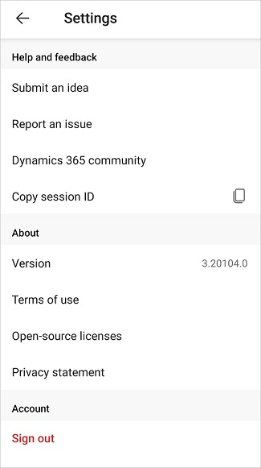

# Dynamics 365 Sales mobile app settings

Settings provides a consolidated view for relevant information about the app, helpful links to submit ideas, report issues, and share feedback, and a sign-out option.

The settings are divided into the following categories:
- [Help and feedback](#help-and-feedback)
- [About](#about)
- [Account](#account)

**To open the Settings panel**

1. Tap your profile picture at the top left of the screen.

2. Tap **Settings**.

    

    The **Settings** panel is displayed.

    

## Help and feedback

This section contains links to actions such as submitting an idea and reporting an issue with the app.

- **Submit an idea**: Allows you to submit idea for the mobile app from the [Dynamics 365 Sales idea submission page](https://go.microsoft.com/fwlink/p/?LinkID=2161876).

- **Report an issue**: Allows you report issues with the mobile app.
    > [!NOTE]
    > - By including your email address, you agree that Microsoft can send you an email if we have questions about your feedback.
    > - Please do not include any confidential or personal information in your comment.
    > - By pressing submit, your feedback will be used to improve Microsoft products and services. Your IT admin will be able to collect this data.

- **Dynamics 365 Community** - Allows you to go to the [Dynamics 365 Sales community forum](https://go.microsoft.com/fwlink/p/?LinkID=2161919) to get help from experts and peers, discover blogs, webinars, videos, events, and more.

- **Copy session ID** - Allows you to copy the session ID to your clipboard. The session ID is helpful for troubleshooting purposes. When you are asked to provide it, tap  to copy the session ID and then share it with the required person.

## About

This section contains links to actions such as viewing version of the mobile app and various legal documents.

- **Version**: Displays the current version of the Dynamics 365 Sales mobile app.

- **Terms of use**: Allows you to view the [terms and conditions, license terms, and legal information](https://go.microsoft.com/fwlink/p/?LinkID=698507).

- **Open-source licenses**: Allows you to view the [open-source licenses and third-party notices](https://go.microsoft.com/fwlink/p/?LinkID=2127442).

- **Privacy statement**: Allows you to view the [Microsoft Privacy Statement](https://go.microsoft.com/fwlink/p/?LinkID=698505).

## Account

This section contains link to sign out from the mobile app.

- **Sign out**: Allows you to sign out of the app.

### See also

[Use the Dynamics 365 Sales mobile app](use-sales-mobile-app.md)    
[Learn the basics](learn-basics-mobile-app.md)

