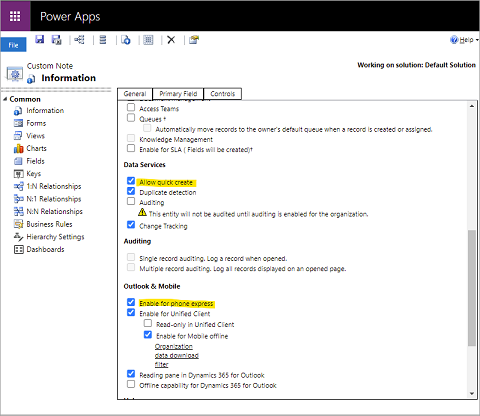

# Configure tables for quick creation of records and activities

Dynamics 365 Sales mobile app supports quick creation of records and activities. As an administrator, you can control which records and activities are available for quick creation and which fields are available in the quick creation form.

## Enable a table or an activity for quick creation

In order for a table or activity to be available in the quick creation list, it should have the following properties:

- Enabled for quick creation and visible in mobile
- Have a quick view form set up

### Enabled for quick creation and visible in mobile

For a table or an activity to be available for quick creation and visible in mobile, ensure that the following properties are selected in the table or activity metadata:

- Allow quick create
- Enable for phone express

When you select the check boxes, the following metadata properties are set as below:

- IsQuickCreateEnabled is set to true
- IsVisibleInMobile is set to true

### Have a quick view form set up

Quick creation is only enabled for tables or activities with a quick view form. For information to create a quick view form, see [Create a quick view form](https://docs.microsoft.com/powerapps/maker/model-driven-apps/create-edit-quick-view-forms).

## Control which fields are displayed in the quick creation form

Fields are obtained as an aggregation of the following:

- Fields from the table's or activity's main quick view form
- Fields that are ApplicationRequired (see [RequiredLevel](https://docs.microsoft.com/dynamics365/customer-engagement/web-api/attributerequiredlevel?view=dynamics-ce-odata-9))

### Supported field types

Currently, quick creation supports the following field types:
- String
- DateTime
- Money
- Integer
- Picklist
- Lookup
- Customer
- Memo
- Generic Text

### See also

[Use the Dynamics 365 Sales mobile app](use-sales-mobile-app.md)    
[Learn the basics](learn-basics-mobile-app.md)

