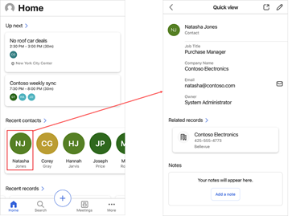
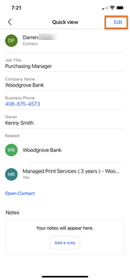
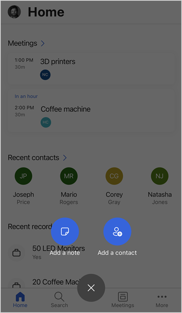
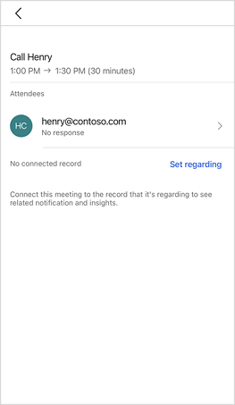
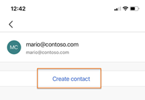

# Manage contacts

[!INCLUDE [cc-beta-prerelease-disclaimer](../../includes/cc-beta-prerelease-disclaimer.md)]

In the Dynamics 365 Sales mobile app, you can view, edit, and create contacts.

- [View details of a contact](#view-details-of-a-contact)

- [Edit contact details](#edit-contact-details)

- [Create contact](#create-contact)

## View details of a contact

Tap a contact on the home page or on the Meetings page to view the details of the contact in a quick view form. To open the contact in the Sales Hub app, tap **Open Contact**. In the following example, the details of a recent contact shown on the home page are displayed in a quick view form:   

> [!div class="mx-imgBorder"]
>  

## Edit contact details

If the contact already exists in your Dynamics 365 Sales organization, you can update the contact details, such as mobile number and business email, by using the Edit option in the quick edit form.   

1. Tap **Edit** in the upper-right corner of the screen. The contact's quick edit form opens.

    > [!div class="mx-imgBorder"]
    > 
    
2. Enter or update the required information, and then tap **Save**.

    > [!div class="mx-imgBorder"]
    >    

## Create contact

If you need to create a contact that doesn't already exist in your Dynamics 365 Sales organization, you can use the mobile app to create the contact from the following pages:

- [Home page](#home-page)

- [Meetings page](#meetings-page)

### Home page

1.  Tap the plus sign  on the navigation bar at the bottom of the screen.

2.  Tap **Add a contact**.

    
    
3.  In the **Create a contact** form, fill in the details, and then tap **Save**.

### Meetings page 

1.  In the attendee list for a meeting, tap the name of an attendee. Note that you can create a contact from an attendee only if the attendee isn't already a contact in your Dynamics 365 organization.

    
    
1. Tap **Create contact**. The **Create a contact** form opens.

    > [!div class="mx-imgBorder"]
    > 
    
3.  In the **Create a contact** form, fill in the details, and then tap **Save**.

## See also

[Learn the basics](learn-basics-mobile-app.md)   
[View meetings](view-agenda.md)

[!INCLUDE[footer-include](../../includes/footer-banner.md)]