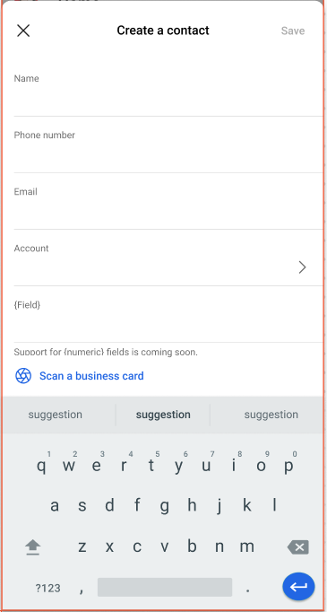

---
title: Create a contact in Dynamics 365 Sales mobile app
description: Instruction to create a contact in Dynamics 365 Sales mobile app
ms.date: 11/03/2020
ms.topic: article
ms.service: dynamics-365-sales
author: sbmjais
ms.author: shjais
manager: shujoshi
---

# Create a contact

[!INCLUDE [cc-beta-prerelease-disclaimer](../../includes/cc-beta-prerelease-disclaimer.md)]

Contact can be created from a Meeting attendee list or from the home page:

-   In the Meeting attendee list, if there's a participant who is not a Dynamics 365 contact, you will see a **Create a contact** link. Tap the link to create a contact record in Dynamics 365.

-   To create a contact from the home page, select the Plus icon  from the bottom navigation bar, and then select **Add a contact**.

The Create a contact form opens.

Fill in the details, and tap **Save**. Alternately, tap on **Scan a business card** to create a contact from a scanned business card.

