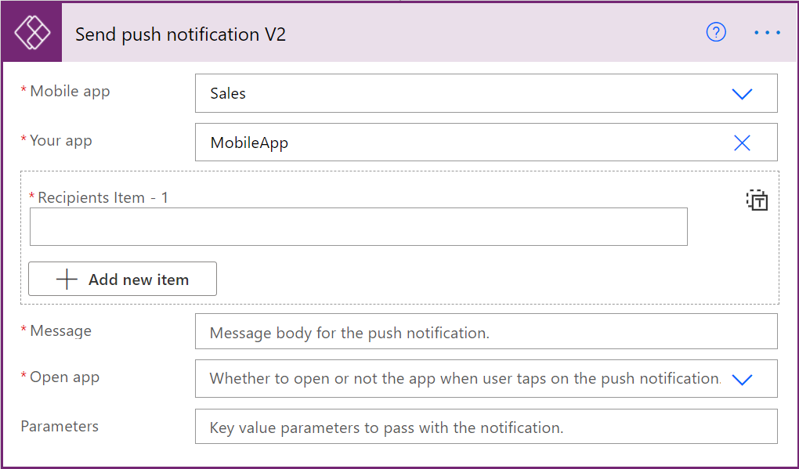
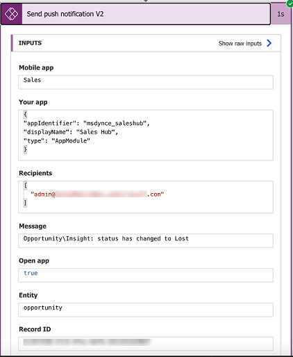

# Create custom push notifications

[!INCLUDE [cc-beta-prerelease-disclaimer](../../includes/cc-beta-prerelease-disclaimer.md)]

Push notifications help to engage app users and help them prioritize key tasks. Dynamics 365 Sales mobile supports push notifications that can be created by using the **Send push notification V2** action with the following details:

- **Mobile app**: Select **Sales**.
- **Your app**: Select the app that you want to set up the notification for.
- **Recipients Item-1**: Enter user's email, or user's Azure Active Directory object ID.
- **Message**: Enter the notification message.
- **Open app**: Select **Yes**.
- **Entity**:  Select which entity the notification is for.
- **Record ID**: Enter the record ID. If you don't enter a record ID, the mobile app will open at the home screen when you tap the notification. If you enter record ID, the mobile app will open the specified record when you tap the notification.

For information on creating push notifications, see [Create push notifications for Power Apps mobile](https://docs.microsoft.com/powerapps/mobile/power-apps-mobile-notification).

## Validate your flow

1. In [Power Automate](https://flow.microsoft.com), select **My flows** from the navigation bar on the left, and then select a flow.

    

2. From the run history, select an instance of the run.

    

3. Validate the inputs passed during the run.

    

### See also

[Use the Dynamics 365 Sales mobile app](use-sales-mobile-app.md)    
[Learn the basics](learn-basics-mobile-app.md)

