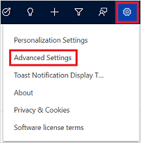
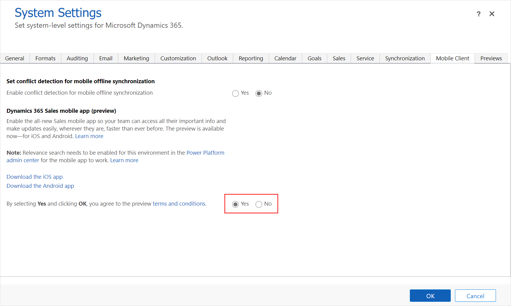

# Enable Dynamics 365 Sales mobile app

[!INCLUDE [cc-beta-prerelease-disclaimer](../../includes/cc-beta-prerelease-disclaimer.md)]

Dynamics 365 Sales mobile app is an intuitive mobile experience that offers quick access to customer information and makes it easy to keep this information current. This simplifies CRM experiences and help sellers focus on selling. 

Field sellers spend a lot of time on the road, traveling to meet customers. On-the-go time can become productive time with the mobile app that is available on iOS and Android platforms.

Before field sellers can use the Dynamics 365 Sales mobile app, you must enable it.

> [!IMPORTANT]
> - For the Dynamics 365 Sales mobile app to work, you must enable Relevance Search for the environment in which you enable the mobile app. For information on Relevance Search and how to enable it, see [Configure Relevance Search to improve search results and performance](https://docs.microsoft.com/power-platform/admin/configure-relevance-search-organization)
> - To set regarding record for a meeting, you must enable server-side synchronization in your environment. More information: [Server-side synchronization](https://docs.microsoft.com/power-platform/admin/server-side-synchronization)

**To enable Dynamics 365 Sales mobile app**

1. In your customer engagement app, select the **Settings** icon, and then select **Advanced Settings**.

    

    The **Business Management** page opens in a new browser tab.

2. On the navigation bar, select **Settings**, and then under **System**, select **Administration**.

3. Select **System Settings**.

4. On the **System Settings** window, go to the **Mobile Client** tab, and then under **Dynamics 365 Sales mobile app (preview)**, select **Yes**.

    

5. Select **OK**.

## What's next

After you enable the Dynamics 365 Sales mobile app, field sellers can now install it from the app store either on iOS or Android platform. More information: [Install the app](install-app.md)