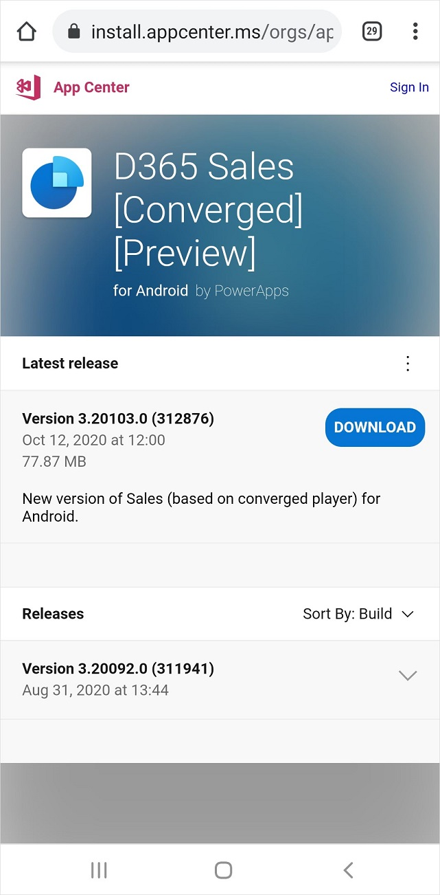
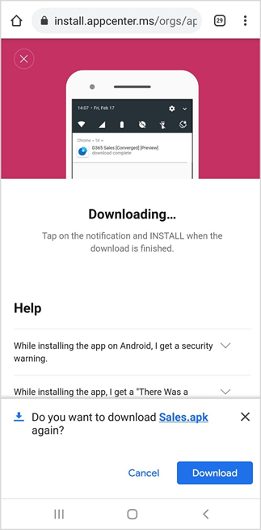
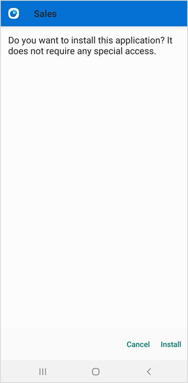
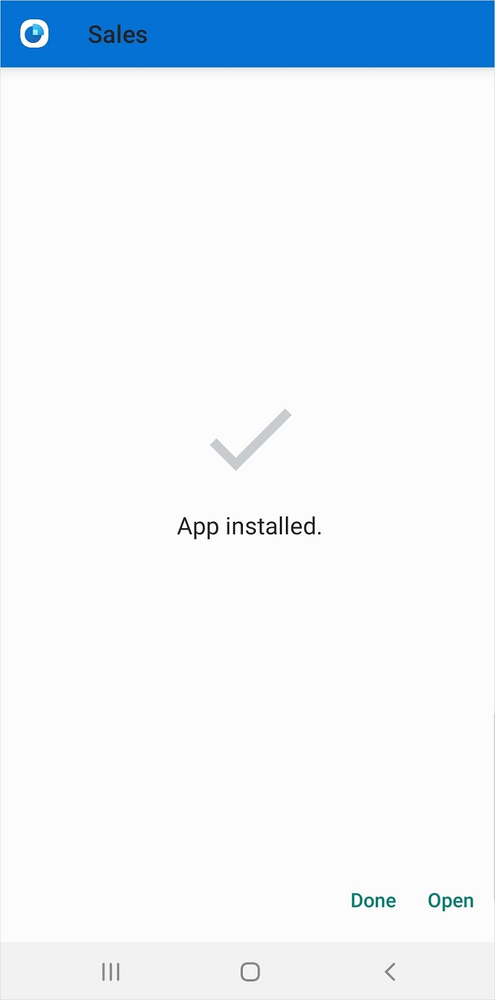

# Install the app on Android

[!INCLUDE [cc-beta-prerelease-disclaimer](../../includes/cc-beta-prerelease-disclaimer.md)]

The Dynamics 365 Sales mobile app can be installed on Android devices without a work profile.

## Install the app on Android without a work profile

1.	On your Android device, go to the [preview version of the Android app](https://go.microsoft.com/fwlink/p/?linkid=2152008)

2.	On the **App Center** page, tap **Download**.

    

3.	In the confirmation message to download the .apk file, tap **Download**.

    

4.	In the mobile app, tap **Install**.

    

5.	When the app is installed, tap **Open**.

    

## Install the app on Android with a work profile

Currently, installation of the app on Android with a work profile is not supported. For more details, contact [Dynamics 365 Sales mobile support](mailto:DSalesMobileSupport@microsoft.com). 

[!INCLUDE[footer-include](../../includes/footer-banner.md)]