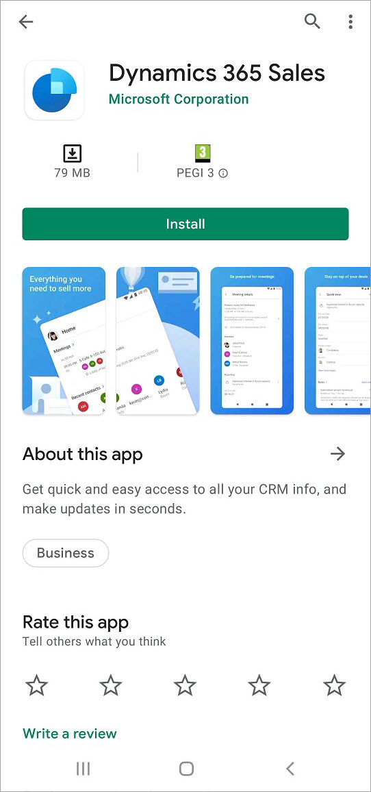

# Install the app on Android

The Dynamics 365 Sales mobile app can be installed on Android devices without a work profile.

## Install the app on Android without a work profile

1. Go to the Google Play Store, and search for **Dynamics 365 Sales**.

    Alternately, you can [click here](https://go.microsoft.com/fwlink/?linkid=2161889) to open the app on Play Store.

2. Tap **Install** to install the app.

    

## Install the app on Android with a work profile

Currently, installation of the app on Android with a work profile is not supported. For more details, contact [Dynamics 365 Sales mobile support](mailto:DSalesMobileSupport@microsoft.com). 

[!INCLUDE[footer-include](../../includes/footer-banner.md)]