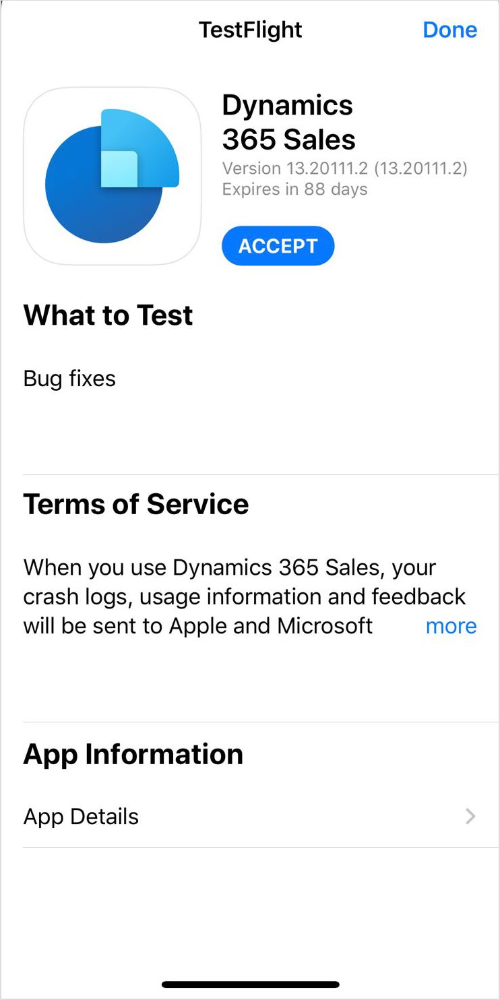
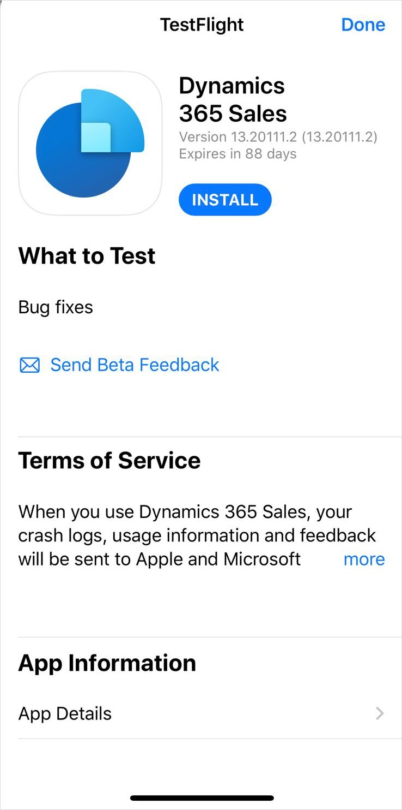

# Install the app on iOS

[!INCLUDE [cc-beta-prerelease-disclaimer](../../includes/cc-beta-prerelease-disclaimer.md)]

1. Go to the Apple App Store and install the **TestFlight** app.

2. On your iOS device, go to the [preview version of the iOS app](https://go.microsoft.com/fwlink/p/?linkid=2151689).

3. In the TestFlight app, tap **Accept**.

    

4. In the TestFlight app, tap **Install**.

    

[!INCLUDE[footer-include](../../includes/footer-banner.md)]