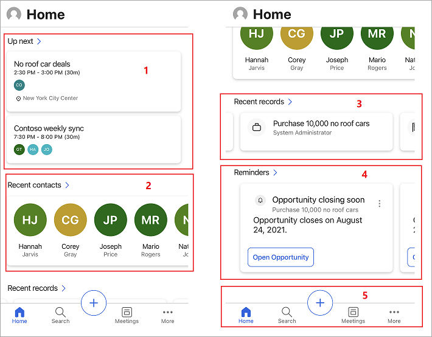
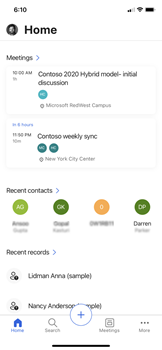
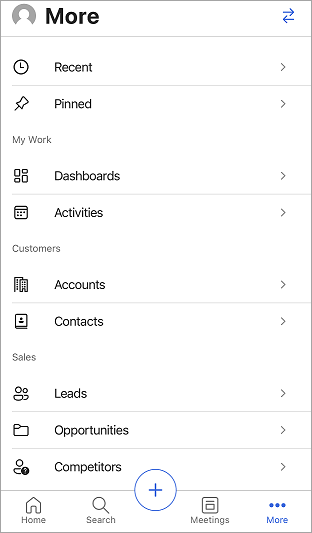

# Learn the basics

[!INCLUDE [cc-beta-prerelease-disclaimer](../../includes/cc-beta-prerelease-disclaimer.md)]

When you open the Dynamics 365 Sales mobile app on your mobile device, you’ll see the home page. This home page provides high-level information on the meetings and insight cards that are specific to you. Typically, the home page displays the following kinds of information:

> [!div class="mx-imgBorder"]
> 

1. [Meetings](#meetings)
2. [Recent contacts](#recent-contacts)
3. [Recent records](#recent-records)
4. [Reminders and insights](#reminders-and-insights)
5. [Navigation bar](#navigation-bar)

## Meetings

The Meetings section of the home page shows important information about the last meeting you were in and the next one coming up.<!-- Edit note: Could be another day I expect. --> When you tap a meeting, the Meeting details page opens. More information: [View meeting details](view-agenda.md#view-meeting-details)

> [!NOTE]
> The Meetings section only includes meetings that have at least one attendee who's outside of your organization's domain.

## Recent contacts

The Recent contact section of the home page shows a few contacts you have recently accessed thorugh the web or mobile app. You can tap a contact to views its details or tap  **Recent contacts** to open an extended list of recent contacts. More information: [Manage contacts](create-contact.md)<!-- Edit note: In this screenshot and others, you should change "no roof cars" to "convertible cars." -->

## Recent records

The Recent records section of the home page shows a few recent records you recently accessed through the web or mobile app, such as an account or opportunity. You can tap a record to views its details or tap **Recent records** to view an extended list. More information: [Manage records or regarding entities](open-record.md)<!-- Edit note: In this screenshot and others, you should change "no roof cars" to "convertible cars." -->

## Reminders and insights

The Reminders and Insights sections on the home page show action cards from the relationship assistant. The cards show up to three reminders and three insights. If your administrator has created custom cards, they can be shown here, too.

Insight cards help keep you up to date with your work in Dynamics 365 Sales, letting you know when you need to follow up on an email, attend a meeting, and much more. The cards are generated by the assistant based on data stored in Dynamics 365 Sales and your Exchange inbox and calendar. More information: [Insight cards reference](https://docs.microsoft.com/dynamics365/ai/sales/action-cards-reference)

>[!NOTE]
>Not all types of insights and reminders cards are displayed in this section. More information: [Notes and reminders](view-agenda.md#notes-and-reminders)<!-- Edit note: This link worked but did not go to the subheading.  -->

When you tap **Reminders** or **Insights**, an extended list appears. Tap a reminder or an insight to see details about it. Tap **Open** in the card to open the reminder or the insight card.

Tap the three dots  to take further action on a reminder, such as to dismiss, snooze, or mark it as helpful or not helpful.

## Navigation bar

You can use the navigation bar at the bottom of the screen to navigate through the app.

The navigation bar includes the following options:<!-- Edit note: We do cover the plus sign elsewhere. Can we skip it here or should it be noted. -->

- [Home](#home)   
- [Search](#search)
- [Meetings](#meetings)
- [More options](#more-options)

### Home

Tap **Home** from anywhere in the app to go to home page.   

### Search

>[!NOTE]
>You must enable relevance search for the environment in which you enable the mobile app. More information: [Configure relevance search to improve search results and performance](https://docs.microsoft.com/power-platform/admin/configure-relevance-search-organization)

Tap the **Search** icon and enter text in the search box to find related information quickly. When you start typing, suggested records are displayed that include the text. Enter the complete words for better results.

When you perform a search, the results are categorized according to the type of entity, such as contacts, accounts, leads, notes, and opportunities. For example, if you searched for **contoso**, the results would include records that contain this text, including contacts, accounts, and leads. Tap the record to view more details. You can also tap **See all** to expand the list for a category.    

> [!div class="mx-imgBorder"]
>    

Below the search box, you can see the number of records found in the search results. Next to the results count is an option to filter the results. You can narrow your results to include only relevant owners or record types, and limit results based on modified and created dates. Tap the filter icon (), and then choose a filter option.   

> [!div class="mx-imgBorder"]
>     

- **Owner**: Specifies the name of the owners who are associated with the search text. You can tap an owner to further refine the search results.    

- **Record Type**: Specifies the type of records that appear in the search results, such as leads, opportunities, email messages, accounts, contacts, attachments, and notes. You can tap a record type to further refine the search results.     

- **Modified On**: Shows the timespan for the last modifed date of the records that appear in the search results. To change the timespan, tap the option, and then choose the **From** and **To** time periods. For example, if you select **From** > **One week ago** and **To** > **Today**, the results are refined to display records modified within the last week.<!-- Edit note: Simplified explanation. -->

- **Created On**: Shows the timespan for the creation date of the records that appear in the search results. To change the timespan, tap the option, and then choose the **From** and **To** time periods. For example, if you select **From** > **One year ago** and **To** > **Today**, the results are refined to display records created within the last year. 

### Meetings

Tap the **Meetings** icon. The calendar selection view is opened with a list of meetings that are scheduled for the current date. By default, information for the current date is displayed. You can swipe left or right to choose a date for which you want to view scheduled meetings.<!-- Edit note: So only meetings would show up here then. -->

> [!div class="mx-imgBorder"]
>    

To learn more, go to [View meetings](view-agenda.md).        

### More options

To navigate to other areas of the app, tap the **More** icon to view the site map or menu of the Sales Hub app or any other custom app module you are using. The following screen is a site map sample:<!-- Edit note: Is it More or More options, since I only see More in the nav bar. -->

> [!div class="mx-imgBorder"]
>     

The **Recent** option, listed at the top of the site map, displays the records that you have accessed recently through the Sales mobile app. Tap the **Pinned** option to display any pinned records.<!-- Edit note: Suggest explaining this beyond just repeating the pinned term -->

Select the bidirectional arrows in the upper-left corner to switch to other menus.<!-- Edit note: Guessing here, not sure what this does. -->  

## See also

[View meetings](view-agenda.md)

[Open a record](open-record.md)
