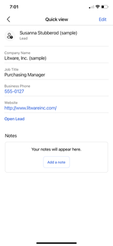
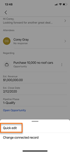

# Manage records

[!INCLUDE [cc-beta-prerelease-disclaimer](../../includes/cc-beta-prerelease-disclaimer.md)]

Records and regarding entities can be accessed from the home page or the Meetings page.

- On the home page, go to the **Recent records** section.   
- On the Meetings page, go to the **Regarding** section.   

You can [view details](#view-details) and [edit records and entities](#edit-records-and-entities) on records on the home and Meetings pages. Additionally, you can [change a regarding entity](view-agenda.md#change-regarding-entity) and [add a regarding entity](view-agenda.md#add-regarding-entity) on the Meetings page.

## View details

> [!NOTE]
> - The fields that you see on the compact form are defined in the quick view form of the entity.
> - The lightweight view doesn't include all attributes of the entity.
> - This is a lightweight form that contains any attributes defined in the first form on quick view form set order. More information: [Set the form order](https://docs.microsoft.com/powerapps/maker/model-driven-apps/control-access-forms#set-the-form-order)

You can view the details of records in the following ways: 

**On the home page**    

The home page displays a list of records that you have recently accessed. These records include opportunities, leads, contacts, quotes, accounts, and notes. When you tap the record, the record opens in a lightweight form. This form provides the basic details, including [related notes and reminders](#notes-and-reminders). 

**On the Meetings page**     

The Meeting details page displays the regarding entity that is related to the meeting. Also, the notes and insights that are displayed in the meeting are related to the displayed regarding entity. Tap **Open *record type*** to view the details in the lightweight form. The details include basic information about the entity, [related notes, and reminders](#notes-and-reminders). 

>[!NOTE]
>To learn more about notes, go to [Manage notes](view-edit-add-note.md).

## Edit records and entities

Follow these steps to edit records and entities in the Dynamics 365 Sales mobile app.

- To edit records on the home page, open the record. In the upper-right corner of the quick view form, tap **Edit**. Edit the details in the Edit form and tap **Save**. To open the record in the Sales Hub app, tap **Open *record type***.

    >[!div class="mx-imgBorder"]
    >
    
- To quickly edit the basic information about the regarding entity on the Meetings page, tap the three dots, **More options** (), and then tap **Quick edit**. The record's Edit form opens. Enter or update the required information, and then tap **Save**.

    >[!div class="mx-imgBorder"]
    >    

    To edit the whole record, tap **Open *record type***. The record opens in the Sales Hub app for editing.   

## Notes and reminders

**Notes**

Notes displayed in the Notes section are related to the regarding entity that is associated with the meeting. You can add, edit, and delete notes. More information: [Manage notes](view-edit-add-note.md)

**Reminders**

You can see the reminders through insight cards based on the regarding entity that is associated with the meeting. By tapping the three dots, **More options** (), on the card, you can take actions such as dismiss, snooze, and like or dislike the card. The cards are retrieved from your Dynamics 365 Sales organization for the selected regarding entity.

The following reminder insight cards are supported:    

<table>
<tr>
<td>{activity} due today</td><td>Buying intent detected in email</td><td>Close date coming soon</td>
</tr>
<tr>
<td>Competitor mentioned</td><td>Email opened</td><td>Email reminder</td>
</tr>
<tr>
<td>File requested</td><td>Issue detected</td><td>Meeting requested</td>
</tr>
<tr>
<td>Missed (opportunity) closed date</td><td>Missed email</td><td>No activity with {record type}</td>
</tr>
<tr>
<td>Opportunity at risk (phrase detection)</td><td>Opportunity at risk (sentiment detection)</td><td>Suggested stakeholder</td>
</tr> 
<tr>
<td></td><td></td><td></td>
</tr>
</table>   

To learn more about insight cards, go to [Insight cards reference](https://docs.microsoft.com/dynamics365/ai/sales/action-cards-reference).  

## See also

[Learn the basics](learn-basics-mobile-app.md)   
[View meetings](view-agenda.md)

[!INCLUDE[footer-include](../../includes/footer-banner.md)]