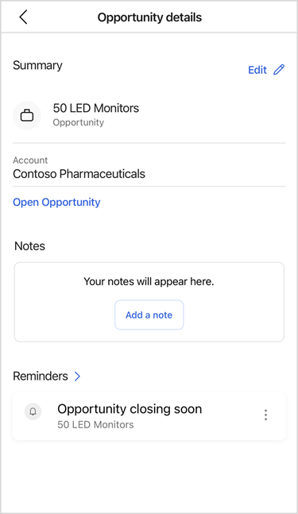

---
title: Open a record in Dynamics 365 Sales mobile app
description: Instructions to open a record in Dynamics 365 Sales mobile app
ms.date: 11/03/2020
ms.topic: article
ms.service: dynamics-365-sales
author: sbmjais
ms.author: shjais
manager: shujoshi
---

# Open a record

You can open a record by tapping an item from the **Recent Contacts** or **Recent Records** section of the Home page. Similarly, you can tap a record from the search results to open the record.

The record is opened in the compact view. The compact form shows important details about the record along with notes, reminders, and insights.

> [!NOTE]
> The fields that you see on the compact form are defined in the Quick View form of the entity.

