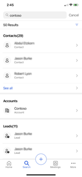
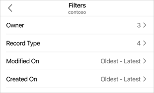

# Search records

You can search for records in the Dynamics 365 Sales mobile app. On the navigation bar at the bottom of the scree, tap the **Search** icon and enter text in the search box to find related information quickly. When you start typing, suggested records are displayed that include the text. Enter the complete words for better results.

> [!NOTE]
> You must enable relevance search for the environment in which you enable the mobile app. More information: [Configure relevance search to improve search results and performance](https://docs.microsoft.com/power-platform/admin/configure-relevance-search-organization)

When you perform a search, the results are categorized according to the type of entity, such as contacts, accounts, leads, notes, and opportunities. For example, if you searched for **contoso**, the results would include records that contain this text, including contacts, accounts, and leads. Tap the record to view more details. You can also tap **See all** to expand the list for a category.    

> [!div class="mx-imgBorder"]
>    

Below the search box, you can see the number of records found in the search results. Next to the results count is an option to filter the results. You can narrow your results to include only relevant owners or record types, and limit results based on modified and created dates. Tap the filter icon (), and then choose a filter option.   

> [!div class="mx-imgBorder"]
>     

- **Owner**: Specifies the name of the owners who are associated with the search text. You can tap an owner to further refine the search results.    

- **Record Type**: Specifies the type of records that appear in the search results, such as leads, opportunities, email messages, accounts, contacts, attachments, and notes. You can tap a record type to further refine the search results.     

- **Modified On**: Shows the timespan for the last modified date of the records that appear in the search results. To change the timespan, tap the option, and then choose the **From** and **To** time periods. For example, if you select **From** > **One week ago** and **To** > **Today**, the results are refined to display records modified within the last week.

- **Created On**: Shows the timespan for the creation date of the records that appear in the search results. To change the timespan, tap the option, and then choose the **From** and **To** time periods. For example, if you select **From** > **One year ago** and **To** > **Today**, the results are refined to display records created within the last year.  

## See also   

[Use the Dynamics 365 Sales mobile app](use-sales-mobile-app.md) 
[Learn the basics](learn-basics-mobile-app.md)