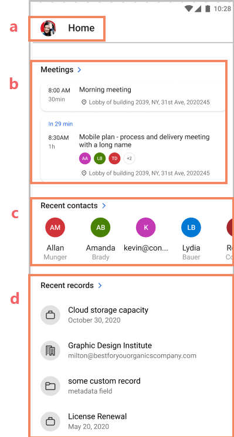
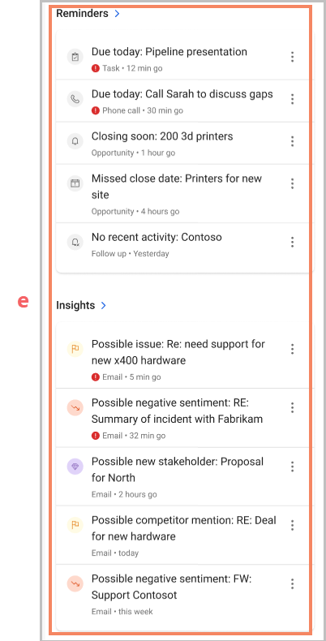
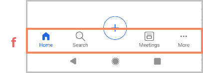

---
title: Using the Dynamics 365 Sales mobile app
description: Instructions for using the Dynamics 365 Sales mobile app
ms.date: 11/03/2020
ms.topic: article
ms.service: dynamics-365-sales
author: sbmjais
ms.author: shjais
manager: shujoshi
---

# Use the Dynamics 365 Sales mobile app

[!INCLUDE [cc-beta-prerelease-disclaimer](../../includes/cc-beta-prerelease-disclaimer.md)]

With the Dynamics 365 Sales mobile app, you will be able to quickly:

-   Plan your day better

    -   View agenda and meetings

    -   View reminders and insights

-   Take actions post a meeting

-   Find and act on records

The home page shows items that are most relevant to you and help you plan your day better, such as

-   Your upcoming meetings

-   Your recent contacts and other records

-   Reminders

-   Insights

## Familiarize with the home page

The home page gives you a quick access to what's most important to you.

| Section     | Descriptions   |
|--------------|--------------------|
| a. Home    | Lets you open site map and navigate to different parts of the app   |
| b. Meetings    | Shows important information about your one previous and one upcoming meeting for the day. More information: [View agenda](view-agenda.md)    |
| c. Recent contacts   | Lets you quickly open the contacts you've recently accessed. The records open in a Quick view form. When you select the chevron, an extended list is shown.     |
| d. Recent records   | Shows the recent records you've worked on, such as an account or opportunity. When you select the chevron, an extended list is shown. From this list, you can also pin the records so they start showing up in the Pinned view. To see more details of a specific record, open it. More information: Open records |
| e. Reminders and insights | Shows action cards from relationship assistant. The cards show up to 5 reminders and insights items. If your admin has created custom cards, they can be shown here, too. When you select the chevron, an extended list is shown. Tap a reminder or insight to see its details in a card. Select Open in the card to open the reminder or insight card in a Unified Interface form. Use the **More actions** menu to take further actions on the reminders, such as, dismiss, snooze, or mark it as useful or not useful. |
| f. Navigation bar  | Lets you quickly access important pages such as Home, Search, and more… More information: [Navigate through the app](navigate-through-the-app.md) |

## Navigate through the app

You can use the bottom navigation bar to navigate through the app. From anywhere in the app:

-   Select the Home icon to go to the home page.

-   Select the Search icon to search for records. More information: Search for records

-   Select the Meetings icon to go to the Agenda view.

-   Select More icon to open items in Unified interface.

