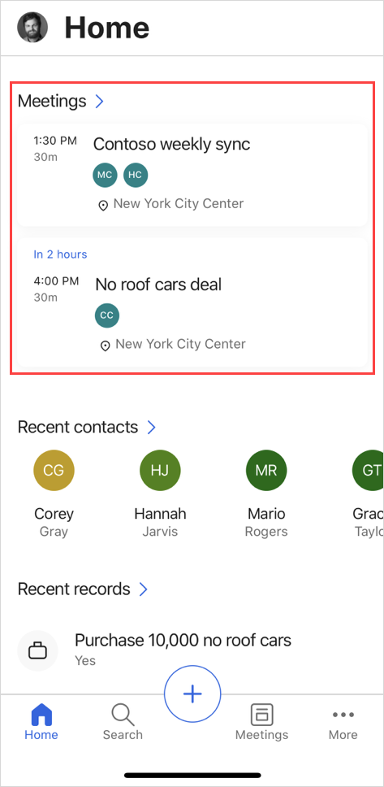
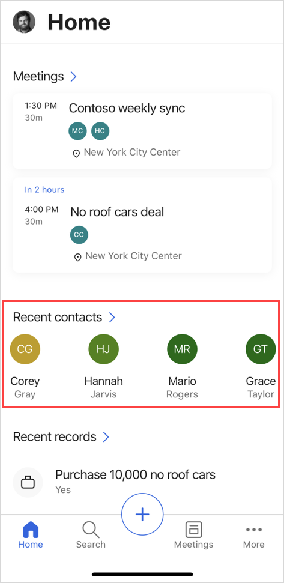
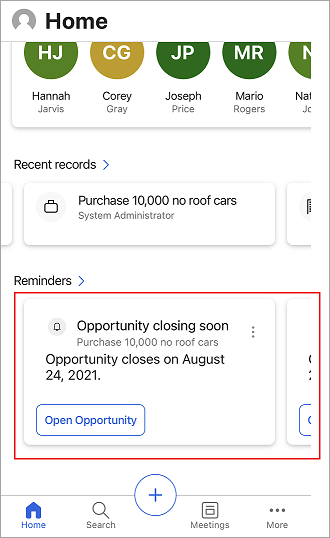
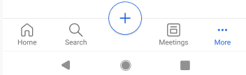

---
title: Using the Dynamics 365 Sales mobile app
description: Instructions for using the Dynamics 365 Sales mobile app
ms.date: 11/03/2020
ms.topic: article
ms.service: dynamics-365-sales
author: sbmjais
ms.author: shjais
manager: shujoshi
---

# Use the Dynamics 365 Sales mobile app

[!INCLUDE [cc-beta-prerelease-disclaimer](../../includes/cc-beta-prerelease-disclaimer.md)]

With the Dynamics 365 Sales mobile app, you will be able to quickly:

-   Plan your day better

    -   View agenda and meetings

    -   View reminders and insights

-   Take actions post a meeting

-   Find and act on records

The home page shows items that are most relevant to you and help you plan your day better, such as:

-   Your upcoming meetings

-   Your recent contacts and other records

-   Reminders

-   Insights

## Familiarize with the home page

The home page gives you a quick access to what's most important to you. The home page is divided into the following sections:

### Meetings

Shows important information about your one previous and one upcoming meeting for the day. More information: [View agenda](view-agenda.md)

### Recent contacts

Lets you quickly open the contacts you've recently accessed. Select **Recent contacts** to view an extended list. You can tap a contact to view its details.

### Recent records

Shows the recent records you've worked on, such as an account or opportunity. Select **Recent records** to view an extended list. You can tap a record to view its details. More information: [Open a record](open-record.md)

### Reminders and insights

Shows action cards from relationship assistant. The cards show up to five reminders and insights items. If your administrator has created custom cards, they can be shown here, too.

When you select **Reminders** or **Insights**, an extended list is shown. Tap a reminder or an insight to see its details in a card. Tap **Open** in the card to open the reminder or the insight card.

Use the **More actions** menu to take further actions on the reminders, such as, dismiss, snooze, or mark it as helpful or not helpful.

## Navigate through the app

You can use the bottom navigation bar to navigate through the app.

From anywhere in the app:

-   Tap **Home** to go to the home page.

-   Tap **Search** to search for records. More information: Search for records

-   Tap **Meetings** to go to the Agenda view.

-   Tap **More** to open items in Unified Interface.

