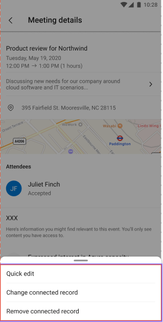

---
title: View meetings in the Dynamics 365 Sales mobile app
description: Instructions to view meetings in the Dynamics 365 Sales mobile app
ms.date: 11/30/2020
ms.topic: article
ms.service: dynamics-365-sales
author: sbmjais
ms.author: shjais
manager: shujoshi
---

# View meetings

[!INCLUDE [cc-beta-prerelease-disclaimer](../../includes/cc-beta-prerelease-disclaimer.md)]

On the home page, you can see resources that can help you better plan your day. For example, one past and one upcoming meeting are displayed in the **Meetings** section.

To see more meetings for the day, tap **Meetings** either on the home page or on the navigation bar. Meetings that have been scheduled in Microsoft Outlook are displayed.

> [!NOTE]
> - You can't create a meeting from the Dynamics 365 Sales mobile app.
> - Only those meetings are displayed that have at least one external attendee (not a part of your organization).

**To view meetings**

1.  On the navigation bar, tap **Meetings**.

    

    The calendar view opens.

    

    The current meeting time is shown in blue with a triangle icon beside it. To see the details of a meeting, tap the meeting record.

2.  To see meetings for a specific date, tap a date in the calendar.

    

    If there are no meetings scheduled for the day, nothing is displayed.

## View meeting details

To see details of a specific meeting, tap the meeting record on either the home page or the calendar view. The meeting details are displayed, as shown in the following image.

Meeting details include the following:

-   Meeting name

-   Meeting time

-   Meeting description: Tap to get a detailed description of the meeting.

-   List of attendees: Up to five attendees are shown. When you tap the name of an attendee, the quick view of their contact record opens. If the attendee is an unknown contact (that is, not a contact stored in Dynamics 365 Sales), you'll see an option to create a contact. More information: [Create a contact](create-contact.md)

-   Regarding: Indicates the record the meeting is about. By tapping , you can do the following:

    -   Open the connected record in edit mode.

    -   Select a different record to connect with the meeting.

        
    
    -   Remove the connected record

    If no regarding record has been set, you'll see the message "No connected record." More information: [Connect a record to a meeting](#connect-a-record-to-a-meeting)
    
    > [!NOTE]
    > You'll be able to set the regarding record only if server-side synchronization has been enabled in your environment. Contact your administrator to enable it.

## Connect a record to a meeting

1. Tap a meeting record either on the home page or the calendar view.

    

2. On the meeting details page, tap **Set regarding**.

    

3. On the **Regarding** page, either select a recent record or tap **Search** to look for the record you want.

    

4. After selecting a record, tap **Save**.

    

The connected record details are displayed in the **Regarding** section.

