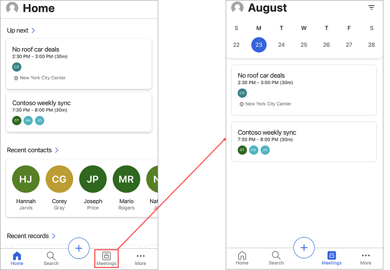
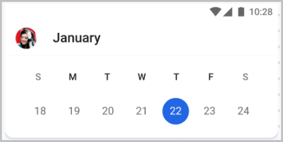
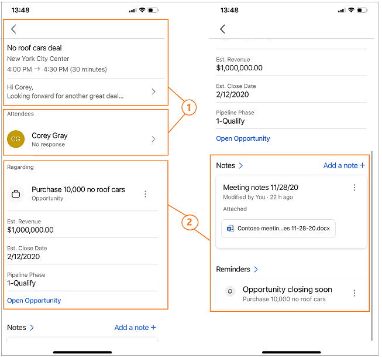
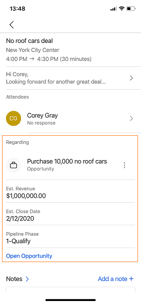
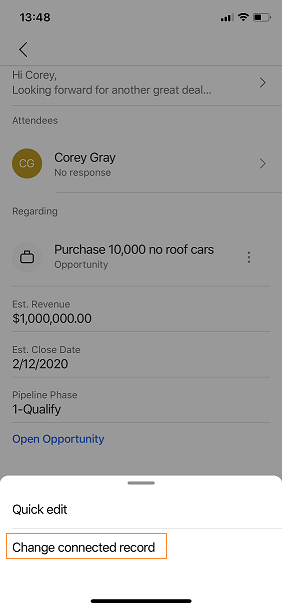
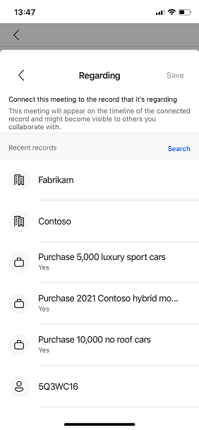
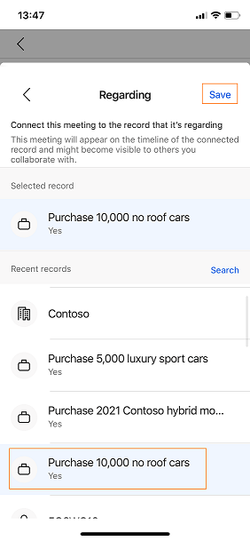
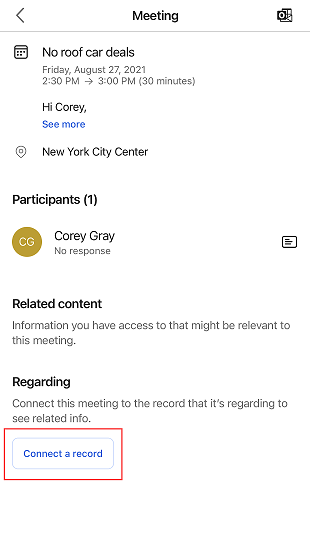

# View meetings

The information on the home page of the Dynamics 365 Sales mobile app can help you better plan your day. For example, the Meetings section displays your most recent meeting and the next upcoming meeting. To see more meetings for the day, tap **Meetings** either on the home page or on the navigation bar. Meetings that have been scheduled in Microsoft Outlook are displayed.  
  
> [!NOTE]
> - You can't create a meeting from the Dynamics 365 Sales mobile app.
> - The Meetings section only include meetings that have at least one attendee who's outside of your organization's domain.   
 
**To view meetings**

1.  On the navigation bar, tap **Meetings**. The calendar view opens.
    
    
    
    To see the details of a meeting, tap the meeting record.
    
2.  To see meetings for a specific date, tap a date in the calendar.

    
    
    If there are no meetings scheduled for the day, nothing is displayed.   

## View meeting details

To see details of a specific meeting, tap the meeting record on either the home page or in the calendar view. The meeting details are displayed, as shown in the following image.    
  

Meeting details include the following:

1. [Meeting information and attendees](#meeting-information-and-attendees)   
2. [Regarding entity, notes, and reminders](#regarding-entity-notes-and-reminders)

### Meeting information and attendees

>[!NOTE]
> The data that is displayed in this section is retrieved from your Microsoft Exchange server.

**Meeting information**

The meeting information section provides information about the meeting subject, location, time, and description. Tap the description section to show more details. Note that the meeting information can be viewed but cannot be edited in the app.

**Attendees**

Up to five meeting attendees are shown in the Attendees section, such as customers and the meeting organizer. You can see attendee acceptance status, such as accepted, tentative, declined, or no response. When you tap the name of an attendee, the quick view of their contact record opens. You can perform the following actions on the contact: view, edit, and create. More information: [Manage contacts](create-contact.md)            

### Regarding entity, notes, and reminders

>[!NOTE]
> The data that is displayed is related to the selected regarding entity and retrieved from your Dynamics 365 Sales organization.

#### Regarding entity

The Regarding section or entity specifies what the meeting is about, such as an opportunity, lead, contact, or account. When a meeting is attached to an entity, the meeting displays the timeline, insight, participant information, and corresponding related entities. Also, the regarding entity helps you to understand what the meeting is about, so you can come prepared with relevant information.

In the following screenshot, you can see that the meeting is about an opportunity to purchase 10,000 cars.

> [!div class="mx-imgBorder"]
> 

You can perform the following action on regarding entities: [view and edit](open-record.md) the records along with [change regarding entity in meetings](#change-regarding-entity) and [add regarding entity in meetings](#add-regarding-entity).    

> [!NOTE]
> You'll be able to set the regarding record only if server-side synchronization has been enabled in your environment. Contact your administrator to enable it.

**Change regarding entity in meetings**

You can update the regarding entity when it is no longer relevant or there are changes to the meeting. To change the regarding entity, follow these steps:

1. Tap the three dots, **More options** (), and then tap **Change connected record**.

    >[!div class="mx-imgBorder"]
    >
    
2. On the Regarding page, either select a recent record or tap **Search** to look for the record you want.

    >[!div class="mx-imgBorder"]
    >
    
3. After selecting a record, tap **Save**.

    >[!div class="mx-imgBorder"]
    >
    
The connected record details are displayed in the Regarding section.

**Add regarding entity in meetings**

You can add a regarding entity to a meeting when no regarding entity is attached to it. When you add the regarding entity, its corresponding related entities are also added to the meeting.  

>[!NOTE]  
>Once you add a regarding entity, you cannot delete it. However, you can update the entity if you find that the added entity is inappropriate.   

1. On the meeting details page, tap **Set regarding**.

    >[!div class="mx-imgBorder"]
    >
    
2. On the Regarding page, either select a recent record or tap **Search** to look for the record you want.

    >[!div class="mx-imgBorder"]
    >
    
3. After selecting a record, tap **Save**.

    >[!div class="mx-imgBorder"]
    >
    
The connected record details are displayed in the Regarding section.

**Notes**    

The Notes section for a meeting can be used to add notes related to a meeting, such as minutes from the meeting. You can add, edit, and delete notes. More information: [Manage notes](view-edit-add-note.md)

**Reminders** 

Any reminders and insights related to the meeting are displayed in the Reminders section. For each card, you can tap the three dots on the left, **More options** (), to dismiss, snooze, and like or dislike the card. More information: [Notes and reminders](open-record.md#notes-and-reminders)

## See also   

[Use the Dynamics 365 Sales mobile app](use-sales-mobile-app.md)    
[Manage contacts](create-contact.md)   
[Manage records](open-record.md)

[!INCLUDE[footer-include](../../includes/footer-banner.md)]